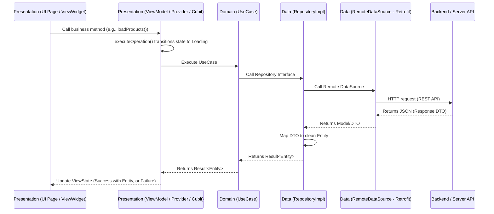

# 🔄 Skill: Implement Domain & Data Flow (Implement Domain & Data Flow)

Use this skill when requested to: "create a new business flow/API call to display data on the UI", "integrate a new API endpoint", etc.

---

## 📋 Data Flow Overview



---

## 📋 Detailed Steps

### Step 1: Define the API Response DTO in the `Data` Layer
Create the DTO class to deserialize JSON from the server under `packages/data/<module>/lib/src/models/`:
```dart
import 'package:freezed_annotation/freezed_annotation.dart';

part 'product_model.freezed.dart';
part 'product_model.g.dart';

@freezed
class ProductModel with _$ProductModel {
  const ProductModel._();

  const factory ProductModel({
    @JsonKey(name: 'id') required int id,
    @JsonKey(name: 'name') required String name,
    @JsonKey(name: 'price') required double price,
  }) = _ProductModel;

  factory ProductModel.fromJson(Map<String, dynamic> json) =>
      _$ProductModelFromJson(json);

  ProductEntity toEntity() {
    return ProductEntity(
      id: id,
      name: name,
      price: price,
    );
  }
}
```

### Step 2: Configure Retrofit API Service
Define the API endpoint inside the Remote DataSource under `packages/data/<module>/lib/src/data_sources/remote/`:
```dart
@POST('/products')
Future<BaseEntity<List<ProductModel>>> getProducts();
```

### Step 3: Define the Clean Entity in the `Domain` Layer
Create the pure business object representation under `packages/domain/<module>/lib/src/entities/`:
```dart
import 'package:freezed_annotation/freezed_annotation.dart';

part 'product_entity.freezed.dart';

@freezed
class ProductEntity with _$ProductEntity {
  const factory ProductEntity({
    required int id,
    required String name,
    required double price,
  }) = _ProductEntity;
}
```

### Step 4: Declare the Repository Interface in the `Domain` Layer
Define the contract for the repository under `packages/domain/<module>/lib/src/repositories/i_<module>_repository.dart`:
```dart
import 'package:domain_core/domain_core.dart';
import '../entities/product_entity.dart';

abstract class IProductRepository {
  Future<Result<List<ProductEntity>>> getProducts();
}
```

### Step 5: Implement the Repository in the `Data` Layer (RepositoryImpl)
Implement the interface by extending `IBaseRepository` from `data_core` to automatically handle exceptions and map errors:
```dart
import 'package:core_common/core_common.dart';
import 'package:data_core/data_core.dart';
import 'package:domain_core/domain_core.dart';
import 'package:domain_payment/domain_payment.dart';
import 'package:injectable/injectable.dart';

import '../data_sources/remote/product_remote_data_source.dart';
import '../models/product_model.dart';

@LazySingleton(as: IProductRepository)
class ProductRepositoryImpl extends IBaseRepository implements IProductRepository {
  final ProductRemoteDataSource _remoteDataSource;
  ProductRepositoryImpl(this._remoteDataSource);

  @override
  Future<Result<List<ProductEntity>>> getProducts() async {
    return execute<List<ProductModel>, List<ProductEntity>>(
      () => _remoteDataSource.getProducts(),
      mapper: (models) => models.map((m) => m.toEntity()).toList(),
    );
  }
}
```

### Step 6: Define the UseCase in the `Domain` Layer
Create the single-purpose use case under `packages/domain/<module>/lib/src/usecases/`:
```dart
import 'package:domain_core/domain_core.dart';
import 'package:injectable/injectable.dart';
import '../repositories/product_repository.dart';
import '../entities/product_entity.dart';

@injectable
class GetProductsUseCase {
  final IProductRepository _repository;
  GetProductsUseCase(this._repository);

  Future<Result<List<ProductEntity>>> call() {
    return _repository.getProducts();
  }
}
```

### Step 7: Run Code Generation & Regenerate Barrel Files
Update barrel files for the domain and data packages, then run build runner:
```bash
dart tools/barrel_generator/generate.dart packages/domain/<module>/lib
dart tools/barrel_generator/generate.dart packages/data/<module>/lib
dart run build_runner build -d --workspace
```
