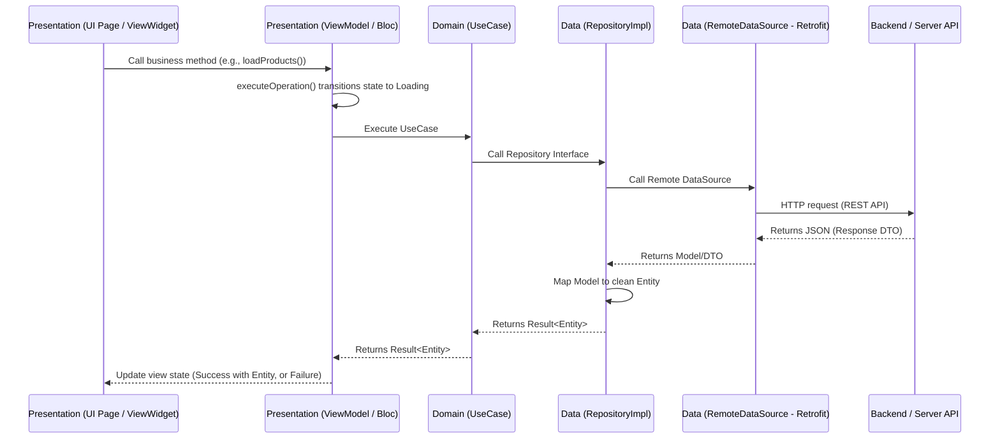

# 🔄 Skill: Implement Domain & Data Flow (Implement Domain & Data Flow)

Use this skill when requested to: "create a new business flow/API call to display data on the UI", "integrate a new API endpoint", etc.

---

## 🧭 Layer rules you must not break

- **Domain is the centre and depends on nothing.** `domain_core` has **zero** workspace
  dependencies and no `flutter` entry in its pubspec; `domain_auth` / `domain_language`
  depend only on `domain_core`. Never add `flutter`, `dio`, `retrofit`, `drift` or a `core_*`
  package to a domain pubspec.
- `AppFailure` lives in **`domain_core`** (`packages/domain/core/lib/src/failures/`). It is
  part of the `Result` contract. `core_common` keeps a re-export shim so existing
  `package:core_common/core_common.dart` imports still resolve it, but prefer importing
  `package:domain_core/domain_core.dart` in new code.
- **DataSources return Models**, never Entities — and never a type generated by Drift or
  Retrofit's response wrapper. Mapping to Entities happens in the RepositoryImpl.
- Constants for a package live in its own `lib/src/utils/` — API paths included
  (`packages/data/auth/lib/src/utils/auth_api_constants.dart`), never in `core_common`.

---

## 📋 Data Flow Overview



---

## 📋 Detailed Steps

### Step 1: Define the API Response DTO in the `Data` Layer
Create the DTO class to deserialize JSON from the server under `packages/data/<module>/lib/src/models/`:
```dart
import 'package:data_core/data_core.dart';
import 'package:freezed_annotation/freezed_annotation.dart';

part 'product_model.freezed.dart';
part 'product_model.g.dart';

@freezed
abstract class ProductModel with _$ProductModel implements BaseModel<ProductEntity> {
  const ProductModel._();

  const factory ProductModel({
    @JsonKey(name: 'id') required int id,
    @JsonKey(name: 'name') required String name,
    @JsonKey(name: 'price') required double price,
  }) = _ProductModel;

  factory ProductModel.fromJson(Map<String, dynamic> json) =>
      _$ProductModelFromJson(json);

  @override
  ProductEntity toEntity() {
    return ProductEntity(id: id, name: name, price: price);
  }
}
```

> [!NOTE]
> For a **database-backed** source the model wraps the Drift row instead of JSON — see
> `packages/data/core/lib/src/models/cache_entry_model.dart`, which exposes
> `CacheEntryModel.fromRow(CacheEntry)` so Drift's generated class never leaves the package.

### Step 2: Configure Retrofit API Service
Define the API endpoint inside the Remote DataSource under `packages/data/<module>/lib/src/data_sources/remote/`, taking the path from the package's own constants file:
```dart
@POST(ProductApiConstants.PRODUCTS)
Future<BaseEntity<List<ProductModel>>> getProducts();
```

### Step 3: Define the Clean Entity in the `Domain` Layer
Create the pure business object representation under `packages/domain/<module>/lib/src/entities/`:
```dart
import 'package:freezed_annotation/freezed_annotation.dart';

part 'product_entity.freezed.dart';

@freezed
abstract class ProductEntity with _$ProductEntity {
  const ProductEntity._();

  const factory ProductEntity({
    required int id,
    required String name,
    required double price,
  }) = _ProductEntity;
}
```

### Step 4: Declare the Repository Interface in the `Domain` Layer
Define the contract under `packages/domain/<module>/lib/src/repositories/i_<module>_repository.dart`:
```dart
import 'package:domain_core/domain_core.dart';
import '../entities/product_entity.dart';

abstract class IProductRepository {
  Future<Result<List<ProductEntity>>> getProducts();
}
```

### Step 5: Implement the Repository in the `Data` Layer (RepositoryImpl)
Extend `IBaseRepository` from `data_core` so exceptions become `AppFailure` automatically:
```dart
import 'package:data_core/data_core.dart';
import 'package:domain_core/domain_core.dart';
import 'package:domain_product/domain_product.dart';
import 'package:injectable/injectable.dart';

import '../data_sources/remote/product_remote_data_source.dart';
import '../models/product_model.dart';

@LazySingleton(as: IProductRepository)
class ProductRepositoryImpl extends IBaseRepository implements IProductRepository {
  ProductRepositoryImpl(this._remoteDataSource);

  final ProductRemoteDataSource _remoteDataSource;

  @override
  Future<Result<List<ProductEntity>>> getProducts() async {
    return execute<List<ProductModel>, List<ProductEntity>>(
      () => _remoteDataSource.getProducts(),
      mapper: (models) => models.map((m) => m.toEntity()).toList(),
    );
  }
}
```

Use `execute()` for async work and `executeSync()` for synchronous work. Errors are converted
by `ErrorHandler.handleError(e)` — **never** call `AppFailure.fromException()` (it does not
exist) and never let an exception escape the Data layer.

> [!WARNING]
> **`ErrorHandler` has no Firebase branch.** `packages/core/common/lib/src/error/error_handler.dart`
> recognises `AppException`, `DioException`, `SocketException`, `HttpException` and
> `FormatException`; everything else — including `FirebaseException`,
> `FirebaseAuthException` and `PlatformException` — falls through to:
> ```dart
> return ServerFailure(
>   message: kDebugMode ? error.toString() : 'Unknown error occurred',
>   code: 9999,
> );
> ```
> So in a release build every Firebase error surfaces as *"Unknown error occurred"*, and any
> UI branching on specific codes is unreachable. If your flow uses Firebase, add the branch
> or map the error inside your repository before it reaches `ErrorHandler`.

### Step 6: Define the UseCase in the `Domain` Layer
Extend `BaseUseCase<RType, Params>` (`FutureOr<Result<RType>> call(Params params)`). Use
`NoParams` when the use case takes no input:
```dart
import 'package:domain_core/domain_core.dart';
import 'package:injectable/injectable.dart';

import '../entities/product_entity.dart';
import '../repositories/i_product_repository.dart';

@injectable
class GetProductsUseCase extends BaseUseCase<List<ProductEntity>, NoParams> {
  GetProductsUseCase(this._repository);

  final IProductRepository _repository;

  @override
  Future<Result<List<ProductEntity>>> call(NoParams params) {
    return _repository.getProducts();
  }
}
```

### Step 7: Consume it in the Presentation layer
- Provider branch → `executeOperation(OperationConfig(operation: () => _useCase(const NoParams())))`, see `implement_provider_ui`.
- BLoC branch → unwrap `Result` by hand in the handler, see `implement_bloc_ui`.

### Step 8: Run Code Generation & Regenerate Barrel Files
```bash
dart tools/barrel_generator/generate.dart packages/domain/<module>/lib
dart tools/barrel_generator/generate.dart packages/data/<module>/lib
dart run build_runner build -d --workspace
```

Then declare the new packages explicitly in the consuming `pubspec.yaml` files — Pub
Workspaces will happily compile an undeclared import. Verify with
`dart tools/unused_checker/check_unused_packages.dart`.

---

## 📌 Reference implementation caveat

`data_auth` is the shipped sample, but read it carefully before copying: `AuthRepositoryImpl`
talks to the **Firebase SDK directly** and does *not* go through `AuthRemoteDataSource`. That
Retrofit data source is kept as a REST reference and is not wired into the live flow. Follow
the layering described above rather than that file's shape.

---

## 🔗 Related

- `docs/{en,vi}/guides/02_new_domain_data.md` — long-form walkthrough
- `docs/{en,vi}/architecture/03_domain.md` and `04_data.md`
- `implement_package_storage` — key-value persistence; `docs/{en,vi}/guides/07_database.md` — Drift tables
