🌍 *Choose Language:* [English](README.md) | [Tiếng Việt](README.vi.md)

# 🏛️ Monorepo System Technical Manual (Master Technical Manual)
## 🌟 Codebase Provider Workspace Project — CaoGiaHieu-dev

Welcome to the core technical documentation of the **Codebase Provider Monorepo**! This is a large-scale, highly sustainable, and modular industrial Flutter application architecture. The system is designed based on the **Micro-packages Monorepo** model, strictly combining **Clean Architecture**, **SOLID** principles, and supporting multi-state management systems (**MVVM + Provider** and **BLoC**).

This project uses Dart's native **Pub Workspaces**, allowing for dependency optimization, feature independence, and automated CI/CD right at the project root.

> **Template disclaimer:** Feature / domain / data packages shipped in this repo (Auth, Home, Settings, Onboarding, Splash, Dashboard) are **sample reference code** that demonstrate Clean Architecture wiring. Treat them as patterns to copy or delete when building a real product — not as production business logic. Agent rules live in [`.agents/AGENTS.md`](.agents/AGENTS.md).

---

## 🗺️ 1. System Architecture Map (Workspace C4 Model)

The layer decomposition in the Monorepo is strictly organized from Core (Infrastructure) ➔ Domain (Core Business) ➔ Data (Integration Implementation) ➔ Features (Feature UI/Screens):

```mermaid
graph TD
    classDef core fill:#f9f2f4,stroke:#d0a9b5,stroke-width:2px,color:#333;
    classDef feature fill:#eef7fa,stroke:#a6c8df,stroke-width:2px,color:#333;
    classDef domain fill:#f4faee,stroke:#b5d4a6,stroke-width:2px,color:#333;
    classDef data fill:#fff3e6,stroke:#f5cb99,stroke-width:2px,color:#333;
    classDef app fill:#f0f0f0,stroke:#cccccc,stroke-width:2px,color:#333;

    App["🚀 Apps (apps/mobile/, apps/admin/)<br/>Each composes its own set of modules"]:::app

    subgraph FeatureLayer ["🎨 Feature Presentation Layer (modules/*/feature)"]
        direction LR
        FeatSplash["splash"]:::feature
        FeatAuth["auth"]:::feature
        FeatDash["dashboard"]:::feature
    end

    subgraph DataLayer ["🔌 Data Layer (platform/data_core + modules/*/data)"]
        direction LR
        DataCore["data_core"]:::data
        DataAuth["data_auth"]:::data
        DataCache["data_cache"]:::data
    end

    subgraph DomainLayer ["⚙️ Domain Layer (platform/domain_core + modules/*/domain)"]
        direction LR
        DomCore["domain_core"]:::domain
        DomAuth["domain_auth"]:::domain
        DomCache["domain_cache"]:::domain
    end

    subgraph CoreLayer ["🛠️ Core Infrastructure Layer (platform/*)"]
        direction LR
        CoreKern["platform_kernel"]:::core
        CoreShell["platform_app_shell"]:::core
        CoreUI["core_base_ui"]:::core
        CoreCom["core_common"]:::core
        CoreNet["core_network"]:::core
        CoreStore["core_storage"]:::core
        CoreDB["core_database"]:::core
        CoreDI["core_di"]:::core
        CoreKit["core_ui_kit"]:::core
        CoreResp["core_responsive"]:::core
        CoreNotif["core_notifications"]:::core
        CoreProv["provider_state_management"]:::core
        CoreBloc["bloc_state_management"]:::core
    end

    %% Cross-layer Relationships
    App -->|"Imports & Initializes"| FeatureLayer
    App -->|"Imports & Initializes"| DataLayer
    App -->|"Imports & Initializes"| DomainLayer
    App -->|"Imports & Initializes"| CoreLayer

    FeatureLayer -->|"Triggers UseCases & Entities"| DomainLayer
    DataLayer -->|"Implements Repository Contracts"| DomainLayer

    FeatureLayer -.->|"Uses Tokens/Widgets/DI"| CoreLayer
    DataLayer -.->|"Uses API/DB/Cache mechanisms"| CoreLayer

    %% Domain sits at the centre and depends on NOTHING.
    %% Core may depend on Domain — never the reverse.
    CoreKern -.->|"ErrorHandler produces AppFailure"| DomCore
    CoreProv -.->|"Uses Result / AppFailure"| DomCore
    CoreBloc -.->|"Uses AppFailure in BlocViewState"| DomCore
```



> [!IMPORTANT]
> **Domain depends on nothing.** `domain_core` declares **zero** workspace dependencies and no
> domain package declares the Flutter SDK — `AppFailure` lives in `domain_core` alongside
> `Result<T>`. Core may depend on Domain — Domain is the innermost ring, so that direction is
> correct. Exactly **three** such edges are approved: `platform_kernel → domain_core`,
> `provider_state_management → domain_core`
> `bloc_state_management → domain_core`. They are hard-coded in
> `tools/arch_check/check.dart` and printed on every run, each with its reason; a fourth fails the
> build. See [`reference/01_rules.md`](docs/en/reference/01_rules.md).

---

## 📂 2. Detailed Folder Structure (Folder Tree)

Below is the complete physical organization structure of the Workspace:

```text
/ (Workspace Root)
├── .github/                       # Continuous Integration workflows (CI Workflows)
│   └── workflows/
│       └── fastlane.yml           # CI Github Action running Fastlane automatically
├── apps/                          # One directory per app — the composition roots
│   ├── admin/                     # Second app: auth + settings only — see apps/admin/README.md
│   └── mobile/
│       ├── app_manifest.yaml      # Which modules this app composes, and the DI group order
│       ├── lib/
│       │   ├── main.dart          # One line: runShellApp(configureDependencies: …)
│       │   ├── di/injection.dart  # Generated by composer from the manifest — never hand-edited
│       │   └── firebase/          # This app's FirebaseOptions (options files git-ignored)
│       ├── android/  ios/         # Native projects
│       ├── fastlane/              # Release lanes
│       └── pubspec.yaml           # Path deps between composer:managed markers are generated
├── platform/                      # Infra team's ground — every module may depend on it
│   ├── app_shell/                 # platform_app_shell: boot scope, router, material wrapper, storage adapters — shared by every app
│   ├── kernel/                    # platform_kernel: getIt helpers, ErrorHandler, pure-Dart utils
│   ├── base_ui/                   # Theme, LanguageProvider, design tokens & l10n (zero widgets)
│   ├── bloc_state_management/     # BaseBloc, BaseCubit, BlocViewState<T>
│   ├── common/                    # AppConfig, AppInitializer, Flutter-bound helpers
│   ├── database/                  # Drift mechanism: IDatabaseHandle, IDatabaseMigration, opener
│   ├── di/                        # DI Hub — every cross-module contract lives here
│   ├── network/                   # Dio + Retrofit factory, interceptor chain, SSL pinning
│   ├── notifications/             # Push Notification management module
│   ├── provider_state_management/ # BaseProvider, executeOperation, ViewStateModel
│   ├── responsive/                # Design-size scaling bound to BuildContext
│   ├── storage/                   # StorageManager + StorageValue<T> (defines NO keys)
│   ├── ui_kit/                    # core_ui_kit — reusable widgets every module may use
│   ├── domain_core/               # Result<T>, AppFailure, BaseEntity, BaseUseCase
│   └── data_core/                 # IBaseRepository, BaseModel, request models
├── modules/                       # One vertical slice per bounded context, one per team
│   ├── auth/                      # Sample: the full three-layer slice
│   │   ├── domain/                # Entities, UseCases, Repository interfaces — pure Dart
│   │   ├── data/                  # Models, DataSources, RepositoryImpl
│   │   └── feature/               # UI + Provider, login only
│   ├── cache/                     # Sample: a package-owned Drift database (domain + data, no UI)
│   ├── home/feature/              # Sample: BLoC, private Freezed events, a nav destination
│   ├── settings/feature/          # Sample: consuming another module's contract
│   ├── dashboard/feature/         # Sample: shell chrome only (bottom-bar host)
│   ├── onboarding/feature/        # Sample: IAppEntryLocation, the cold-start location
│   └── splash/feature/            # Sample: IAppSplashScreen, shown before the router exists
├── tools/                         # Command-line toolset for developers
│   ├── android_compliance/        # 16KB Page Size compatibility check (Android 15+)
│   ├── barrel_generator/          # Script to auto-generate barrel files for packages
│   ├── code_review/               # Gemini AI integrated automated source code review tool
│   ├── firebase/                  # Automated Firebase environment configuration
│   ├── module_generator/          # CLI to generate new Feature/Domain/Data/Core packages
│   ├── theme_generator/           # Auto-generate Splash Screen & App Icons
│   ├── unused_checker/            # Analyze & clean unused files, assets, translations
│   ├── workspace_setup/           # Workspace setup script (pub get, build_runner, l10n)
│   ├── dependency_sync.dart       # Sync library versions from centralized catalog
│   └── check_outdated.dart        # Check for outdated libraries on pub.dev
├── pubspec.yaml                   # Pub Workspace configuration (workspace: [...])
├── pubspec_dependencies.yaml      # Single source of truth for library versions (Version Catalog)
└── README.md                      # This Master Technical Manual
```

> [!NOTE]
> **Every package owns a `utils/` folder** holding *its own* constants — storage keys, route
> paths, timeouts. Nothing domain-specific belongs in `core_common`. The single approved
> exception is the design-token set under `core_base_ui/src/styles/`, which stays put because it
> is the public surface of the design system.

---

## 🛠️ 3. Project Toolset

All tools can be run from the root directory. 

1.  **Module Generator (`tools/module_generator/`)**:
    ```bash
    # Create Feature package 'profile' using Provider:
    dart tools/module_generator/generate.dart 1 profile "" 1
    # Create Domain micro-package 'payment':
    dart tools/module_generator/generate.dart 2 payment
    # Create Data micro-package 'payment':
    dart tools/module_generator/generate.dart 3 payment
    ```
2.  **Dependency Sync (`tools/dependency_sync.dart`)**:
    ```bash
    dart tools/dependency_sync.dart          # Sync version
    dart tools/dependency_sync.dart --check   # Check only
    ```
3.  **Check Outdated (`tools/check_outdated.dart`)**:
    ```bash
    dart tools/check_outdated.dart   # Check outdated libraries on pub.dev
    ```
4.  **Barrel Generator (`tools/barrel_generator/`)**:
    ```bash
    dart tools/barrel_generator/generate.dart modules/profile/feature/lib
    ```
5.  **Workspace Setup (`tools/workspace_setup/`)**:
    ```bash
    dart tools/workspace_setup/configure.dart  # cross-platform
    ```
6.  **Code Review AI (`tools/code_review/`)**:
    ```bash
    dart tools/code_review/code_review.dart --all
    ```
7.  **Unused Checker (`tools/unused_checker/`)**:
    ```bash
    dart tools/unused_checker/check_script.dart
    ```
8.  **Theme & Firebase**:
    ```bash
    dart tools/theme_generator/theme_setting.dart --app mobile
    dart tools/firebase/firebase_config.dart --app mobile
    ```

---

## 🏛️ 4. The Golden Rules of Clean Architecture & SOLID

### Separation of Concerns
1. **Domain Layer (`modules/*/domain`)**:
   - **Pure Dart, enforced by the package graph** — not merely by convention. `domain_core` has
     **zero** workspace dependencies and no domain package declares the Flutter SDK.
   - Do not import `flutter/material.dart`, `dio`, `retrofit`, or any UI/Network library.
   - Defines `Entities`, `UseCases`, `Repository Interfaces`, `Result<T>` and `AppFailure`.
2. **Data Layer (`modules/*/data`)**:
   - Implements contracts from the `domain`.
   - Uses `core_network` (API), `core_storage` (key-value) and `core_database` (SQL) as *mechanisms*
     — each data package declares its own storage keys and its own database.
   - DataSources return **Models**, never Entities, and never expose Drift-generated row classes.
   - Transforms Models → Entities via the `.toEntity()` function.
3. **Presentation Layer (`modules/*/feature`)**:
   - Renders UI and manages state (Provider or BLoC).
   - **Only communicates with Domain through UseCases**, absolutely no direct API calls.
   - **FORBIDDEN to depend on the `data` layer** or on any other feature package — no exception; shared widgets come from the core package `core_ui_kit`.
4. **Core Layer (`platform/*`)**:
   - Supplies mechanism only. **FORBIDDEN to depend on any `feature_*` or `data_*` package.**
   - May depend on `domain_*` (Domain is the centre): `platform_kernel → domain_core`,
     `provider_state_management → domain_core`, `bloc_state_management → domain_core`.

> [!IMPORTANT]
> **Any feature can be deleted and the app still boots.** Everything the shell consumes at runtime
> resolves through a `core_di` contract behind `getItOrNull` / `getAllOrEmpty` with a safe fallback.
> `getAll<T>()` **throws** when nothing is registered — always prefer `getAllOrEmpty<T>()`.

### Dependency Inversion Principle (DIP)
Features communicate across each other entirely through intermediate interfaces in `core_di`:

```text
[Feature Auth]
   │
   ▼ (Requests redirection to Home)
[Interface HomeNavigator (core_di)]  ◄── (Contract definition)
   ▲
   │ (Concrete implementation in the owning feature)
[HomeNavigatorImpl (modules/home/feature/lib/src/routing/)]
```

Cross-feature UI actions (e.g. logout) use the same DIP shape with `I*ActionHandler` in `core_di` and `*ActionHandlerImpl` inside the owning feature (`feature_auth/handlers/`).

---

## 💉 5. Automated DI Registration Mechanism (Micro-packages DI)

Each micro-package is responsible for its own DI configuration using `injectable`:

### Child Package Configuration:
```dart
import 'package:injectable/injectable.dart';

@InjectableInit.microPackage()
void initMicroPackage() {}
```

### Assembly at Host App (`apps/mobile/lib/di/injection.dart`):
The lists are **generated** from `apps/mobile/app_manifest.yaml` by
`dart tools/composer/composer.dart sync --app mobile` — edit the manifest, never this file:

```dart
// composer:managed:modules — generated from app_manifest.yaml
const _coreModules = [
  ExternalModule(CoreCommonPackageModule),
  ExternalModule(CoreNetworkPackageModule),
  ExternalModule(CoreStoragePackageModule),
  // Registers nothing: `core_database` is mechanism only and owns no database.
  ExternalModule(CoreDatabasePackageModule),
  ExternalModule(CoreDiPackageModule),
];

// After the app's own registrations — PushNotificationService (an eager
// singleton) injects the FirebaseOptions this app registers in
// `lib/firebase/firebase_module.dart`.
const _notificationsModules = [
  ExternalModule(CoreNotificationsPackageModule),
];

// platform_app_shell: storage adapters, NetworkConfig, router, providers.
const _shellModules = [
  ExternalModule(PlatformAppShellPackageModule),
];

// CoreBaseUiPackageModule injects ILanguageStorage / IThemeStorage,
// registered by the shell group above.
const _uiModules = [
  ExternalModule(CoreBaseUiPackageModule),
];

const _domainModules = [
  ExternalModule(DomainCorePackageModule),
  ExternalModule(DomainAuthPackageModule),
  ExternalModule(DomainCachePackageModule),
];

const _dataModules = [
  ExternalModule(DataCorePackageModule),
  ExternalModule(DataAuthPackageModule),
  ExternalModule(DataCachePackageModule),
];

// The app's ONLY intentional hard reference to feature packages —
// as the composition root it must name what it composes.
const _featureModules = [
  ExternalModule(FeatureAuthPackageModule),
  ExternalModule(FeatureHomePackageModule),
  ExternalModule(FeatureSettingsPackageModule),
  ExternalModule(FeatureOnboardingPackageModule),
  ExternalModule(FeatureSplashPackageModule),
  ExternalModule(FeatureDashboardPackageModule),
];

const _otherModules = [
  ExternalModule(ProviderStateManagementPackageModule),
  ExternalModule(BlocStateManagementPackageModule),
];

const _externalModulesBefore = [..._coreModules];
const _externalModulesAfter = [
    ..._notificationsModules,
    ..._shellModules,
    ..._uiModules,
    ..._domainModules,
    ..._dataModules,
    ..._featureModules,
    ..._otherModules,
];
// composer:end:modules

@InjectableInit(
  externalPackageModulesBefore: _externalModulesBefore,
  externalPackageModulesAfter: _externalModulesAfter,
)
Future<void> configureDependencies({String? environment}) async {
  getIt.enableRegisteringMultipleInstancesOfOneType();
  final env = environment ?? AppConfig.appFlavor.toValue();
  await getIt.init(environment: env);
}
```

### Two ordering rules that bite

> [!CAUTION]
> **An eager `@Singleton` must not depend on a type registered by a later module** — it throws
> *"not registered"* at boot. `flutter analyze` cannot catch this; verify against the generated
> `apps/mobile/lib/di/injection.config.dart`. Use `@LazySingleton` when the dependency lands later.
>
> **GetIt does not resolve supertypes.** Registering `Impl as InterfaceA` leaves
> `getIt<InterfaceB>()` unresolvable even when `InterfaceA implements InterfaceB` — bind the second
> interface explicitly through an `@module` (see `platform/app_shell/lib/di/network_binding_module.dart`).

---

## 🚦 6. Decoupled Type-Safe Routing System

We use `go_router` combined with `go_router_builder` to ensure type-safe routing and maximum source code fragmentation.

### Route Ownership
Each Feature Package owns its own routing structure and files:
- `SplashPage` is hosted by `MainScope` during boot and is **not** registered in GoRouter.
- The `feature_auth` package owns the route group `AuthShellRoute`, `LoginRoute`.
- Routes inherit from `GoRouteDataCustom` to inherently possess automatic screen tracking and smooth cross-platform transitions.

### Runtime Assembly (Assembly)
`platform/app_shell/lib/presentation/navigation/app_router.dart` **does not** hardcode `$onboardingRoute` / `$homeRoute` lists. It collects:

- `getAllOrEmpty<IFeatureRouteModule>()` → top-level stack routes (auth, onboarding, …) — **no `order`**
- `getAllOrEmpty<INavDestinationModule>()` sorted by `order` → `StatefulShellBranch` list
- `getItOrNull<DashboardRouteModule>()` → dashboard chrome (optional)
- `getItOrNull<IAppEntryLocation>()?.path` → `initialLocation` (else first tab / `/`)
- `getItOrNull<IAuthRefreshListenable>()` → `refreshListenable`

Note the last one: the router depends on a **`core_di` contract**, not on `AuthProvider`. The shell
holds no feature type at all, which is what makes `feature_auth` removable.

### Removing a feature

1. Delete its line from `modules:` in every `apps/<id>/app_manifest.yaml` that composes it.
2. `dart tools/composer/composer.dart sync` — regenerates `injection.dart`, the app's path
   dependencies and the root `workspace:` list, all between `composer:managed` markers.
3. `flutter pub get && dart run build_runner build -d --workspace`.

Or let `dart tools/sample_cleanup/remove_sample.dart <bundle>` do it, dry-run first. No other file
needs editing — every runtime lookup falls back safely. See
[`guides/04_routing.md`](docs/en/guides/04_routing.md).

---

## 🚀 7. CI/CD Architecture Running From Workspace Root

The CI/CD system utilizes **Fastlane** with the **Workspace-Root Delegation** architecture:

### Android APK Build Command from Root:
```powershell
fastlane android build flavor:dev build_type:apk distribute_store:false distribute_firebase:false skip_setup:true change_log:test build_number:1 flutter_version:stable version:1.0.0
```

---

## 🛠️ 8. DevTools CLI Policy

1. **Forbidden to Use `print` Command**: All CLI Tools in `tools/` must use `stdout.writeln(...)` and `stderr.writeln(...)`.
2. **Forbidden to Disable Linter Warnings**: Do not use `// ignore_for_file: avoid_print`.

---

## 🚀 Initialization & Local Development Guide

### 1. Environment Preparation
- **Flutter**: >= 3.47.4 (Stable)
- **Dart SDK**: >= 3.13.3
- **JDK**: 17
- **Ruby**: >= 3.0 (for Fastlane)

### 2. Install All Dependencies
```bash
flutter pub get
```
*Thanks to Pub Workspaces, all dependencies of the Host App and all sub-packages are fetched concurrently and create a single `pubspec.lock`.*

### 3. Generate Firebase Options (required — the repo will not compile without it)
`apps/mobile/lib/firebase/firebase_module.dart` imports all three
`firebase_options_{dev,staging,prod}.dart` files unconditionally, and they are git-ignored. Run
`dart tools/firebase/firebase_config.dart --app mobile` before the first build — see
[`getting-started/01_setup.md`](docs/en/getting-started/01_setup.md).

### 4. Trigger Bulk Code Generation
```bash
dart run build_runner build -d --workspace
```

### 5. Run Application
```bash
flutter run -t apps/mobile/lib/main.dart --flavor dev --dart-define-from-file=apps/mobile/env.dev
```

### 6. Build an APK
```bash
cd apps/mobile   # required — building from the workspace root fails with a misleading Gradle error
flutter build apk --flavor dev --debug --dart-define-from-file=env.dev
```

> [!WARNING]
> `flutter analyze` **excludes generated files** (`**.freezed.dart`, `**.g.dart`, `**.config.dart`,
> `**.module.dart` — see `analysis_options.yaml`). A clean analyze does **not** prove the app
> compiles. Always run a real build before trusting a large refactor.

---

## 📚 Documentation Hub

**Start here → [`docs/en/README.md`](docs/en/README.md)** *(Vietnamese: [`docs/vi/README.md`](docs/vi/README.md))*

The documentation is organised by **what you are trying to do**, not by layer.

### 🚀 Getting Started — *new to the repo? read these in order*
| Doc | Answers |
| :--- | :--- |
| [01. Setup](docs/en/getting-started/01_setup.md) | What do I install, and how do I get the app running? |
| [02. Project Tour](docs/en/getting-started/02_project_tour.md) | What is every package for, and where do I change X? |
| [03. Daily Workflow](docs/en/getting-started/03_daily_workflow.md) | Which commands do I run, and when? |

### 🏛️ Architecture — *understand the system*
| Doc | Covers |
| :--- | :--- |
| [01. Overview](docs/en/architecture/01_overview.md) | Clean Architecture, the dependency rule, key trade-offs |
| [02. Core Layer](docs/en/architecture/02_core.md) | All nine `core_*` packages and what does **not** belong in them |
| [03. Domain Layer](docs/en/architecture/03_domain.md) | Pure Dart mandate, `Result<T>`, entities, use cases |
| [04. Data Layer](docs/en/architecture/04_data.md) | Models, data sources, repositories, error conversion |
| [05. Feature Layer](docs/en/architecture/05_features.md) | Feature boundaries, structure, controller lifecycle |
| [06. App Shell](docs/en/architecture/06_app_shell.md) | Boot lifecycle, DI assembly, dynamic router |

### 🧭 Guides — *how to actually do it*
| Doc | Task |
| :--- | :--- |
| [01. New Feature](docs/en/guides/01_new_feature.md) | Scaffold a feature end to end |
| [02. New Domain + Data](docs/en/guides/02_new_domain_data.md) | Add a business capability |
| [03. State Management](docs/en/guides/03_state_management.md) | Choose and use Provider or BLoC |
| [04. Routing](docs/en/guides/04_routing.md) | Register routes, navigate across features |
| [05. Dependency Injection](docs/en/guides/05_di.md) | Scopes, module order, common traps |
| [06. Storage](docs/en/guides/06_storage.md) | Persist a value your package owns |
| [07. Database](docs/en/guides/07_database.md) | Tables, DAOs, migrations (Drift) |
| [08. Networking](docs/en/guides/08_networking.md) | API client, interceptors, token refresh, SSL pinning |
| [09. Localization & Theming](docs/en/guides/09_localization_theming.md) | Translations, design tokens, responsive sizing |
| [10. Cross-Feature Communication](docs/en/guides/10_cross_feature.md) | The six sanctioned models |

### 📐 Reference — *look it up*
| Doc | Contains |
| :--- | :--- |
| [01. Rules](docs/en/reference/01_rules.md) | Every architectural rule with its rationale |
| [02. Naming](docs/en/reference/02_naming.md) | File/class suffixes, folder conventions |
| [03. Tooling](docs/en/reference/03_tooling.md) | Every script in `tools/` |
| [04. Review Checklist](docs/en/reference/04_review_checklist.md) | PR gate |

### 🚢 Operations — *ship it*
| Doc | Contains |
| :--- | :--- |
| [01. CI/CD](docs/en/operations/01_cicd.md) | GitHub Actions & Azure pipelines, required secrets |
| [02. Fastlane & Release](docs/en/operations/02_fastlane_release.md) | Lanes, signing, store distribution |

> AI-agent rules live separately in [`.agents/AGENTS.md`](.agents/AGENTS.md) and
> [`.agents/skills/`](.agents/skills/).

---
*Intellectual property rights belong to CaoGiaHieu-dev. All rights reserved.*
