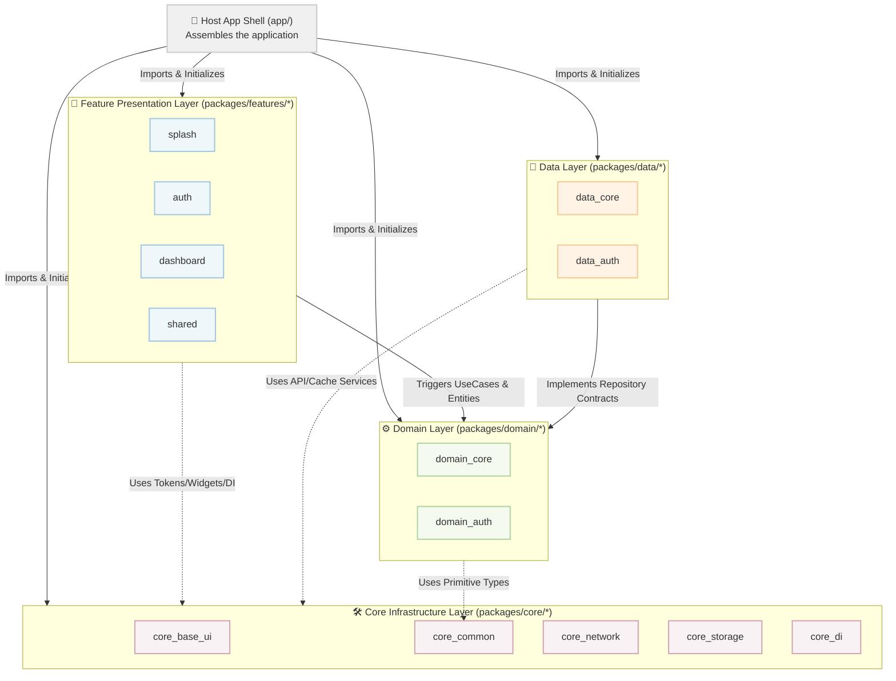

🌍 *Choose Language:* [English](README.md) | [Tiếng Việt](README.vi.md)

# 🏛️ Monorepo System Technical Manual (Master Technical Manual)
## 🌟 Codebase Provider Workspace Project — CaoGiaHieu-dev

Welcome to the core technical documentation of the **Codebase Provider Monorepo**! This is a large-scale, highly sustainable, and modular industrial Flutter application architecture. The system is designed based on the **Micro-packages Monorepo** model, strictly combining **Clean Architecture**, **SOLID** principles, and supporting multi-state management systems (**MVVM + Provider** and **BLoC**).

This project uses Dart's native **Pub Workspaces**, allowing for dependency optimization, feature independence, and automated CI/CD right at the project root.

> **Template disclaimer:** Feature / domain / data packages shipped in this repo (Auth, Home, Settings, Onboarding, Splash, Dashboard, Language, etc.) are **sample reference code** that demonstrate Clean Architecture wiring. Treat them as patterns to copy or delete when building a real product — not as production business logic. Agent rules live in [`.agents/AGENTS.md`](.agents/AGENTS.md).

---

## 🗺️ 1. System Architecture Map (Workspace C4 Model)

The layer decomposition in the Monorepo is strictly organized from Core (Infrastructure) ➔ Domain (Core Business) ➔ Data (Integration Implementation) ➔ Features (Feature UI/Screens):



---

## 📂 2. Detailed Folder Structure (Folder Tree)

Below is the complete physical organization structure of the Workspace:

```text
/ (Workspace Root)
├── .github/                       # Continuous Integration workflows (CI Workflows)
│   └── workflows/
│       └── fastlane.yml           # CI Github Action running Fastlane automatically
├── app/                           # Host Application (Main App Shell)
│   ├── android/                   # Native Android project
│   ├── ios/                       # Native iOS project
│   ├── lib/
│   │   ├── config/                # Environment configurations (Flavors dev, staging, prod)
│   │   ├── di/                    # Central DI registration point (injection.dart)
│   │   ├── presentation/
│   │   │   ├── navigation/        # GoRouter assembly (app_router.dart) + shell widgets
│   │   │   ├── providers/         # App-shell globals (AppProvider, DeeplinkProvider)
│   │   │   └── widgets/           # NavigatorWrapperWidget, UndefineRouteWidget
│   │   ├── main.dart              # Main app entrypoint
│   │   └── main_scope.dart        # Boot Lifecycle Management (Splash → RootApp)
│   └── pubspec.yaml               # Host App config (links all sub-packages)
├── packages/                      # Contains Micro-packages
│   ├── core/                      # Shared infrastructure and utilities (Core Packages)
│   │   ├── base_ui/               # Theme, LanguageProvider, global assets & l10n (no widgets)
│   │   ├── bloc_state_management/ # BaseCubit, BaseBloc, and ViewState for BLoC
│   │   ├── common/                # Constants, Enums, AppFailure, ErrorHandler
│   │   ├── di/                    # DI Hub (Navigator / ActionHandler interfaces)
│   │   ├── network/               # API Connection Client (Dio + custom Retrofit factory)
│   │   ├── notifications/         # Push Notification management module
│   │   ├── provider_state_management/ # BaseProvider and state management helpers
│   │   └── storage/               # Reactive Secure Storage + Shared Preferences
│   ├── domain/                    # Pure business Micro-packages (Pure Dart)
│   │   ├── core/                  # Result<T>, BaseEntity, shared types
│   │   ├── auth/                  # Entities, UseCases, Repository interfaces for Auth
│   │   └── language/              # Entities, UseCases for multi-language
│   ├── data/                      # Integration implementation Micro-packages
│   │   ├── core/                  # IBaseRepository, error handling wrapper functions
│   │   ├── auth/                  # Models, DataSources, RepositoryImpl for Auth
│   │   └── language/              # RepositoryImpl for multi-language
│   └── features/                  # Independent feature packages (Feature Packages)
│       ├── splash/                # Splash Feature (sample): Startup loading screen
│       ├── onboarding/            # Onboarding Feature (sample): New user guide
│       ├── auth/                  # Auth Feature (sample): Login, Register, Forgot Password
│       ├── dashboard/             # Dashboard Feature (sample): Shell chrome only (Bottom Tab host)
│       ├── home/                  # Home Feature (sample): Home Tab
│       ├── settings/              # Settings Feature (sample): Settings Tab (separate from Home)
│       └── shared/                # Shared Feature: Shared widgets between features
├── tools/                         # Command-line toolset for developers
│   ├── android_compliance/        # 16KB Page Size compatibility check (Android 15+)
│   ├── barrel_generator/          # Script to auto-generate barrel files for packages
│   ├── code_review/               # Gemini AI integrated automated source code review tool
│   ├── firebase/                  # Automated Firebase environment configuration
│   ├── module_generator/          # CLI to generate new Feature/Domain/Data/Core packages
│   ├── theme_generator/           # Auto-generate Splash Screen & App Icons
│   ├── unused_checker/            # Analyze & clean unused files, assets, translations
│   ├── workspace_setup/           # Workspace setup script (pub get, build_runner, l10n)
│   ├── dependency_sync.dart       # Sync library versions from centralized catalog
│   └── check_outdated.dart        # Check for outdated libraries on pub.dev
├── pubspec.yaml                   # Pub Workspace configuration (workspace: [...])
├── pubspec_dependencies.yaml      # Single source of truth for library versions (Version Catalog)
└── README.md                      # This Master Technical Manual
```

---

## 🛠️ 3. Project Toolset

All tools can be run from the root directory. 

1.  **Module Generator (`tools/module_generator/`)**:
    ```bash
    # Create Feature package 'profile' using Provider:
    dart tools/module_generator/generate.dart 1 profile "" 1
    # Create Domain micro-package 'payment':
    dart tools/module_generator/generate.dart 2 payment
    # Create Data micro-package 'payment':
    dart tools/module_generator/generate.dart 3 payment
    ```
2.  **Dependency Sync (`tools/dependency_sync.dart`)**:
    ```bash
    dart tools/dependency_sync.dart          # Sync version
    dart tools/dependency_sync.dart --check   # Check only
    ```
3.  **Check Outdated (`tools/check_outdated.dart`)**:
    ```bash
    dart tools/check_outdated.dart   # Check outdated libraries on pub.dev
    ```
4.  **Barrel Generator (`tools/barrel_generator/`)**:
    ```bash
    dart tools/barrel_generator/generate.dart packages/features/profile/lib
    ```
5.  **Workspace Setup (`tools/workspace_setup/`)**:
    ```bash
    .\tools\workspace_setup\configure.bat  # Windows
    ./tools/workspace_setup/configure.sh   # macOS/Linux
    ```
6.  **Code Review AI (`tools/code_review/`)**:
    ```bash
    dart tools/code_review/code_review.dart --all
    ```
7.  **Unused Checker (`tools/unused_checker/`)**:
    ```bash
    dart tools/unused_checker/check_script.dart
    ```
8.  **Theme & Firebase**:
    ```bash
    .\tools\theme_generator\theme_setting.bat
    .\tools\firebase\firebase_config.bat
    ```

---

## 🏛️ 4. The Golden Rules of Clean Architecture & SOLID

### Separation of Concerns
1. **Domain Layer (`packages/domain/*`)**:
   - **Pure Dart**: Do not import `flutter/material.dart`, `dio`, `retrofit`, or any UI/Network libraries.
   - Defines `Entities`, `UseCases`, and `Repository Interfaces`.
2. **Data Layer (`packages/data/*`)**:
   - Implements contracts from the `domain`.
   - Connects directly with `core_network` (API) and `core_storage` (Local DB).
   - Transforms DTOs/Models → Entities via the `.toEntity()` function.
3. **Presentation Layer (`packages/features/*`)**:
   - Renders UI and manages state (Provider or BLoC).
   - **Only communicates with Domain through UseCases**, absolutely no direct API calls.
   - **FORBIDDEN to depend on the `data` layer** or other feature packages (except `feature_shared`).

### Dependency Inversion Principle (DIP)
Features communicate across each other entirely through intermediate interfaces in `core_di`:

```text
[Feature Auth]
   │
   ▼ (Requests redirection to Home)
[Interface HomeNavigator (core_di)]  ◄── (Contract definition)
   ▲
   │ (Concrete implementation in the owning feature)
[HomeNavigatorImpl (packages/features/home/lib/src/routing/)]
```

Cross-feature UI actions (e.g. logout) use the same DIP shape with `I*ActionHandler` in `core_di` and `*ActionHandlerImpl` inside the owning feature (`feature_auth/handlers/`).

---

## 💉 5. Automated DI Registration Mechanism (Micro-packages DI)

Each micro-package is responsible for its own DI configuration using `injectable`:

### Child Package Configuration:
```dart
import 'package:injectable/injectable.dart';

@InjectableInit.microPackage()
void initMicroPackage() {}
```

### Assembly at Host App (`app/lib/di/injection.dart`):
```dart
const _coreModules = [
  ExternalModule(CoreCommonPackageModule),
  ExternalModule(CoreNetworkPackageModule),
  ExternalModule(CoreNotificationsPackageModule),
  ExternalModule(CoreStoragePackageModule),
  ExternalModule(CoreDiPackageModule),
];

// CoreBaseUiPackageModule depends on ILanguageStorage / IThemeStorage
// (app-local singletons). Register it in externalPackageModulesAfter.
const _uiModules = [
  ExternalModule(CoreBaseUiPackageModule),
];

const _domainModules = [
  ExternalModule(DomainCorePackageModule),
  ExternalModule(DomainAuthPackageModule),
  ExternalModule(DomainLanguagePackageModule),
];

const _dataModules = [
  ExternalModule(DataCorePackageModule),
  ExternalModule(DataAuthPackageModule),
  ExternalModule(DataLanguagePackageModule),
];

const _featureModules = [
  ExternalModule(FeatureAuthPackageModule),
  ExternalModule(FeatureDashboardPackageModule),
  ExternalModule(FeatureHomePackageModule),
  ExternalModule(FeatureOnboardingPackageModule),
  ExternalModule(FeatureSplashPackageModule),
];

const _otherModules = [
  ExternalModule(ProviderStateManagementPackageModule),
  ExternalModule(BlocStateManagementPackageModule),
];

@InjectableInit(
  externalPackageModulesBefore: [..._coreModules],
  externalPackageModulesAfter: [
    ..._uiModules,
    ..._domainModules,
    ..._dataModules,
    ..._featureModules,
    ..._otherModules,
  ],
)
Future<void> configureDependencies({String? environment}) async {
  getIt.enableRegisteringMultipleInstancesOfOneType();
  final env = environment ?? AppConfig.appFlavor.toValue();
  await getIt.init(environment: env);
}
```

---

## 🚦 6. Decoupled Type-Safe Routing System

We use `go_router` combined with `go_router_builder` to ensure type-safe routing and maximum source code fragmentation.

### Route Ownership
Each Feature Package owns its own routing structure and files:
- `SplashPage` is hosted by `MainScope` during boot and is **not** registered in GoRouter.
- The `feature_auth` package owns the route group `AuthShellRoute`, `LoginRoute`, `RegisterRoute`, `ForgotPasswordRoute`.
- Routes inherit from `GoRouteDataCustom` to inherently possess automatic screen tracking and smooth cross-platform transitions.

### Runtime Assembly (Assembly)
`app/lib/presentation/navigation/app_router.dart` **does not** hardcode `$onboardingRoute` / `$homeShellRoute` lists. It collects:

- `getAllOrEmpty<IFeatureRouteModule>()` → top-level stack routes (auth, onboarding, …) — **no `order`**
- `getAllOrEmpty<IDashboardTabModule>()` sorted by `order` → `StatefulShellBranch` list
- `getItOrNull<DashboardRouteModule>()` → dashboard chrome (optional)
- `getItOrNull<IAppEntryLocation>()?.path` → `initialLocation` (else first tab / `/`)
- `getItOrNull<AuthProvider>()` → `refreshListenable`

Removing a feature = drop its `ExternalModule` + pubspec entry; hot restart. See [docs/en/08_routing.md](docs/en/08_routing.md) § Dashboard.

---

## 🚀 7. CI/CD Architecture Running From Workspace Root

The CI/CD system utilizes **Fastlane** with the **Workspace-Root Delegation** architecture:

### Android APK Build Command from Root:
```powershell
fastlane android build flavor:dev build_type:apk distribute_store:false distribute_firebase:false skip_setup:true change_log:test build_number:1 flutter_version:stable version:1.0.0
```

---

## 🛠️ 8. DevTools CLI Policy

1. **Forbidden to Use `print` Command**: All CLI Tools in `tools/` must use `stdout.writeln(...)` and `stderr.writeln(...)`.
2. **Forbidden to Disable Linter Warnings**: Do not use `// ignore_for_file: avoid_print`.

---

## 🚀 Initialization & Local Development Guide

### 1. Environment Preparation
- **Flutter**: >= 3.47.0 (Stable)
- **Dart SDK**: >= 3.13.0
- **Ruby**: >= 3.0 (for Fastlane)

### 2. Install All Dependencies
```bash
flutter pub get
```
*Thanks to Pub Workspaces, all dependencies of the Host App and all sub-packages are fetched concurrently and create a single `pubspec.lock`.*

### 3. Trigger Bulk Code Generation
```bash
dart run build_runner build -d --workspace
```

### 4. Run Application
```bash
flutter run -t app/lib/main.dart --flavor dev
```

---

## 📚 Supplementary Documentation Hub

*   [📘 00. Overview & Architecture Analysis](docs/en/00_overview.md)
*   [🎨 01. Core Base UI Layer & Theme System](docs/en/01_core_layer.md)
*   [🧬 02. Domain Layer & UseCase Creation Process](docs/en/02_domain_layer.md)
*   [💾 03. Data Layer & Repository Integration](docs/en/03_data_layer.md)
*   [🖥️ 04. MVVM Presentation Layer & State Management](docs/en/04_presentation_layer.md)
*   [🔌 05. Modular Dependency Injection (DI Manual)](docs/en/05_dependency_injection.md)
*   [🌐 06. Networking & Static API Calls](docs/en/06_networking.md)
*   [🛡️ 07. Naming Rules & Clean Code Conventions](docs/en/07_rules_and_conventions.md)
*   [🚦 08. GoRouter Routing & Decoupled Navigation](docs/en/08_routing.md)
*   [📦 09. Shared Component Usage Manual](docs/en/09_commons_and_shared.md)
*   [📝 10. Review Checklist](docs/en/10_review_checklist.md)
*   [🔐 11. Reactive Secure Storage System](docs/en/11_storage_system.md)
*   [🗄️ 14. Local Database System (Drift + Isolate)](docs/en/14_database_system.md)
*   [🚀 12. Advanced Fastlane CI/CD Guide](docs/en/12_fastlane_guide.md)
*   [🛠️ 13. New Module Guide](docs/en/13_new_module_guide.md)

---
*Intellectual property rights belong to CaoGiaHieu-dev. All rights reserved.*
