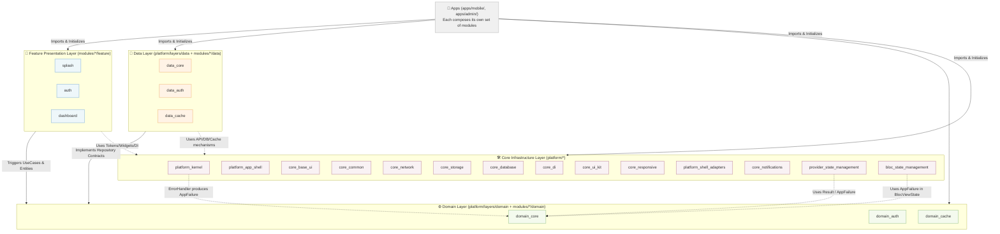

🌍 *Choose Language:* [English](README.md) | [Tiếng Việt](README.vi.md)

# 🏛️ Monorepo System Technical Manual (Master Technical Manual)
## 🌟 Codebase Provider Workspace Project — CaoGiaHieu-dev

Welcome to the core technical documentation of the **Codebase Provider Monorepo**! This is a large-scale, highly sustainable, and modular industrial Flutter application architecture. The system is designed based on the **Micro-packages Monorepo** model, strictly combining **Clean Architecture**, **SOLID** principles, and supporting multi-state management systems (**MVVM + Provider** and **BLoC**).

This project uses Dart's native **Pub Workspaces**, allowing for dependency optimization, feature independence, and automated CI/CD right at the project root.

> **Template disclaimer:** Feature / domain / data packages shipped in this repo (Auth, Cache, Home, Settings, Onboarding, Splash, Dashboard) are **sample reference code** that demonstrate Clean Architecture wiring. Treat them as patterns to copy or delete when building a real product — not as production business logic. Agents start from [`CLAUDE.md`](CLAUDE.md) (Claude Code) or [`.agents/AGENTS.md`](.agents/AGENTS.md) (other tools).

---

## 🗺️ 1. System Architecture Map (Workspace C4 Model)

The layer decomposition in the Monorepo is strictly organized from Core (Infrastructure) ➔ Domain (Core Business) ➔ Data (Integration Implementation) ➔ Features (Feature UI/Screens):


```mermaid
graph TD
    classDef core fill:#f9f2f4,stroke:#d0a9b5,stroke-width:2px,color:#333;
    classDef feature fill:#eef7fa,stroke:#a6c8df,stroke-width:2px,color:#333;
    classDef domain fill:#f4faee,stroke:#b5d4a6,stroke-width:2px,color:#333;
    classDef data fill:#fff3e6,stroke:#f5cb99,stroke-width:2px,color:#333;
    classDef app fill:#f0f0f0,stroke:#cccccc,stroke-width:2px,color:#333;

    App["🚀 Apps (apps/mobile/, apps/admin/)<br/>Each composes its own set of modules"]:::app

    subgraph FeatureLayer ["🎨 Feature Presentation Layer (modules/*/feature)"]
        direction LR
        FeatSplash["splash"]:::feature
        FeatAuth["auth"]:::feature
        FeatDash["dashboard"]:::feature
    end

    subgraph DataLayer ["🔌 Data Layer (platform/layers/data + modules/*/data)"]
        direction LR
        DataCore["data_core"]:::data
        DataAuth["data_auth"]:::data
        DataCache["data_cache"]:::data
    end

    subgraph DomainLayer ["⚙️ Domain Layer (platform/layers/domain + modules/*/domain)"]
        direction LR
        DomCore["domain_core"]:::domain
        DomAuth["domain_auth"]:::domain
        DomCache["domain_cache"]:::domain
    end

    subgraph CoreLayer ["🛠️ Core Infrastructure Layer (platform/*)"]
        direction LR
        CoreKern["platform_kernel"]:::core
        CoreShell["platform_app_shell"]:::core
        CoreUI["core_base_ui"]:::core
        CoreCom["core_common"]:::core
        CoreNet["core_network"]:::core
        CoreStore["core_storage"]:::core
        CoreDB["core_database"]:::core
        CoreDI["core_di"]:::core
        CoreKit["core_ui_kit"]:::core
        CoreResp["core_responsive"]:::core
        CoreAdapt["platform_shell_adapters"]:::core
        CoreNotif["core_notifications"]:::core
        CoreProv["provider_state_management"]:::core
        CoreBloc["bloc_state_management"]:::core
    end

    %% Cross-layer Relationships
    App -->|"Imports & Initializes"| FeatureLayer
    App -->|"Imports & Initializes"| DataLayer
    App -->|"Imports & Initializes"| DomainLayer
    App -->|"Imports & Initializes"| CoreLayer

    FeatureLayer -->|"Triggers UseCases & Entities"| DomainLayer
    DataLayer -->|"Implements Repository Contracts"| DomainLayer

    FeatureLayer -.->|"Uses Tokens/Widgets/DI"| CoreLayer
    DataLayer -.->|"Uses API/DB/Cache mechanisms"| CoreLayer

    %% Domain sits at the centre and depends on NOTHING.
    %% Core may depend on Domain — never the reverse.
    CoreKern -.->|"ErrorHandler produces AppFailure"| DomCore
    CoreProv -.->|"Uses Result / AppFailure"| DomCore
    CoreBloc -.->|"Uses AppFailure in BlocViewState"| DomCore
```

> [!IMPORTANT]
> **Domain depends on nothing.** `domain_core` declares **zero** workspace dependencies and no
> domain package declares the Flutter SDK — `AppFailure` lives in `domain_core` alongside
> `Result<T>`. Core may depend on Domain — Domain is the innermost ring, so that direction is
> correct. Exactly **four** such edges are approved: `platform_kernel → domain_core`,
> `provider_state_management → domain_core`, `bloc_state_management → domain_core` and
> `data_core → domain_core`. They are hard-coded in `tools/arch_check/check.dart` and printed on
> every run, each with its reason; a fifth fails the build (RULE-01). See
> [`reference/01_rules.md`](docs/en/reference/01_rules.md).

---

## 📂 2. Detailed Folder Structure (Folder Tree)

Below is every tracked top-level entry of the Workspace, one line each (gitignored build output,
`.dart_tool/` and IDE state are left out):

```text
/ (Workspace Root)
├── .agents/                       # AGENTS.md — entry point for AI tools other than Claude Code
├── .claude/                       # skills/ — agent task recipes (Claude Code discovers them here)
├── .github/                       # CODEOWNERS, SETUP_GUIDE.md, dependabot.yml, issue forms, PR template, CI workflows
│   └── workflows/
│       ├── pr_quality_check.yml   # PR gates 0–5 (composer, arch_check, analyze, tests, catalog, docs_check), barrel drift, unused audit, debug APK, two generator smoke tests
│       ├── flutter_build.yml      # Manual build & distribute with the Flutter CLI
│       ├── fastlane.yml           # Manual build & distribute through Fastlane
│       ├── code_review.yml        # Gemini AI review on pull requests (advisory)
│       └── README.md              # What each workflow does and the secrets it needs
├── .vscode/                       # launch.json (App Dev/Staging/Prod, Admin Web/Desktop), settings, tasks
├── apps/                          # One directory per app — the composition roots
│   ├── admin/                     # Second app: auth + settings only — see apps/admin/README.md
│   └── mobile/                    # Every sample module — see apps/mobile/README.md
│       ├── app_manifest.yaml      # What the app is (flavors, env, platforms, capabilities) and composes
│       ├── README.md              # Reading path + a generated report of what the app declares
│       ├── lib/
│       │   ├── main.dart          # One call: runShellApp(profile:, hooks:, configureDependencies:)
│       │   ├── app/               # app_profile.dart (generated facts + typed tuning), app_hooks.dart
│       │   ├── di/injection.dart  # Generated by composer from the manifest — never hand-edited
│       │   └── firebase/          # This app's FirebaseOptions (options files git-ignored)
│       ├── android/  ios/         # Native projects — run and build from apps/mobile/
│       ├── test/                  # DI smoke test (checkAppContract per flavor, every factory built), profile and boot tests
│       ├── env.dev  env.stg       # Flavor env files (env.prod: create it yourself)
│       ├── fastlane/              # Release lanes
│       └── pubspec.yaml           # Path deps between composer:managed markers are generated
├── assets/                        # branding/ — launcher-icon source images (read by theme_generator)
├── docs/                          # Documentation hub — en/ and vi/ twins (start at docs/en/README.md), history/
├── fastlane/                      # Root Fastfile/Pluginfile: import apps/mobile/fastlane so lanes run from the root
├── modules/                       # One vertical slice per bounded context, one per team
│   ├── auth/                      # Sample: the full three-layer slice (domain, data, feature) + api (auth_api)
│   ├── cache/                     # Sample: a package-owned Drift database (domain + data, no UI)
│   ├── home/{api,feature}/        # Sample: BLoC, private Freezed events, a nav destination; home_api
│   ├── settings/feature/          # Sample: consuming another module's contract
│   ├── dashboard/feature/         # Sample: shell chrome only (bottom bar on compact, NavigationRail from medium, extended from large)
│   ├── onboarding/feature/        # Sample: IAppEntryLocation, the first-launch location
│   └── splash/feature/            # Sample: IAppSplashScreen, shown before the router exists
├── platform/                      # Infra team's ground — every module may depend on it
│   ├── foundation/                # Pure base everything builds on: getIt/errors, DI contracts, Flutter helpers
│   │   ├── kernel/                # platform_kernel: getIt helpers, ErrorHandler, pure-Dart utils
│   │   ├── contracts/             # core_di: DI Hub — product-neutral contracts (session, locations, routing)
│   │   └── common/                # core_common: AppConfig, AppInitializer, Flutter-bound helpers
│   ├── layers/                    # Base contracts of the domain and data layers
│   │   ├── domain/                # domain_core: Result<T>, AppFailure, BaseEntity, BaseUseCase
│   │   └── data/                  # data_core: BaseRepository, BaseModel, request models
│   ├── infra/                     # I/O mechanisms: network, storage, database, push
│   │   ├── network/               # core_network: Dio + Retrofit factory, interceptor chain, SSL pinning
│   │   ├── storage/               # core_storage: StorageManager + StorageValue<T> (defines NO keys)
│   │   ├── database/              # core_database: Drift mechanism: IDatabaseHandle, IDatabaseMigration, opener
│   │   └── notifications/         # core_notifications: Push Notification management module
│   ├── ui/                        # Scaling, design system, shared widgets
│   │   ├── responsive/            # core_responsive: Design-size scaling bound to BuildContext
│   │   ├── design_system/         # core_base_ui: Theme, LanguageProvider, design tokens & l10n (zero widgets)
│   │   └── ui_kit/                # core_ui_kit — reusable widgets every module may use
│   ├── state/                     # State-management bases (Provider, BLoC)
│   │   ├── provider/              # provider_state_management: BaseProvider, executeOperation, ViewStateModel
│   │   └── bloc/                  # bloc_state_management: BaseBloc, BaseCubit, BlocViewState<T>
│   └── shell/                     # The app shell every app composes
│       ├── adapters/              # platform_shell_adapters: NetworkConfigImpl, storage adapters, AppBootStorage
│       └── app_shell/             # platform_app_shell: boot scope, router, material wrapper, app providers
├── tools/                         # Command-line toolset (a workspace member) — see tools/README.md
│   ├── android_compliance/        # 16KB page size compatibility check (Android 15+)
│   ├── arch_check/                # Layering and hygiene rules R1–R21 — PR Gate 1
│   ├── barrel_generator/          # Regenerates a package's one barrel, lib/<package>.dart
│   ├── code_review/               # Gemini AI source code review
│   ├── composer/                  # sync/verify/describe/new/list apps from app_manifest.yaml — PR Gate 0
│   ├── coverage_report/           # Advisory coverage summary from lcov.info
│   ├── docs_check/                # Doc paths exist, en↔vi parity, RULE-ID citations — PR Gate 5
│   ├── firebase/                  # Per-flavor Firebase configuration for one app
│   ├── module_generator/          # Scaffolds Feature/Domain/Data/Core/Custom/API packages
│   ├── sample_cleanup/            # Lists and removes the sample modules safely
│   ├── shared/                    # Helpers the tools share (toolchain/FVM detection, app locator, workspace, contract scan)
│   ├── test/                      # The gate tools' own tests — `cd tools && dart test`, PR Gate 1
│   ├── theme_generator/           # Splash screen & app icons
│   ├── unused_checker/            # Unused files, assets, translations, packages
│   ├── workspace_setup/           # configure.dart — the fresh-clone setup script
│   ├── check_outdated.dart        # Outdated libraries on pub.dev
│   ├── dependency_sync.dart       # Syncs versions from the catalog — PR Gate 4
│   └── sample_manifest.yaml       # Which packages are sample code (read by sample_cleanup)
├── .editorconfig                  # Editor settings shared by every IDE
├── .fvmrc                         # Pinned Flutter version (FVM optional)
├── .gitattributes                 # LF line endings, binary file handling
├── .gitignore                     # Generated code, secrets, build output
├── analysis_options.yaml          # Lints for the whole workspace — the only one (RULE-71)
├── azure-ci-cd.yml                # Azure DevOps pipeline
├── CHANGELOG.md                   # Notable changes per release (Keep a Changelog)
├── CLAUDE.md                      # Agent brief for Claude Code — rules live in docs/en/reference/01_rules.md
├── CODE_OF_CONDUCT.md             # Contributor Covenant 2.1
├── CONTRIBUTING.md                # Setup, commits, the checks before a PR, the documentation contract
├── devtools_options.yaml          # Flutter DevTools settings
├── flutter_native_splash-{dev,staging,prod}.yaml  # Splash config per flavor (theme_generator)
├── icons_launcher-{dev,staging,prod}.yaml         # App icon config per flavor (theme_generator)
├── Gemfile                        # Ruby gems for Fastlane (Gemfile.lock is generated, not committed)
├── LICENSE                        # BSD 3-Clause License
├── pubspec.yaml                   # Pub Workspace configuration (workspace: [...]) — the one workspace node
├── pubspec_dependencies.yaml      # Single source of truth for library versions (Version Catalog)
├── README.md                      # This Master Technical Manual
├── README.vi.md                   # Vietnamese twin
└── SECURITY.md                    # Supported versions and private vulnerability reporting
```

> [!NOTE]
> **A package's constants live in its own `utils/` folder** — storage keys, route paths,
> timeouts; a package with no constants needs no `utils/`. Nothing domain-specific belongs in `core_common`. The single approved
> exception is the design-token set under `core_base_ui/src/styles/`, which stays put because it
> is the public surface of the design system.

---

## 🛠️ 3. Project Toolset

All tools can be run from the root directory. 

1.  **Module Generator (`tools/module_generator/`)**:
    ```bash
    # Create Feature package 'profile' using Provider + stack routes. Always pass <SM> and
    # <route> for a feature: a missing one is prompted for, and without a terminal it exits 64.
    dart tools/module_generator/generate.dart 1 profile "" 1 1
    # Create Domain micro-package 'payment':
    dart tools/module_generator/generate.dart 2 payment
    # Create Data micro-package 'payment':
    dart tools/module_generator/generate.dart 3 payment
    ```
2.  **Dependency Sync (`tools/dependency_sync.dart`)**:
    ```bash
    dart tools/dependency_sync.dart          # Sync version
    dart tools/dependency_sync.dart --check   # Check only
    ```
3.  **Check Outdated (`tools/check_outdated.dart`)**:
    ```bash
    dart tools/check_outdated.dart   # Check outdated libraries on pub.dev
    ```
4.  **Barrel Generator (`tools/barrel_generator/`)** — rewrites the one barrel, `lib/<package>.dart`:
    ```bash
    dart tools/barrel_generator/generate.dart modules/profile/feature/lib
    ```
5.  **Workspace Setup (`tools/workspace_setup/`)**:
    ```bash
    dart tools/workspace_setup/configure.dart                  # cross-platform
    dart tools/workspace_setup/configure.dart --stub-firebase  # + compile-only Firebase stubs (what CI runs)
    ```
6.  **Code Review AI (`tools/code_review/`)**:
    ```bash
    dart tools/code_review/code_review.dart --all
    ```
7.  **Unused Checker (`tools/unused_checker/`)**:
    ```bash
    dart tools/unused_checker/check_script.dart
    ```
8.  **Theme & Firebase**:
    ```bash
    dart tools/theme_generator/theme_setting.dart --app mobile   # needs the app's android/ + ios/
    dart tools/firebase/firebase_config.dart --app mobile        # interactive; needs the Firebase CLI, logged in
    ```
9.  **Android 16 KB page-size check (`tools/android_compliance/`)**:
    ```bash
    ./tools/android_compliance/16kb_check.sh apps/mobile/build/app/outputs/flutter-apk/app-<flavor>-release.apk
    ```
10. **Composer (`tools/composer/`)** — what each app composes, from `apps/<id>/app_manifest.yaml`:
    ```bash
    dart tools/composer/composer.dart sync                      # regenerate the composer:managed regions
    dart tools/composer/composer.dart verify                    # PR Gate 0: fail on drift
    dart tools/composer/composer.dart describe --app mobile     # what the app declares and the shell resolves
    dart tools/composer/composer.dart new kiosk --platforms android,web   # a whole new app
    ```
11. **The gates (`tools/arch_check/`, `tools/docs_check/`, `tools/sample_cleanup/`)**:
    ```bash
    dart tools/arch_check/check.dart                            # PR Gate 1 — rules R1–R21
    dart tools/docs_check/check.dart                            # PR Gate 5 — paths, en↔vi parity, RULE-IDs
    dart tools/sample_cleanup/remove_sample.dart --list         # the sample bundles you can remove
    ```

Every tool, its arguments and its exit codes: [`reference/03_tooling.md`](docs/en/reference/03_tooling.md).

---

## 🏛️ 4. The Golden Rules of Clean Architecture & SOLID

### Separation of Concerns
Every rule below is stated once, with its reason and its enforcement, in the
[rule registry](docs/en/reference/01_rules.md#rule-registry); this is the map, not the law.

1. **Domain Layer (`modules/*/domain`)** — pure Dart, enforced by `arch_check` R2 (RULE-03):
   `Entities`, `UseCases`, `Repository Interfaces`, `Result<T>` and `AppFailure`.
2. **Data Layer (`modules/*/data`)** — implements the domain's contracts over `core_network` (API),
   `core_storage` (key-value) and `core_database` (SQL) as *mechanisms*; each data package owns its
   keys and its database (RULE-44, RULE-46). DataSources return **Models**, mapped with `.toEntity()`
   (RULE-41).
3. **Presentation Layer (`modules/*/feature`)** — UI and state (Provider or BLoC), talking to Domain
   through UseCases only; never a `data` package or another feature (RULE-04).
4. **Core Layer (`platform/*`)** — mechanism only; never depends on a module, bar the four approved
   `→ domain_core` edges (RULE-01) and the group direction (RULE-02).

> [!IMPORTANT]
> **Any feature can be deleted and the app still boots** (RULE-05): the shell consumes modules only
> through `core_di` contracts behind `getItOrNull` / `getAllOrEmpty` with a safe fallback (RULE-12).

### Dependency Inversion Principle (DIP)
Features communicate across each other entirely through intermediate interfaces — in the owning module's API package (`modules/<id>/api`, `<id>_api`) for a module-specific contract, in `core_di` for a product-neutral one (the session, the sign-in / post-sign-in locations the app shell uses):

```text
[Feature Onboarding]
   │
   ▼ (Requests redirection to Home)
[Interface HomeNavigator (home_api)]  ◄── (Contract definition)
   ▲
   │ (Concrete implementation in the owning feature)
[HomeNavigatorImpl (modules/home/feature/lib/src/routing/)]
```

Cross-feature UI actions (e.g. logout) use the same DIP shape with `I*ActionHandler` in the owning module's API package (`auth_api`) and `*ActionHandlerImpl` inside the owning feature (`feature_auth/handlers/`).

---

## 💉 5. Automated DI Registration Mechanism (Micro-packages DI)

Each micro-package is responsible for its own DI configuration using `injectable`:

### Child Package Configuration:
```dart
import 'package:injectable/injectable.dart';

@InjectableInit.microPackage()
void initMicroPackage() {}
```

### Assembly at Host App (`apps/mobile/lib/di/injection.dart`):
The `imports` and `modules` regions are **generated** from `apps/mobile/app_manifest.yaml` by
`dart tools/composer/composer.dart sync --app mobile` — edit the manifest, never this file, and
write nothing outside the regions but comments; `composer verify` (PR Gate 0) fails on any
difference or any code outside them. Its `modules` region, verbatim:

```dart
// composer:managed:modules — generated from app_manifest.yaml
const _coreModules = [
  ExternalModule(CoreCommonPackageModule),
  ExternalModule(CoreNetworkPackageModule),
  ExternalModule(CoreStoragePackageModule),
  ExternalModule(CoreDatabasePackageModule),
  ExternalModule(CoreDiPackageModule),
];

const _notificationsModules = [
  ExternalModule(CoreNotificationsPackageModule),
];

const _shellModules = [
  ExternalModule(PlatformShellAdaptersPackageModule),
  ExternalModule(PlatformAppShellPackageModule),
];

const _uiModules = [
  ExternalModule(CoreBaseUiPackageModule),
];

const _domainModules = [
  ExternalModule(DomainCorePackageModule),
  ExternalModule(DomainAuthPackageModule),
  ExternalModule(DomainCachePackageModule),
];

const _dataModules = [
  ExternalModule(DataCorePackageModule),
  ExternalModule(DataAuthPackageModule),
  ExternalModule(DataCachePackageModule),
];

const _featureModules = [
  ExternalModule(FeatureAuthPackageModule),
  ExternalModule(FeatureHomePackageModule),
  ExternalModule(FeatureSettingsPackageModule),
  ExternalModule(FeatureOnboardingPackageModule),
  ExternalModule(FeatureSplashPackageModule),
  ExternalModule(FeatureDashboardPackageModule),
];

const _otherModules = [
  ExternalModule(ProviderStateManagementPackageModule),
  ExternalModule(BlocStateManagementPackageModule),
];

const _externalModulesBefore = [..._coreModules];
const _externalModulesAfter = [
  ..._notificationsModules,
  ..._shellModules,
  ..._uiModules,
  ..._domainModules,
  ..._dataModules,
  ..._featureModules,
  ..._otherModules,
];

/// Boots the dependency graph: every module of `_externalModulesBefore`, then
/// the `after` groups in manifest order, for [environment] — by default the
/// flavor this build is.
///
/// A class the graph builds injects the profile sections it reads
/// (`NetworkProfile`, `LocaleProfile`, ...). `runShellApp` registers the app's
/// own before this runs; `registerProfileDefaults` then adds the template's
/// default for any section still missing, so a graph booted without a profile
/// completes instead of throwing `"<Section> is not registered"`.
///
/// [locator] is where the graph registers — `getIt`, always, in a real boot. A
/// test passes a `FactoryRecorder` (platform_app_shell) wrapped around `getIt`
/// to watch the factories go by and build each one.
@InjectableInit(
  externalPackageModulesBefore: _externalModulesBefore,
  externalPackageModulesAfter: _externalModulesAfter,
)
Future<void> configureDependencies({
  String? environment,
  ServiceLocator? locator,
}) async {
  final target = locator ?? getIt;
  target.enableRegisteringMultipleInstancesOfOneType();
  registerProfileDefaults(locator: target);
  final env = environment ?? AppConfig.appFlavor.toValue();
  await target.init(environment: env);
}

/// Reset all dependencies (useful for testing)
Future<void> resetDependencies() async {
  await getIt.reset();
}
// composer:end:modules
```

`configureDependencies` initialises the `before` modules, then the `after` groups in the order the
manifest's `di_groups` declare; `runShellApp` has already registered the app's profile, so a class in
any group can take a profile section as a constructor parameter. The boot sequence and why each group
sits where it does: [`architecture/06_app_shell.md`](docs/en/architecture/06_app_shell.md) § 3.

### Two ordering rules that bite

> [!CAUTION]
> **RULE-13** — an eager `@Singleton` must not depend on a type a later module registers; it throws
> *"not registered"* at boot, invisible to `flutter analyze`. Each app's `test/di_smoke_test.dart`
> boots the real graph in CI (Gate 3), builds every lazy singleton and every `@injectable` factory,
> and names the type that fails.
>
> **RULE-14** — GetIt does not resolve supertypes: bind a second interface through an `@module`
> (see `modules/auth/feature/lib/di/module.dart`).

---

## 🚦 6. Decoupled Type-Safe Routing System

We use `go_router` combined with `go_router_builder` to ensure type-safe routing and maximum source code fragmentation.

### Route Ownership
Each Feature Package owns its own routing structure and files:
- `SplashPage` (`feature_splash`, offered through `IAppSplashScreen`) is shown by `MainScope` while the app initializes and is **not** registered in GoRouter.
- The `feature_auth` package owns `LoginRoute`, contributed through its `IFeatureRouteModule`.
- Routes inherit from `GoRouteDataCustom` to inherently possess automatic screen tracking and smooth cross-platform transitions.

### Runtime Assembly (Assembly)
`platform/shell/app_shell/lib/src/navigation/app_router.dart` **does not** hardcode `$onboardingRoute` / `$homeRoute` lists. It collects:

- `getAllOrEmpty<IFeatureRouteModule>()` → top-level stack routes (auth, …) — **no `order`**
- `getAllOrEmpty<INavDestinationModule>()` sorted by `order` → `StatefulShellBranch` list
- `getItOrNull<IDashboardRouteModule>()` → dashboard chrome (optional; without it the destinations render without chrome)
- `getItOrNull<IAppEntryLocation>()?.path` → `initialLocation`, by the app's `RouterProfile.entry` (default: the first launch only; later launches, or none registered: `RouterProfile.fallbackPath`, else the first destination's path, else `/_empty_dashboard`)
- `getItOrNull<ISessionRefreshListenable>()` → `refreshListenable`
- `getItOrNull<ShellHooks>()` → the app's `redirect` guard and `navigatorObservers`

Note the last one: the router depends on a **`core_di` contract**, not on `AuthProvider`. The shell
holds no feature type at all, which is what makes `feature_auth` removable.

### Removing a feature

1. Delete its line from `modules:` in every `apps/<id>/app_manifest.yaml` that composes it.
2. If a capability lost its last provider (the only splash, the only tab), `dart tools/composer/composer.dart
   reconcile --reason "<why>"` declares it `absent` in the manifests — `composer verify` refuses `provided`
   for a contract nothing registers. Then `dart tools/composer/composer.dart sync` — regenerates
   `injection.dart`, the app's path dependencies and the root `workspace:` list, all between
   `composer:managed` markers.
3. Delete the leftover `modules/<id>/` directory — `composer verify` fails on a package no app composes.
4. `flutter pub get && dart run build_runner build --workspace`.

Or let `dart tools/sample_cleanup/remove_sample.dart <bundle>` do it (dry run first; `--apply`
writes and deletes the directories). No other file needs editing — every runtime lookup falls back
safely. See
[`guides/04_routing.md`](docs/en/guides/04_routing.md).

---

## 🚀 7. CI/CD Architecture Running From Workspace Root

The CI/CD system utilizes **Fastlane** with the **Workspace-Root Delegation** architecture:

Every pull request runs `.github/workflows/pr_quality_check.yml`: the quality job (`composer verify`,
`arch_check`, the gate tools' tests, setup + codegen, the barrel-drift check, `flutter analyze`, per-package
tests, the catalog check, `docs_check`, the unused-dependency audit), then a debug APK build and two
generator smoke tests. The commands, in order: [`CONTRIBUTING.md`](CONTRIBUTING.md) § 3; the full
description: [`operations/01_cicd.md`](docs/en/operations/01_cicd.md).

### Android APK Build Command from Root:
```bash
bundle install                                                                  # once
cp apps/mobile/fastlane/Config.example.yaml apps/mobile/fastlane/Config.yaml    # once — the lanes stop without it
bundle exec fastlane android build flavor:dev build_type:apk distribute_store:false distribute_firebase:false skip_setup:true change_log:test build_number:1 flutter_version:stable version:1.0.0
```

`Config.yaml` is gitignored. With both distribution flags `false`, the unmodified example is enough to build; fill it in before you distribute: [`operations/02_fastlane_release.md`](docs/en/operations/02_fastlane_release.md) § 2. The build lands in `apps/mobile/build/app/outputs/flutter-apk/`.

---

## 🛠️ 8. DevTools CLI Policy

1. **No `print`** — CLI tools write with `stdout.writeln(...)` / `stderr.writeln(...)` (RULE-65).
2. **No lint suppressions, no `.ps1`, no hardcoded `fvm`** — RULE-71, RULE-72, RULE-73.

---

## 🚀 Initialization & Local Development Guide

### 1. Environment Preparation
- **Flutter**: >= 3.47.4 (Stable)
- **Dart SDK**: >= 3.13.3
- **JDK**: 17 or newer (CI builds with 17; `apps/mobile/android/app/build.gradle.kts` targets Java 17 bytecode, which is not a ceiling)
- **Ruby**: >= 3.2 (for Fastlane)
- **Node.js + npm, a Google account and a Firebase project**: only for real Firebase config (step 3)

### 2. Set Up the Workspace — one command
```bash
dart tools/workspace_setup/configure.dart
```
This is **the** setup step: it activates `flutterfire_cli`, then runs `flutter clean` →
`flutter pub get` → `gen-l10n` in every package with an `l10n.yaml` →
`dart run build_runner build --workspace` → the barrel generator for every package. The manual
sequence is `pub get`, `gen-l10n`, `build_runner` — in that order, because each package's committed
barrel (`lib/<package>.dart`) exports the gitignored generated files, which dangle until codegen has
written them. The barrel pass is only needed after you add, rename or delete a `lib/` file. The full
manual sequence is in [`getting-started/01_setup.md`](docs/en/getting-started/01_setup.md) § 2.

*Lock files (`pubspec.lock`, `Gemfile.lock`, `Podfile.lock`) are generated by `flutter pub get` and `bundle install`, git-ignored and never committed: versions are pinned only in `pubspec_dependencies.yaml` (RULE-74) and `.fvmrc`.*

### 3. Firebase Options (required — the repo will not compile without them)
`apps/mobile/lib/firebase/firebase_module.dart` imports all three
`firebase_options_{dev,staging,prod}.dart` files unconditionally, and they are git-ignored. You can
either:
- **Have a Firebase project:** install the Firebase CLI (`npm install -g firebase-tools`), run
  `firebase login`, then run `dart tools/firebase/firebase_config.dart --app mobile`. It puts every
  flavor in the one project ID you enter.
- **Have none yet:** run `dart tools/workspace_setup/configure.dart --stub-firebase`, which writes the
  compile-only stubs — the three Dart files plus a `google-services.json` per flavor — and leaves any
  file that already exists alone. The app builds, but push and other Firebase features do not work.

Both are in [`getting-started/01_setup.md`](docs/en/getting-started/01_setup.md) § 3.

### 4. Run Application — from `apps/mobile/`
```bash
cd apps/mobile   # required — the workspace root has no android/ or ios/ project
flutter run --flavor dev --dart-define-from-file=env.dev
```

> [!NOTE]
> **Expect a sign-in screen that cannot sign in.** The sample app shows a splash, then onboarding,
> then the sign-in form. The committed `env.dev` leaves `BASE_URL` empty and the repository ships no
> backend, so submitting the form ends in the toast "A network error occurred". To go further, set
> `BASE_URL` in `apps/mobile/env.dev` to a server that answers the sample's sign-in call, or replace
> the sample data source with your own. What each screen shows, and the request and response the
> sample expects: [`getting-started/01_setup.md`](docs/en/getting-started/01_setup.md) § 6 and
> [`guides/08_networking.md`](docs/en/guides/08_networking.md#the-sample-sign-in-contract).

### 5. Build an APK
```bash
cd apps/mobile   # required — building from the workspace root fails with a misleading Gradle error
flutter build apk --flavor dev --debug --dart-define-from-file=env.dev
```

### 6. After Changing an Annotation
```bash
dart run build_runner build --workspace   # no -d: build_runner removed that flag and ignores it
dart tools/barrel_generator/generate.dart <package>/lib   # after adding, renaming or deleting a lib/ file (the barrel)
```

> [!WARNING]
> `flutter analyze` **excludes generated files** (`**.freezed.dart`, `**.g.dart`, `**.config.dart`,
> `**.module.dart` — see `analysis_options.yaml`). A clean analyze does **not** prove the app
> compiles. Always run a real build before trusting a large refactor.

### 7. Make It Yours
The template ships under placeholder names — `com.example.codebase`, the author's Apple team ID,
`your-domain.example` addresses, `@your-org` CODEOWNERS handles, links to the original repository. The
complete list, file by file, and the names to leave alone: [`getting-started/01_setup.md`](docs/en/getting-started/01_setup.md) § 8.

---

## 📚 Documentation Hub

**Start here → [`docs/en/README.md`](docs/en/README.md)** *(Vietnamese: [`docs/vi/README.md`](docs/vi/README.md))*

The documentation is organised by **what you are trying to do**, not by layer.

### 🚀 Getting Started — *new to the repo? read these in order*
| Doc | Answers |
| :--- | :--- |
| [01. Setup](docs/en/getting-started/01_setup.md) | What do I install, how do I get the app running, and what do I rename to make it mine? |
| [02. Project Tour](docs/en/getting-started/02_project_tour.md) | What is every package for, and where do I change X? |
| [03. Daily Workflow](docs/en/getting-started/03_daily_workflow.md) | Which commands do I run, and when? |
| [04. First Feature Tutorial](docs/en/getting-started/04_first_feature_tutorial.md) | Build, test and remove a small module end to end, in 30 minutes |

### 🏛️ Architecture — *understand the system*
| Doc | Covers |
| :--- | :--- |
| [01. Overview](docs/en/architecture/01_overview.md) | Clean Architecture, the dependency rule, key trade-offs |
| [02. Core Layer](docs/en/architecture/02_core.md) | What is inside `platform/*`, which package to reach for, and what does **not** belong in it |
| [03. Domain Layer](docs/en/architecture/03_domain.md) | Pure Dart mandate, `Result<T>`, entities, use cases |
| [04. Data Layer](docs/en/architecture/04_data.md) | Models, data sources, repositories, error conversion |
| [05. Feature Layer](docs/en/architecture/05_features.md) | Feature boundaries, structure, controller lifecycle |
| [06. App Shell](docs/en/architecture/06_app_shell.md) | Boot lifecycle, the app profile and hooks, DI assembly, dynamic router |

### 🧭 Guides — *how to actually do it*
| Doc | Task |
| :--- | :--- |
| [01. New Feature](docs/en/guides/01_new_feature.md) | Scaffold a feature end to end |
| [02. New Domain + Data](docs/en/guides/02_new_domain_data.md) | Add a business capability |
| [03. State Management](docs/en/guides/03_state_management.md) | Choose and use Provider or BLoC |
| [04. Routing](docs/en/guides/04_routing.md) | Register routes, navigate across features |
| [05. Dependency Injection](docs/en/guides/05_di.md) | Which annotation, where a module registers, why "not registered" happens |
| [06. Storage](docs/en/guides/06_storage.md) | Persist a value your package owns |
| [07. Database](docs/en/guides/07_database.md) | Tables, DAOs, migrations (Drift) |
| [08. Networking](docs/en/guides/08_networking.md) | API client, interceptors, token refresh, SSL pinning |
| [09. Localization & Theming](docs/en/guides/09_localization_theming.md) | Translations, design tokens, responsive sizing |
| [10. Cross-Feature Communication](docs/en/guides/10_cross_feature.md) | The six sanctioned models (RULE-25) |
| [11. Design System](docs/en/guides/11_design_system.md) | Colours, fonts, spacing, radii; scaling and adaptive layouts |
| [12. Module Isolation](docs/en/guides/12_module_isolation.md) | Split a module into its own repository; partial checkouts |
| [13. App Composition](docs/en/guides/13_app_composition.md) | What an app declares per platform, how to configure it, a third app by command |

### 📐 Reference — *look it up*
| Doc | Contains |
| :--- | :--- |
| [01. Rules](docs/en/reference/01_rules.md) | The rule registry — every rule once as `RULE-NN`, with why, what enforces it and how to verify |
| [02. Naming](docs/en/reference/02_naming.md) | File/class suffixes, folder conventions |
| [03. Tooling](docs/en/reference/03_tooling.md) | Every script in `tools/`, its arguments and exit codes |
| [04. Review Checklist](docs/en/reference/04_review_checklist.md) | What must hold before a PR merges |

### 🚢 Operations — *ship it*
| Doc | Contains |
| :--- | :--- |
| [01. CI/CD](docs/en/operations/01_cicd.md) | The workflows, the gates, required secrets |
| [02. Fastlane & Release](docs/en/operations/02_fastlane_release.md) | Lanes, signing, store distribution |

> AI agents start from [`CLAUDE.md`](CLAUDE.md) (Claude Code) or [`.agents/AGENTS.md`](.agents/AGENTS.md)
> (other tools); task recipes live in [`.claude/skills/`](.claude/skills/). They cite the
> [rule registry](docs/en/reference/01_rules.md) rather than restating it. How the repository got
> to its current shape (English only): [`docs/history/`](docs/history/restructure-log.md).

---

## 🤝 Contributing, Security & License

| File | What it covers |
| :--- | :--- |
| [CONTRIBUTING.md](CONTRIBUTING.md) | Setup, branch/commit conventions, the checks to run before a PR |
| [CODE_OF_CONDUCT.md](CODE_OF_CONDUCT.md) | Contributor Covenant 2.1 and how to report a conduct issue |
| [SECURITY.md](SECURITY.md) | Supported versions and how to report a vulnerability privately |
| [CHANGELOG.md](CHANGELOG.md) | Notable changes per release (Keep a Changelog, SemVer tags `vX.Y.Z`) |
| [LICENSE](LICENSE) | BSD 3-Clause License |

---
*© CaoGiaHieu-dev. Released under the [BSD 3-Clause License](LICENSE).*
