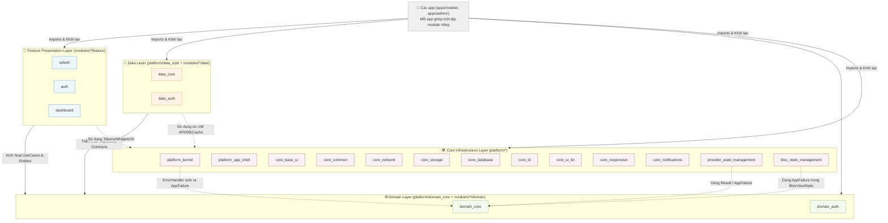

🌍 *Choose Language:* [English](README.md) | [Tiếng Việt](README.vi.md)

# 🏛️ Cẩm Nang Kỹ Thuật Hệ Thống Monorepo (Master Technical Manual)
## 🌟 Dự án Codebase Provider Workspace — CaoGiaHieu-dev

Chào mừng bạn đến với tài liệu kỹ thuật cốt lõi của **Codebase Provider Monorepo**! Đây là một kiến trúc ứng dụng Flutter công nghiệp quy mô lớn, bền vững và có tính module hóa cực cao. Hệ thống được thiết kế theo mô hình **Micro-packages Monorepo** kết hợp nghiêm ngặt nguyên lý **Clean Architecture**, **SOLID** và hỗ trợ đa hệ quản lý trạng thái (**MVVM + Provider** và **BLoC**).

Dự án này sử dụng **Pub Workspaces** bản địa của Dart, cho phép tối ưu phụ thuộc, độc lập tính năng và tự động hóa CI/CD ngay tại thư mục gốc của dự án.

> **Lưu ý template:** Các package feature / domain / data có sẵn (Auth, Home, Settings, Onboarding, Splash, Dashboard) là **mã mẫu tham chiếu** minh họa wiring Clean Architecture. Hãy coi chúng là pattern để copy hoặc xóa khi làm sản phẩm thật — không phải business logic production. Quy tắc cho AI Agent nằm ở [`.agents/AGENTS.md`](.agents/AGENTS.md).

---

## 🗺️ 1. Bản Đồ Kiến Trúc Hệ Thống (Workspace C4 Model)

Sự phân rã các tầng trong Monorepo được tổ chức chặt chẽ từ Core (Hạ tầng) ➔ Domain (Nghiệp vụ cốt lõi) ➔ Data (Triển khai tích hợp) ➔ Features (Màn hình/Giao diện tính năng):



> [!IMPORTANT]
> **Domain không phụ thuộc bất cứ thứ gì.** `domain_core` khai báo **0** workspace dependency và
> không package domain nào khai Flutter SDK — `AppFailure` nằm trong `domain_core` cạnh `Result<T>`.
> Core được phép phụ thuộc Domain — Domain là vòng trong cùng nên hướng đó là đúng. Có đúng
> **ba** cạnh như vậy được duyệt: `platform_kernel → domain_core`,
> `provider_state_management → domain_core`, `bloc_state_management → domain_core`. Chúng được
> hard-code trong `tools/arch_check/check.dart` và in ra ở mỗi lần chạy kèm lý do; cạnh thứ tư sẽ
> làm fail build. Xem [`reference/01_rules.md`](docs/vi/reference/01_rules.md).

---

## 📂 2. Cấu Trúc Chi Tiết Thư Mục (Folder Tree)

Dưới đây là sơ đồ tổ chức vật lý hoàn chỉnh của Workspace:

```text
/ (Workspace Root)
├── .github/                       # Luồng tích hợp liên tục (CI Workflows)
│   └── workflows/
│       └── fastlane.yml           # CI Github Action chạy Fastlane tự động
├── apps/                          # Mỗi app một thư mục — các điểm lắp ráp
│   ├── admin/                     # App thứ hai: chỉ auth + settings — xem apps/admin/README.md
│   └── mobile/
│       ├── app_manifest.yaml      # App này ghép những module nào, và thứ tự nhóm DI
│       ├── lib/
│       │   ├── main.dart          # Một dòng: runShellApp(configureDependencies: …)
│       │   ├── di/injection.dart  # Do composer sinh từ manifest — không bao giờ sửa tay
│       │   └── firebase/          # FirebaseOptions của app này (file options bị git-ignore)
│       ├── android/  ios/         # Project native
│       ├── fastlane/              # Lane phát hành
│       └── pubspec.yaml           # Path dep giữa các marker composer:managed là do máy sinh
├── platform/                      # Phần đất của team infra — mọi module đều được phép phụ thuộc
│   ├── app_shell/                 # platform_app_shell: boot scope, router, material wrapper, storage adapter — dùng chung cho mọi app
│   ├── kernel/                    # platform_kernel: helper getIt, ErrorHandler, tiện ích thuần Dart
│   ├── base_ui/                   # Theme, LanguageProvider, design token & l10n (không có widget)
│   ├── bloc_state_management/     # BaseBloc, BaseCubit, BlocViewState<T>
│   ├── common/                    # AppConfig, AppInitializer, helper gắn với Flutter
│   ├── database/                  # Cơ chế Drift: IDatabaseHandle, IDatabaseMigration, opener
│   ├── di/                        # DI Hub — mọi hợp đồng liên module nằm ở đây
│   ├── network/                   # Factory Dio + Retrofit, chuỗi interceptor, SSL pinning
│   ├── notifications/             # Module quản lý Push Notification
│   ├── provider_state_management/ # BaseProvider, executeOperation, ViewStateModel
│   ├── responsive/                # Scale theo design-size, gắn với BuildContext
│   ├── storage/                   # StorageManager + StorageValue<T> (KHÔNG định nghĩa key nào)
│   ├── ui_kit/                    # core_ui_kit — widget tái sử dụng cho mọi module
│   ├── domain_core/               # Result<T>, AppFailure, BaseEntity, BaseUseCase
│   └── data_core/                 # IBaseRepository + CacheDatabase (tự sở hữu table/DAO của nó)
├── modules/                       # Mỗi bounded context một lát cắt dọc, mỗi team một module
│   ├── auth/                      # Mẫu: lát cắt đủ ba tầng
│   │   ├── domain/                # Entity, UseCase, interface Repository — thuần Dart
│   │   ├── data/                  # Model, DataSource, RepositoryImpl
│   │   └── feature/               # UI + Provider, chỉ còn màn login
│   ├── home/feature/              # Mẫu: BLoC, Freezed event private, một nav destination
│   ├── settings/feature/          # Mẫu: tiêu thụ hợp đồng của module khác
│   ├── dashboard/feature/         # Mẫu: chỉ là khung vỏ (host của bottom bar)
│   ├── onboarding/feature/        # Mẫu: IAppEntryLocation, vị trí khởi động nguội
│   └── splash/feature/            # Mẫu: IAppSplashScreen, hiện trước khi router tồn tại
├── tools/                         # Bộ công cụ dòng lệnh dành cho lập trình viên
│   ├── android_compliance/        # Kiểm tra tính tương thích 16KB Page Size (Android 15+)
│   ├── barrel_generator/          # Script tự động tạo barrel files cho packages
│   ├── code_review/               # Công cụ review mã nguồn tự động tích hợp Gemini AI
│   ├── firebase/                  # Cấu hình môi trường Firebase tự động
│   ├── module_generator/          # CLI tạo Feature/Domain/Data/Core package mới
│   ├── theme_generator/           # Tự động sinh Splash Screen & App Icons
│   ├── unused_checker/            # Phân tích & dọn dẹp tệp, tài nguyên, bản dịch dư thừa
│   ├── workspace_setup/           # Script thiết lập workspace (pub get, build_runner, l10n)
│   ├── dependency_sync.dart       # Đồng bộ phiên bản thư viện từ catalog tập trung
│   └── check_outdated.dart        # Kiểm tra phiên bản thư viện đã lỗi thời trên pub.dev
├── pubspec.yaml                   # File cấu hình Pub Workspace (workspace: [...])
├── pubspec_dependencies.yaml      # Nguồn chân lý phiên bản thư viện (Version Catalog)
└── README.md                      # Cẩm nang kỹ thuật Master này
```

> [!NOTE]
> **Mọi package đều có thư mục `utils/`** chứa hằng số của **chính nó** — storage key, route path,
> timeout. Không có gì mang tính domain được phép nằm ở `core_common`. Ngoại lệ duy nhất được duyệt
> là bộ design token trong `core_base_ui/src/styles/`, giữ nguyên vị trí vì đó là bề mặt công khai
> của design system.

---

## 🛠️ 3. Bộ Công Cụ Dự Án (Project Toolset)

Tất cả công cụ đều có thể chạy từ thư mục gốc.

1.  **Module Generator (`tools/module_generator/`)**:
    ```bash
    # Tạo Feature package 'profile' sử dụng Provider:
    dart tools/module_generator/generate.dart 1 profile "" 1
    # Tạo Domain micro-package 'payment':
    dart tools/module_generator/generate.dart 2 payment
    # Tạo Data micro-package 'payment':
    dart tools/module_generator/generate.dart 3 payment
    ```
2.  **Dependency Sync (`tools/dependency_sync.dart`)**:
    ```bash
    dart tools/dependency_sync.dart          # Đồng bộ version
    dart tools/dependency_sync.dart --check   # Chỉ kiểm tra
    ```
3.  **Check Outdated (`tools/check_outdated.dart`)**:
    ```bash
    dart tools/check_outdated.dart   # Kiểm tra thư viện lỗi thời trên pub.dev
    ```
4.  **Barrel Generator (`tools/barrel_generator/`)**:
    ```bash
    dart tools/barrel_generator/generate.dart modules/profile/feature/lib
    ```
5.  **Workspace Setup (`tools/workspace_setup/`)**:
    ```bash
    dart tools/workspace_setup/configure.dart  # đa nền tảng
    ```
6.  **Code Review AI (`tools/code_review/`)**:
    ```bash
    dart tools/code_review/code_review.dart --all
    ```
7.  **Unused Checker (`tools/unused_checker/`)**:
    ```bash
    dart tools/unused_checker/check_script.dart
    ```
8.  **Theme & Firebase**:
    ```bash
    dart tools/theme_generator/theme_setting.dart --app mobile
    dart tools/firebase/firebase_config.dart --app mobile
    ```

---

## 🏛️ 4. Quy Tắc Vàng của Clean Architecture & SOLID

### Tách Biệt Mối Quan Tâm (Separation of Concerns)
1. **Tầng Domain (`modules/*/domain`)**:
   - **Pure Dart, được bảo đảm bởi package graph** — không chỉ bằng quy ước. `domain_core` có
     **0** workspace dependency và không package domain nào khai Flutter SDK.
   - Không import `flutter/material.dart`, `dio`, `retrofit`, hay bất kỳ thư viện UI/Network nào.
   - Định nghĩa `Entities`, `UseCases`, `Repository Interfaces`, `Result<T>` và `AppFailure`.
2. **Tầng Data (`modules/*/data`)**:
   - Triển khai các hợp đồng (contracts) từ `domain`.
   - Dùng `core_network` (API), `core_storage` (key-value) và `core_database` (SQL) như *cơ chế* —
     mỗi package data tự khai storage key và tự sở hữu database riêng.
   - DataSource trả về **Model**, không bao giờ trả Entity, và không phơi class do Drift sinh.
   - Biến đổi Models → Entities qua hàm `.toEntity()`.
3. **Tầng Presentation (`modules/*/feature`)**:
   - Hiển thị UI và quản lý trạng thái (Provider hoặc BLoC).
   - **Chỉ giao tiếp với Domain thông qua UseCases**, tuyệt đối không gọi trực tiếp API.
   - **CẤM phụ thuộc vào tầng `data`** hoặc bất kỳ feature package nào khác — không ngoại lệ; widget dùng chung lấy từ package core `core_ui_kit`.
4. **Tầng Core (`platform/*`)**:
   - Chỉ cung cấp cơ chế. **CẤM phụ thuộc bất kỳ package `feature_*` hoặc `data_*` nào.**
   - Được phép phụ thuộc `domain_*` (Domain là tâm): `platform_kernel → domain_core`,
     `provider_state_management → domain_core`, `bloc_state_management → domain_core`.

> [!IMPORTANT]
> **Gỡ bất kỳ feature nào app vẫn khởi động bình thường.** Mọi thứ app shell tiêu thụ lúc runtime
> đều đi qua contract ở `core_di` sau `getItOrNull` / `getAllOrEmpty` kèm fallback an toàn.
> `getAll<T>()` **ném lỗi** khi chưa có gì đăng ký — luôn ưu tiên `getAllOrEmpty<T>()`.

### Nguyên Lý Đảo Ngược Phụ Thuộc (DIP)
Features giao tiếp chéo hoàn toàn qua giao diện trung gian trong `core_di`:

```text
[Feature Auth]
   │
   ▼ (Yêu cầu chuyển hướng đến Home)
[Interface HomeNavigator (core_di)]  ◄── (Định nghĩa hợp đồng)
   ▲
   │ (Triển khai cụ thể trong feature sở hữu route)
[HomeNavigatorImpl (modules/home/feature/lib/src/routing/)]
```

Hành động UI xuyên feature (ví dụ logout) dùng cùng mô hình DIP với `I*ActionHandler` trong `core_di` và `*ActionHandlerImpl` trong feature sở hữu (`feature_auth/handlers/`).

---

## 💉 5. Cơ Chế Đăng Ký DI tự động (Micro-packages DI)

Mỗi micro-package tự chịu trách nhiệm cấu hình DI thông qua `injectable`:

### Cấu hình tại Package con:
```dart
import 'package:injectable/injectable.dart';

@InjectableInit.microPackage()
void initMicroPackage() {}
```

### Tổng hợp tại Host App (`apps/mobile/lib/di/injection.dart`):
Các danh sách được **sinh tự động** từ `apps/mobile/app_manifest.yaml` bởi
`dart tools/composer/composer.dart sync --app mobile` — sửa manifest, đừng sửa file này:

```dart
// composer:managed:modules — generated from app_manifest.yaml
const _coreModules = [
  ExternalModule(CoreCommonPackageModule),
  ExternalModule(CoreNetworkPackageModule),
  ExternalModule(CoreStoragePackageModule),
  // Không đăng ký gì: `core_database` chỉ là cơ chế, không sở hữu database nào.
  ExternalModule(CoreDatabasePackageModule),
  ExternalModule(CoreDiPackageModule),
];

// Chạy sau phần đăng ký của chính app — PushNotificationService (singleton
// eager) inject FirebaseOptions mà app đăng ký ở
// `lib/firebase/firebase_module.dart`.
const _notificationsModules = [
  ExternalModule(CoreNotificationsPackageModule),
];

// platform_app_shell: storage adapter, NetworkConfig, router, provider.
const _shellModules = [
  ExternalModule(PlatformAppShellPackageModule),
];

// CoreBaseUiPackageModule inject ILanguageStorage / IThemeStorage,
// do nhóm shell phía trên đăng ký.
const _uiModules = [
  ExternalModule(CoreBaseUiPackageModule),
];

const _domainModules = [
  ExternalModule(DomainCorePackageModule),
  ExternalModule(DomainAuthPackageModule),
];

const _dataModules = [
  ExternalModule(DataCorePackageModule),
  ExternalModule(DataAuthPackageModule),
];

// Tham chiếu cứng DUY NHẤT có chủ đích của app tới feature package —
// là composition root, nó buộc phải gọi tên những gì nó lắp ráp.
const _featureModules = [
  ExternalModule(FeatureAuthPackageModule),
  ExternalModule(FeatureHomePackageModule),
  ExternalModule(FeatureSettingsPackageModule),
  ExternalModule(FeatureOnboardingPackageModule),
  ExternalModule(FeatureSplashPackageModule),
  ExternalModule(FeatureDashboardPackageModule),
];

const _otherModules = [
  ExternalModule(ProviderStateManagementPackageModule),
  ExternalModule(BlocStateManagementPackageModule),
];

const _externalModulesBefore = [..._coreModules];
const _externalModulesAfter = [
    ..._notificationsModules,
    ..._shellModules,
    ..._uiModules,
    ..._domainModules,
    ..._dataModules,
    ..._featureModules,
    ..._otherModules,
];
// composer:end:modules

@InjectableInit(
  externalPackageModulesBefore: _externalModulesBefore,
  externalPackageModulesAfter: _externalModulesAfter,
)
Future<void> configureDependencies({String? environment}) async {
  getIt.enableRegisteringMultipleInstancesOfOneType();
  final env = environment ?? AppConfig.appFlavor.toValue();
  await getIt.init(environment: env);
}
```

### Hai quy tắc thứ tự dễ gây lỗi

> [!CAUTION]
> **`@Singleton` eager KHÔNG được phụ thuộc type đăng ký ở module chạy sau** — sẽ ném
> *"not registered"* ngay lúc boot. `flutter analyze` không bắt được lỗi này; phải kiểm chứng ở file
> sinh ra `apps/mobile/lib/di/injection.config.dart`. Dùng `@LazySingleton` khi phụ thuộc nằm ở module sau.
>
> **GetIt không resolve theo supertype.** Đăng ký `Impl as InterfaceA` thì `getIt<InterfaceB>()` vẫn
> không resolve được dù `InterfaceA implements InterfaceB` — phải bind interface thứ hai tường minh
> qua `@module` (xem `platform/app_shell/lib/di/network_binding_module.dart`).

---

## 🚦 6. Hệ Thống Định Tuyến Phân Lớp (Decoupled Type-Safe Routing)

Chúng ta sử dụng `go_router` kết hợp với `go_router_builder` để đảm bảo định tuyến an toàn kiểu dữ liệu (type-safe) và chia nhỏ mã nguồn tối đa.

### Quyền Sở Hữu Tuyến Đường (Route Ownership)
Từng Feature Package tự sở hữu cấu trúc và tệp định tuyến của riêng mình:
- `SplashPage` được `MainScope` host lúc boot và **không** đăng ký trong GoRouter.
- Gói `feature_auth` sở hữu nhóm tuyến `AuthShellRoute`, `LoginRoute`.
- Các Route tự kế thừa `GoRouteDataCustom` để có sẵn tính năng theo dõi màn hình tự động và chuyển trang mượt mà theo từng nền tảng.

### Lắp Ráp Tại Runtime (Assembly)
`platform/app_shell/lib/presentation/navigation/app_router.dart` **không** hardcode list `$onboardingRoute` / `$homeShellRoute`. Nó thu thập:

- `getAllOrEmpty<IFeatureRouteModule>()` → route stack top-level (auth, onboarding, …) — **không có `order`**
- `getAllOrEmpty<INavDestinationModule>()` sort theo `order` → list `StatefulShellBranch`
- `getItOrNull<DashboardRouteModule>()` → chrome dashboard (tùy chọn)
- `getItOrNull<IAppEntryLocation>()?.path` → `initialLocation` (không có thì tab đầu / `/`)
- `getItOrNull<IAuthRefreshListenable>()` → `refreshListenable`

Chú ý dòng cuối: router phụ thuộc vào **contract ở `core_di`**, không phải `AuthProvider`. App shell
không giữ kiểu dữ liệu nào của feature — đó chính là điều khiến `feature_auth` gỡ được.

### Gỡ một feature

1. Xóa dòng của nó trong mục `modules:` ở mọi `apps/<id>/app_manifest.yaml` có ghép nó.
2. `dart tools/composer/composer.dart sync` — sinh lại `injection.dart`, path dependency của app
   và danh sách `workspace:` ở root, tất cả nằm giữa marker `composer:managed`.
3. `flutter pub get && dart run build_runner build -d --workspace`.

Hoặc để `dart tools/sample_cleanup/remove_sample.dart <bundle>` làm, chạy dry-run trước. Không cần
sửa file nào khác — mọi lookup lúc runtime đều có fallback an toàn. Xem
[`guides/04_routing.md`](docs/vi/guides/04_routing.md).

---

## 🚀 7. Kiến Trúc CI/CD Chạy Từ Workspace Root

Hệ thống CI/CD sử dụng **Fastlane** với kiến trúc **Workspace-Root Delegation**:

### Lệnh Biên Dịch Android APK từ Root:
```powershell
fastlane android build flavor:dev build_type:apk distribute_store:false distribute_firebase:false skip_setup:true change_log:test build_number:1 flutter_version:stable version:1.0.0
```

---

## 🛠️ 8. Quy Tắc Lập Trình Công Cụ Phát Triển (DevTools CLI Policy)

1. **Cấm Sử Dụng Lệnh `print`**: Tất cả các CLI Tools trong `tools/` bắt buộc dùng `stdout.writeln(...)` và `stderr.writeln(...)`.
2. **Cấm Tắt Cảnh Báo Linter**: Không sử dụng `// ignore_for_file: avoid_print`.

---

## 🚀 Hướng Dẫn Khởi Tạo & Phát Triển Cục Bộ

### 1. Chuẩn Bị Môi Trường
- **Flutter**: >= 3.47.4 (Stable)
- **Dart SDK**: >= 3.13.3
- **JDK**: 17
- **Ruby**: >= 3.0 (cho Fastlane)

### 2. Cài Đặt Tất Cả Gói Phụ Thuộc
```bash
flutter pub get
```
*Nhờ Pub Workspaces, toàn bộ phụ thuộc của Host App và tất cả packages con được tải đồng thời và tạo duy nhất một `pubspec.lock`.*

### 3. Sinh Firebase Options (bắt buộc — thiếu là repo không biên dịch được)
`apps/mobile/lib/firebase/firebase_module.dart` import cả ba file
`firebase_options_{dev,staging,prod}.dart` một cách vô điều kiện, mà chúng lại bị git-ignore. Phải
chạy `dart tools/firebase/firebase_config.dart --app mobile` trước lần build đầu tiên — xem
[`getting-started/01_setup.md`](docs/vi/getting-started/01_setup.md).

### 4. Khởi Chạy Sinh Mã Đồng Loạt
```bash
dart run build_runner build -d --workspace
```

### 5. Chạy Ứng Dụng
```bash
flutter run -t apps/mobile/lib/main.dart --flavor dev --dart-define-from-file=apps/mobile/env.dev
```

### 6. Build APK
```bash
cd apps/mobile   # bắt buộc — build từ thư mục gốc workspace sẽ lỗi Gradle khó hiểu
flutter build apk --flavor dev --debug --dart-define-from-file=env.dev
```

> [!WARNING]
> `flutter analyze` **loại trừ các file sinh tự động** (`**.freezed.dart`, `**.g.dart`,
> `**.config.dart`, `**.module.dart` — xem `analysis_options.yaml`). Analyze sạch **không** chứng
> minh app biên dịch được. Luôn build thật trước khi tin vào một đợt refactor lớn.

---

## 📚 Hệ Thống Tài Liệu (Documentation Hub)

**Bắt đầu tại → [`docs/vi/README.md`](docs/vi/README.md)** *(English: [`docs/en/README.md`](docs/en/README.md))*

Tài liệu được tổ chức theo **việc bạn đang muốn làm**, không theo tầng kiến trúc.

### 🚀 Bắt Đầu — *mới vào repo? đọc theo thứ tự này*
| Tài liệu | Trả lời câu hỏi |
| :--- | :--- |
| [01. Cài đặt](docs/vi/getting-started/01_setup.md) | Cần cài gì, và làm sao chạy được app? |
| [02. Dạo quanh dự án](docs/vi/getting-started/02_project_tour.md) | Mỗi package làm gì, muốn sửa X thì vào đâu? |
| [03. Quy trình hàng ngày](docs/vi/getting-started/03_daily_workflow.md) | Gõ lệnh nào, khi nào? |

### 🏛️ Kiến Trúc — *hiểu hệ thống*
| Tài liệu | Nội dung |
| :--- | :--- |
| [01. Tổng quan](docs/vi/architecture/01_overview.md) | Clean Architecture, luật phụ thuộc, các đánh đổi chính |
| [02. Tầng Core](docs/vi/architecture/02_core.md) | Cả chín package `core_*` và những gì **không** thuộc về chúng |
| [03. Tầng Domain](docs/vi/architecture/03_domain.md) | Pure Dart, `Result<T>`, entity, use case |
| [04. Tầng Data](docs/vi/architecture/04_data.md) | Model, data source, repository, chuyển đổi lỗi |
| [05. Tầng Feature](docs/vi/architecture/05_features.md) | Ranh giới feature, cấu trúc, vòng đời controller |
| [06. App Shell](docs/vi/architecture/06_app_shell.md) | Vòng đời khởi động, lắp ráp DI, router động |

### 🧭 Hướng Dẫn — *bắt tay vào làm*
| Tài liệu | Việc |
| :--- | :--- |
| [01. Tạo feature mới](docs/vi/guides/01_new_feature.md) | Dựng một feature từ đầu đến cuối |
| [02. Tạo domain + data](docs/vi/guides/02_new_domain_data.md) | Thêm một nghiệp vụ mới |
| [03. Quản lý trạng thái](docs/vi/guides/03_state_management.md) | Chọn và dùng Provider hay BLoC |
| [04. Định tuyến](docs/vi/guides/04_routing.md) | Đăng ký route, điều hướng xuyên feature |
| [05. Dependency Injection](docs/vi/guides/05_di.md) | Scope, thứ tự module, các bẫy thường gặp |
| [06. Lưu trữ](docs/vi/guides/06_storage.md) | Lưu một giá trị mà package của bạn sở hữu |
| [07. Database](docs/vi/guides/07_database.md) | Bảng, DAO, migration (Drift) |
| [08. Networking](docs/vi/guides/08_networking.md) | API client, interceptor, refresh token, SSL pinning |
| [09. Đa ngôn ngữ & Theming](docs/vi/guides/09_localization_theming.md) | Bản dịch, design token, responsive |
| [10. Giao tiếp xuyên feature](docs/vi/guides/10_cross_feature.md) | Sáu mô hình được cho phép |

### 📐 Tra Cứu — *tìm nhanh*
| Tài liệu | Chứa |
| :--- | :--- |
| [01. Luật kiến trúc](docs/vi/reference/01_rules.md) | Mọi luật kèm lý do đằng sau |
| [02. Quy ước đặt tên](docs/vi/reference/02_naming.md) | Hậu tố file/class, quy ước thư mục |
| [03. Công cụ](docs/vi/reference/03_tooling.md) | Mọi script trong `tools/` |
| [04. Checklist review](docs/vi/reference/04_review_checklist.md) | Cổng kiểm tra PR |

### 🚢 Vận Hành — *đưa lên production*
| Tài liệu | Chứa |
| :--- | :--- |
| [01. CI/CD](docs/vi/operations/01_cicd.md) | Pipeline GitHub Actions & Azure, secrets cần thiết |
| [02. Fastlane & phát hành](docs/vi/operations/02_fastlane_release.md) | Lane, ký ứng dụng, phân phối store |

> Luật dành cho AI Agent nằm riêng ở [`.agents/AGENTS.md`](.agents/AGENTS.md) và
> [`.agents/skills/`](.agents/skills/).

---
*Bản quyền sở hữu trí tuệ thuộc về CaoGiaHieu-dev. Mọi quyền được bảo lưu.*
