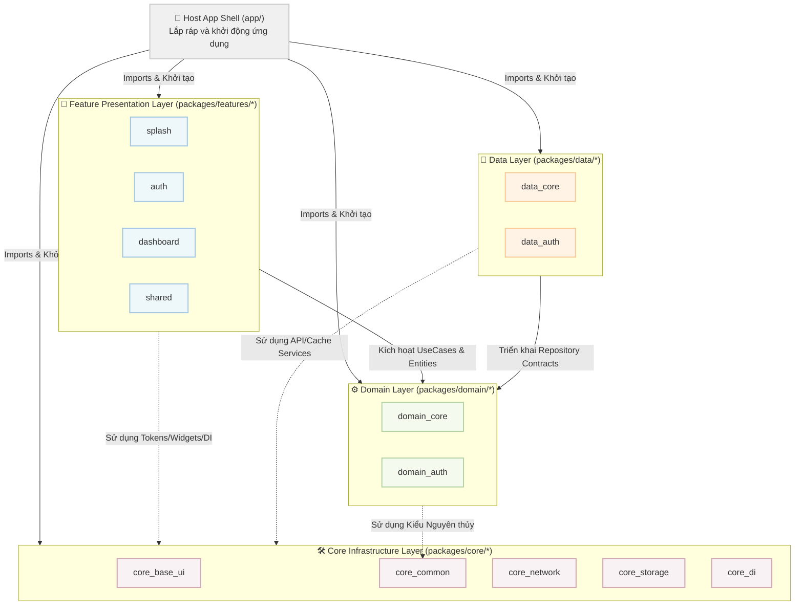

🌍 *Choose Language:* [English](README.md) | [Tiếng Việt](README.vi.md)

# 🏛️ Cẩm Nang Kỹ Thuật Hệ Thống Monorepo (Master Technical Manual)
## 🌟 Dự án Codebase Provider Workspace — CaoGiaHieu-dev

Chào mừng bạn đến với tài liệu kỹ thuật cốt lõi của **Codebase Provider Monorepo**! Đây là một kiến trúc ứng dụng Flutter công nghiệp quy mô lớn, bền vững và có tính module hóa cực cao. Hệ thống được thiết kế theo mô hình **Micro-packages Monorepo** kết hợp nghiêm ngặt nguyên lý **Clean Architecture**, **SOLID** và hỗ trợ đa hệ quản lý trạng thái (**MVVM + Provider** và **BLoC**).

Dự án này sử dụng **Pub Workspaces** bản địa của Dart, cho phép tối ưu phụ thuộc, độc lập tính năng và tự động hóa CI/CD ngay tại thư mục gốc của dự án.

> **Lưu ý template:** Các package feature / domain / data có sẵn (Auth, Home, Settings, Onboarding, Splash, Dashboard, Language, …) là **mã mẫu tham chiếu** minh họa wiring Clean Architecture. Hãy coi chúng là pattern để copy hoặc xóa khi làm sản phẩm thật — không phải business logic production. Quy tắc cho AI Agent nằm ở [`.agents/AGENTS.md`](.agents/AGENTS.md).

---

## 🗺️ 1. Bản Đồ Kiến Trúc Hệ Thống (Workspace C4 Model)

Sự phân rã các tầng trong Monorepo được tổ chức chặt chẽ từ Core (Hạ tầng) ➔ Domain (Nghiệp vụ cốt lõi) ➔ Data (Triển khai tích hợp) ➔ Features (Màn hình/Giao diện tính năng):



---

## 📂 2. Cấu Trúc Chi Tiết Thư Mục (Folder Tree)

Dưới đây là sơ đồ tổ chức vật lý hoàn chỉnh của Workspace:

```text
/ (Workspace Root)
├── .github/                       # Luồng tích hợp liên tục (CI Workflows)
│   └── workflows/
│       └── fastlane.yml           # CI Github Action chạy Fastlane tự động
├── app/                           # Host Application (Vỏ ứng dụng chính)
│   ├── android/                   # Dự án Android bản địa
│   ├── ios/                       # Dự án iOS bản địa
│   ├── lib/
│   │   ├── config/                # Cấu hình môi trường (Flavors dev, staging, prod)
│   │   ├── di/                    # Điểm đăng ký DI trung tâm (injection.dart)
│   │   ├── presentation/
│   │   │   ├── navigation/        # Lắp ráp GoRouter (app_router.dart) + shell widgets
│   │   │   ├── providers/         # Global App Shell (AppProvider, DeeplinkProvider)
│   │   │   └── widgets/           # NavigatorWrapperWidget, UndefineRouteWidget
│   │   ├── main.dart              # Điểm chạy app chính (entrypoint)
│   │   └── main_scope.dart        # Quản lý Boot Lifecycle (Splash → RootApp)
│   └── pubspec.yaml               # Cấu hình Host App (liên kết tất cả packages con)
├── packages/                      # Thư mục chứa các Micro-packages
│   ├── core/                      # Các tiện ích và hạ tầng dùng chung (Core Packages)
│   │   ├── base_ui/               # Theme, LanguageProvider, assets & l10n toàn cục (không widget)
│   │   ├── bloc_state_management/ # Lớp BaseCubit, BaseBloc và ViewState cho BLoC
│   │   ├── common/                # Hằng số (Constants), Enums, AppFailure, ErrorHandler
│   │   ├── di/                    # DI Hub (Navigator / ActionHandler interfaces)
│   │   ├── network/               # Client kết nối API (Dio + Retrofit custom factory)
│   │   ├── notifications/         # Module quản lý thông báo đẩy (Push Notification)
│   │   ├── provider_state_management/ # Lớp BaseProvider và các Helper quản lý trạng thái
│   │   └── storage/               # Secure Storage Reactive + Shared Preferences
│   ├── domain/                    # Micro-packages nghiệp vụ thuần (Pure Dart)
│   │   ├── core/                  # Result<T>, BaseEntity, các types dùng chung
│   │   ├── auth/                  # Entities, UseCases, Repository interfaces cho Auth
│   │   └── language/              # Entities, UseCases cho đa ngôn ngữ
│   ├── data/                      # Micro-packages triển khai tích hợp
│   │   ├── core/                  # IBaseRepository, các hàm wrapper xử lý lỗi
│   │   ├── auth/                  # Models, DataSources, RepositoryImpl cho Auth
│   │   └── language/              # RepositoryImpl cho đa ngôn ngữ
│   └── features/                  # Các gói tính năng độc lập (Feature Packages)
│       ├── splash/                # Feature Splash (mẫu): Màn hình chờ khởi động
│       ├── onboarding/            # Feature Onboarding (mẫu): Hướng dẫn người dùng mới
│       ├── auth/                  # Feature Auth (mẫu): Login, Register, Forgot Password
│       ├── dashboard/             # Feature Dashboard (mẫu): Chrome shell Bottom Tab only
│       ├── home/                  # Feature Home (mẫu): Tab Trang chủ
│       ├── settings/              # Feature Settings (mẫu): Tab Cài đặt (tách khỏi Home)
│       └── shared/                # Feature Shared: Widgets dùng chung giữa features
├── tools/                         # Bộ công cụ dòng lệnh dành cho lập trình viên
│   ├── android_compliance/        # Kiểm tra tính tương thích 16KB Page Size (Android 15+)
│   ├── barrel_generator/          # Script tự động tạo barrel files cho packages
│   ├── code_review/               # Công cụ review mã nguồn tự động tích hợp Gemini AI
│   ├── firebase/                  # Cấu hình môi trường Firebase tự động
│   ├── module_generator/          # CLI tạo Feature/Domain/Data/Core package mới
│   ├── theme_generator/           # Tự động sinh Splash Screen & App Icons
│   ├── unused_checker/            # Phân tích & dọn dẹp tệp, tài nguyên, bản dịch dư thừa
│   ├── workspace_setup/           # Script thiết lập workspace (pub get, build_runner, l10n)
│   ├── dependency_sync.dart       # Đồng bộ phiên bản thư viện từ catalog tập trung
│   └── check_outdated.dart        # Kiểm tra phiên bản thư viện đã lỗi thời trên pub.dev
├── pubspec.yaml                   # File cấu hình Pub Workspace (workspace: [...])
├── pubspec_dependencies.yaml      # Nguồn chân lý phiên bản thư viện (Version Catalog)
└── README.md                      # Cẩm nang kỹ thuật Master này
```

---

## 🛠️ 3. Bộ Công Cụ Dự Án (Project Toolset)

Tất cả công cụ đều có thể chạy từ thư mục gốc.

1.  **Module Generator (`tools/module_generator/`)**:
    ```bash
    # Tạo Feature package 'profile' sử dụng Provider:
    dart tools/module_generator/generate.dart 1 profile "" 1
    # Tạo Domain micro-package 'payment':
    dart tools/module_generator/generate.dart 2 payment
    # Tạo Data micro-package 'payment':
    dart tools/module_generator/generate.dart 3 payment
    ```
2.  **Dependency Sync (`tools/dependency_sync.dart`)**:
    ```bash
    dart tools/dependency_sync.dart          # Đồng bộ version
    dart tools/dependency_sync.dart --check   # Chỉ kiểm tra
    ```
3.  **Check Outdated (`tools/check_outdated.dart`)**:
    ```bash
    dart tools/check_outdated.dart   # Kiểm tra thư viện lỗi thời trên pub.dev
    ```
4.  **Barrel Generator (`tools/barrel_generator/`)**:
    ```bash
    dart tools/barrel_generator/generate.dart packages/features/profile/lib
    ```
5.  **Workspace Setup (`tools/workspace_setup/`)**:
    ```bash
    .\tools\workspace_setup\configure.bat  # Windows
    ./tools/workspace_setup/configure.sh   # macOS/Linux
    ```
6.  **Code Review AI (`tools/code_review/`)**:
    ```bash
    dart tools/code_review/code_review.dart --all
    ```
7.  **Unused Checker (`tools/unused_checker/`)**:
    ```bash
    dart tools/unused_checker/check_script.dart
    ```
8.  **Theme & Firebase**:
    ```bash
    .\tools\theme_generator\theme_setting.bat
    .\tools\firebase\firebase_config.bat
    ```

---

## 🏛️ 4. Quy Tắc Vàng của Clean Architecture & SOLID

### Tách Biệt Mối Quan Tâm (Separation of Concerns)
1. **Tầng Domain (`packages/domain/*`)**:
   - **Pure Dart**: Không import `flutter/material.dart`, `dio`, `retrofit`, hoặc bất kỳ thư viện UI/Network nào.
   - Định nghĩa `Entities`, `UseCases`, và `Repository Interfaces`.
2. **Tầng Data (`packages/data/*`)**:
   - Triển khai các hợp đồng (contracts) từ `domain`.
   - Kết nối trực tiếp với `core_network` (API) và `core_storage` (DB cục bộ).
   - Biến đổi DTOs/Models → Entities qua hàm `.toEntity()`.
3. **Tầng Presentation (`packages/features/*`)**:
   - Hiển thị UI và quản lý trạng thái (Provider hoặc BLoC).
   - **Chỉ giao tiếp với Domain thông qua UseCases**, tuyệt đối không gọi trực tiếp API.
   - **CẤM phụ thuộc vào tầng `data`** hoặc feature package khác (ngoại trừ `feature_shared`).

### Nguyên Lý Đảo Ngược Phụ Thuộc (DIP)
Features giao tiếp chéo hoàn toàn qua giao diện trung gian trong `core_di`:

```text
[Feature Auth]
   │
   ▼ (Yêu cầu chuyển hướng đến Home)
[Interface HomeNavigator (core_di)]  ◄── (Định nghĩa hợp đồng)
   ▲
   │ (Triển khai cụ thể trong feature sở hữu route)
[HomeNavigatorImpl (packages/features/home/lib/src/routing/)]
```

Hành động UI xuyên feature (ví dụ logout) dùng cùng mô hình DIP với `I*ActionHandler` trong `core_di` và `*ActionHandlerImpl` trong feature sở hữu (`feature_auth/handlers/`).

---

## 💉 5. Cơ Chế Đăng Ký DI tự động (Micro-packages DI)

Mỗi micro-package tự chịu trách nhiệm cấu hình DI thông qua `injectable`:

### Cấu hình tại Package con:
```dart
import 'package:injectable/injectable.dart';

@InjectableInit.microPackage()
void initMicroPackage() {}
```

### Tổng hợp tại Host App (`app/lib/di/injection.dart`):
```dart
const _coreModules = [
  ExternalModule(CoreCommonPackageModule),
  ExternalModule(CoreNetworkPackageModule),
  ExternalModule(CoreNotificationsPackageModule),
  ExternalModule(CoreStoragePackageModule),
  ExternalModule(CoreDiPackageModule),
];

// CoreBaseUiPackageModule phụ thuộc ILanguageStorage / IThemeStorage
// (singleton đăng ký tại App Shell). Đặt trong externalPackageModulesAfter.
const _uiModules = [
  ExternalModule(CoreBaseUiPackageModule),
];

const _domainModules = [
  ExternalModule(DomainCorePackageModule),
  ExternalModule(DomainAuthPackageModule),
  ExternalModule(DomainLanguagePackageModule),
];

const _dataModules = [
  ExternalModule(DataCorePackageModule),
  ExternalModule(DataAuthPackageModule),
  ExternalModule(DataLanguagePackageModule),
];

const _featureModules = [
  ExternalModule(FeatureAuthPackageModule),
  ExternalModule(FeatureDashboardPackageModule),
  ExternalModule(FeatureHomePackageModule),
  ExternalModule(FeatureOnboardingPackageModule),
  ExternalModule(FeatureSplashPackageModule),
];

const _otherModules = [
  ExternalModule(ProviderStateManagementPackageModule),
  ExternalModule(BlocStateManagementPackageModule),
];

@InjectableInit(
  externalPackageModulesBefore: [..._coreModules],
  externalPackageModulesAfter: [
    ..._uiModules,
    ..._domainModules,
    ..._dataModules,
    ..._featureModules,
    ..._otherModules,
  ],
)
Future<void> configureDependencies({String? environment}) async {
  getIt.enableRegisteringMultipleInstancesOfOneType();
  final env = environment ?? AppConfig.appFlavor.toValue();
  await getIt.init(environment: env);
}
```

---

## 🚦 6. Hệ Thống Định Tuyến Phân Lớp (Decoupled Type-Safe Routing)

Chúng ta sử dụng `go_router` kết hợp với `go_router_builder` để đảm bảo định tuyến an toàn kiểu dữ liệu (type-safe) và chia nhỏ mã nguồn tối đa.

### Quyền Sở Hữu Tuyến Đường (Route Ownership)
Từng Feature Package tự sở hữu cấu trúc và tệp định tuyến của riêng mình:
- `SplashPage` được `MainScope` host lúc boot và **không** đăng ký trong GoRouter.
- Gói `feature_auth` sở hữu nhóm tuyến `AuthShellRoute`, `LoginRoute`, `RegisterRoute`, `ForgotPasswordRoute`.
- Các Route tự kế thừa `GoRouteDataCustom` để có sẵn tính năng theo dõi màn hình tự động và chuyển trang mượt mà theo từng nền tảng.

### Lắp Ráp Tại Runtime (Assembly)
`app/lib/presentation/navigation/app_router.dart` **không** hardcode list `$onboardingRoute` / `$homeShellRoute`. Nó thu thập:

- `getAllOrEmpty<IFeatureRouteModule>()` → route stack top-level (auth, onboarding, …) — **không có `order`**
- `getAllOrEmpty<IDashboardTabModule>()` sort theo `order` → list `StatefulShellBranch`
- `getItOrNull<DashboardRouteModule>()` → chrome dashboard (tùy chọn)
- `getItOrNull<IAppEntryLocation>()?.path` → `initialLocation` (không có thì tab đầu / `/`)
- `getItOrNull<AuthProvider>()` → `refreshListenable`

Gỡ feature = bỏ `ExternalModule` + pubspec; hot restart. Chi tiết: [docs/vi/08_routing.md](docs/vi/08_routing.md) mục Dashboard.

---

## 🚀 7. Kiến Trúc CI/CD Chạy Từ Workspace Root

Hệ thống CI/CD sử dụng **Fastlane** với kiến trúc **Workspace-Root Delegation**:

### Lệnh Biên Dịch Android APK từ Root:
```powershell
fastlane android build flavor:dev build_type:apk distribute_store:false distribute_firebase:false skip_setup:true change_log:test build_number:1 flutter_version:stable version:1.0.0
```

---

## 🛠️ 8. Quy Tắc Lập Trình Công Cụ Phát Triển (DevTools CLI Policy)

1. **Cấm Sử Dụng Lệnh `print`**: Tất cả các CLI Tools trong `tools/` bắt buộc dùng `stdout.writeln(...)` và `stderr.writeln(...)`.
2. **Cấm Tắt Cảnh Báo Linter**: Không sử dụng `// ignore_for_file: avoid_print`.

---

## 🚀 Hướng Dẫn Khởi Tạo & Phát Triển Cục Bộ

### 1. Chuẩn Bị Môi Trường
- **Flutter**: >= 3.44.0 (Stable)
- **Dart SDK**: >= 3.12.0
- **Ruby**: >= 3.0 (cho Fastlane)

### 2. Cài Đặt Tất Cả Gói Phụ Thuộc
```bash
flutter pub get
```
*Nhờ Pub Workspaces, toàn bộ phụ thuộc của Host App và tất cả packages con được tải đồng thời và tạo duy nhất một `pubspec.lock`.*

### 3. Khởi Chạy Sinh Mã Đồng Loạt
```bash
dart run build_runner build -d --workspace
```

### 4. Chạy Ứng Dụng
```bash
flutter run -t app/lib/main.dart --flavor dev
```

---

## 📚 Hệ Thống Tài Liệu Bổ Trợ (Documentation Hub)

*   [📘 00. Tổng Quan & Phân Tích Kiến Trúc](docs/vi/00_overview.md)
*   [🎨 01. Tầng Core Base UI & Theme System](docs/vi/01_core_layer.md)
*   [🧬 02. Tầng Domain & Quy Trình Tạo UseCase](docs/vi/02_domain_layer.md)
*   [💾 03. Tầng Data & Tích Hợp Kho Lưu Trữ](docs/vi/03_data_layer.md)
*   [🖥️ 04. Tầng Giao Diện MVVM & Quản Lý Trạng Thái](docs/vi/04_presentation_layer.md)
*   [🔌 05. Tiêm Phụ Thuộc Hướng Mô-đun (DI Manual)](docs/vi/05_dependency_injection.md)
*   [🌐 06. Kết Nối Mạng & Gọi API Tĩnh](docs/vi/06_networking.md)
*   [🛡️ 07. Quy Tắc Đặt Tên & Viết Mã Nguồn Sạch](docs/vi/07_rules_and_conventions.md)
*   [🚦 08. Định Tuyến GoRouter & Decoupled Navigation](docs/vi/08_routing.md)
*   [📦 09. Cẩm Nang Sử Dụng Component Dùng Chung](docs/vi/09_commons_and_shared.md)
*   [📝 10. Danh Sách Kiểm Tra Khi Review (Review Checklist)](docs/vi/10_review_checklist.md)
*   [🔐 11. Hệ Thống Lưu Trữ Reactive Secure Storage](docs/vi/11_storage_system.md)
*   [🗄️ 14. Hệ Thống Database Drift + Isolate](docs/vi/14_database_system.md)
*   [🚀 12. Hướng Dẫn CI/CD Fastlane Cấp Cao](docs/vi/12_fastlane_guide.md)
*   [🛠️ 13. Hướng Dẫn Tạo Module Mới (New Module Guide)](docs/vi/13_new_module_guide.md)

---
*Bản quyền sở hữu trí tuệ thuộc về CaoGiaHieu-dev. Mọi quyền được bảo lưu.*
