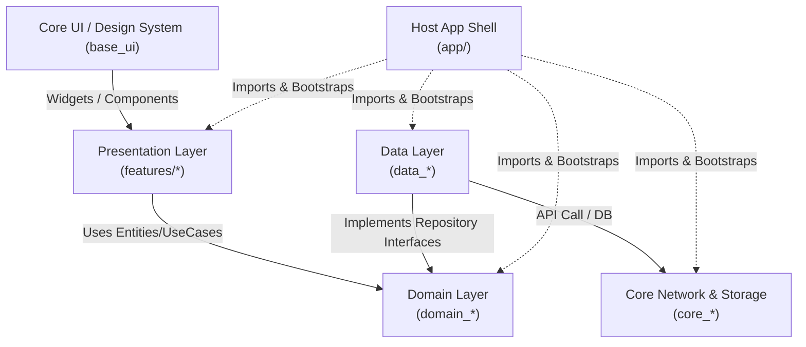
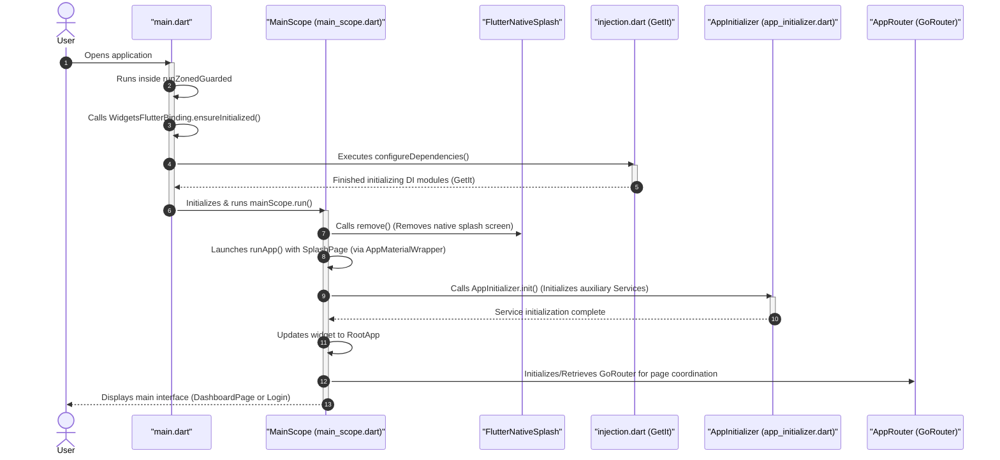

# 00. System Architecture & Overview

This document provides a comprehensive overview of the design philosophy, source code organizational structure, and operational mechanics of the **Codebase Provider Workspace** monorepo. This is a mandatory read for all development members to maintain system uniformity.

---

## 🏛️ 1. Architectural Philosophy

The system is built upon a combination of **Clean Architecture**, **SOLID** principles, and the **MVVM + Provider/BLoC** pattern for user interface state management.

### Separation of Concerns
The ultimate goal is to isolate the core Business Logic from infrastructure details that are prone to frequent changes (such as Flutter UI, local databases, Dio/Http networking libraries). As a result:
- **High Testability**: You can write Unit Tests for the business layer (Domain) entirely in pure Dart without needing to boot up a device emulator or render a single widget.
- **UI-Independence**: The Presentation layer can be completely redesigned or expanded to other platforms (Web, Desktop) without modifying a single line of business logic.
- **Modularization (Micro-packages Monorepo)**: Breaking down the project into multiple independent sub-packages accelerates incremental compilation, minimizes git merge conflicts in large teams, and increases source code reusability.

---

## 🗺️ 2. The Dependency Flow

The immutable principle of Clean Architecture is **The Dependency Rule Always Points Inward**:

- **Domain Layer (packages/domain/* - Micro-packages)**: Is the central nucleus. This package **MUST NOT DEPEND** on any other package except `core_common` and `domain_core`. The Domain has absolutely no knowledge of the UI interface or raw data sources from the internet.
- **Data Layer (packages/data/* - Micro-packages)**: Depends on the corresponding `domain` to inherit and implement Interfaces (Contracts). It also depends on `core_network`, `core_storage`, and `core_database` to handle API communication, secure key-value cache, or local SQL persistence.
- **Presentation Layer (packages/features/*)**: Depends on the `domain` to retrieve data entities and trigger UseCases. It depends on `core_di` for cross-routing/dependency injection, `core_base_ui` for design tokens/assets, and `feature_shared` for shared UI components.
- **Host App Shell (app/)**: Resides at the outermost layer, responsible for importing all child packages, initializing the global DI container (`get_it`), configuring running environments (Flavors), and booting the application.

---

## 📂 3. Detailed Architectural Layer Survey

### A. Core Business Layer: Domain Packages (`packages/domain/*`)
The Domain layer defines the business identity of the application as independent micro-packages:
- **`domain_core`**: Contains the shared `Result<T>`, `BaseEntity<T>`, and core utilities.
- **`domain_auth`**: Entities, UseCases, and Contracts for Authentication.
- **`domain_language`**: Entities and UseCases for Language operations.

Each package contains:
- **Entities**: Pure entity classes holding core data (e.g., `UserEntity`). All these classes use the `freezed` library to ensure Immutable State.
- **Use Cases**: Represents specific business tasks of the system (e.g., `LoginUseCase`, `GetLanguageUseCase`). Returns results inside the safe error wrapper Class `Result<T>`.
- **Repository Interfaces**: Defines the contracts that the Data layer MUST implement.

### B. Integration Implementation Layer: Data Packages (`packages/data/*`)
The Data layer is responsible for pulling raw data and transforming it into clean business data:
- **`data_core`**: Provides `IBaseRepository` integrated with automatic error handling.
- **`data_auth`**: Implements authentication business logic.
- **`data_language`**: Implements locale storage business logic.

Main components:
- **Models (DTOs)**: Data Transfer Objects capable of auto JSON parsing (`fromJson`/`toJson`), auto-generated by `json_serializable`.
- **Data Sources**: Direct data supply sources:
  - *Remote Data Source*: Calls API endpoints via Dio Client.
  - *Local Data Source*: Reads/writes local database, Secure Storage.
- **Repository Implementations**: Classes inheriting interfaces from the Domain and inheriting `IBaseRepository` from `data_core`.

### C. User Interface Layer: Feature Packages (`packages/features/*`)
Each independent feature module (e.g., `feature_auth`) contains:
- **Pages / Widgets**: Specific display interfaces built using components from `feature_shared` and design tokens from `core_base_ui`.
- **Providers / Blocs**: Prefer `BaseProvider` or `BaseBloc` (Cubit only when events are unnecessary). Responsible for managing the Unidirectional Data Flow:
  1. *View* sends Actions to the *Controller*.
  2. *Controller* triggers Domain *UseCases* and listens for results.
  3. *Controller* updates immutable UI state (`ViewState<T>` or custom Freezed state when needed).
  4. *View* automatically re-renders when the state changes.

### D. Shared Infrastructure Layer: Core Packages (`packages/core/*`)
Provides foundational tools and utilities for the entire system:
- **`core_common`**: Defines enums, mixins, static constants, and centralized `ErrorHandler`.
- **`core_di`**: Relay station for Navigator / ActionHandler interfaces, routing contribution contracts (`IFeatureRouteModule`, `IDashboardTabModule`, `IAppEntryLocation`, `DashboardRouteModule`), and `NavigatorKeys`.
- **`core_base_ui`**: Manages the Design System.
- **`core_network`**: Pre-configured HTTP Client with Interceptors.
- **`core_storage`**: Reactive cache memory with dual-layer security.
- **`core_database`**: Drift/SQLite relational database on a background isolate.
- **`core_notifications`**: Push notifications management module.
- **`provider_state_management`** & **`bloc_state_management`**: UI state management backbone.

> **Template note:** Packages under `packages/domain/*`, `packages/data/*`, and `packages/features/*` (except reusable `feature_shared` widgets) ship as **sample / reference implementations** (Auth, Home, Settings, Onboarding, Splash, Dashboard, Language). Replace or delete them when starting a real product — they demonstrate patterns, not production business rules. **One feature package = one bounded UI concern** (Home and Settings are separate packages; Dashboard only composes their routes).

---

## 🚦 4. Application Boot Lifecycle

When a user opens the application, the Host App Shell layer (`app/`) orchestrates the initialization flow via `MainScope` (`app/lib/main_scope.dart`) to ensure the system is completely ready before displaying the main UI:

### 📦 Consistent App Wrapper (AppMaterialWrapper)

To avoid duplicating `MaterialApp` configurations between the Splash screen (when DI is loading) and the main `RootApp` (when DI is ready), the system provides the **`AppMaterialWrapper`** class at the `app/` layer:

*   **Two operational modes**:
    *   `AppMaterialWrapper(...)`: For the raw Splash screen, doesn't access DI to avoid crashing while DI is still initializing.
    *   `AppMaterialWrapper.router(...)`: For the main routed application (`RootApp`).
*   **Global Providers Automation**:
    *   The Wrapper automatically wraps the widget tree in a `MultiProvider` with singletons managed by GetIt (`AppProvider`, `ThemeProvider`, `AuthProvider`, `DeeplinkProvider`).
    *   Uses `Consumer2<ThemeProvider, LanguageProvider>` to listen to real-time changes in Theme (Light/Dark) and Language (Locale), automatically synchronizing colors and System UI Overlay (`AnnotatedRegion<SystemUiOverlayStyle>`).
    *   Keeps the source code of `RootApp` and `MainScope` extremely concise and focused.

---
*Copyright (c) 2026 CaoGiaHieu-dev. All rights reserved.*
