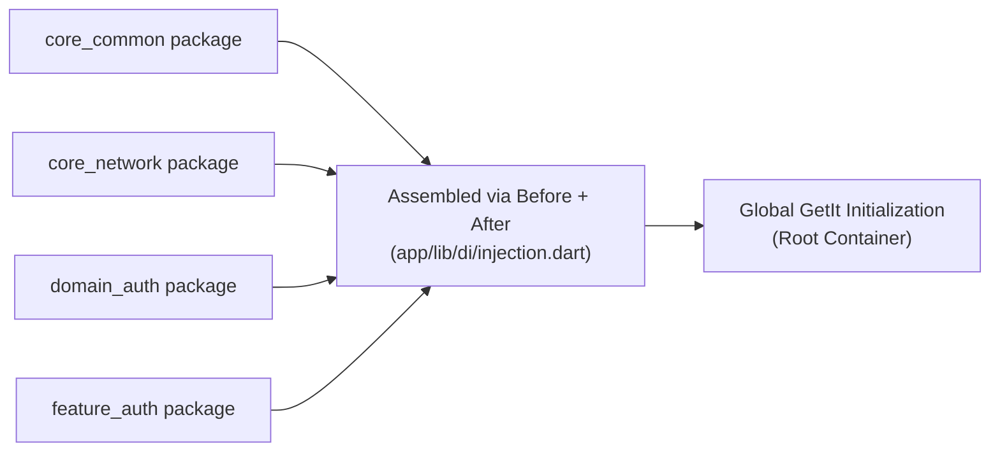

# 05. Modular Dependency Injection (Micro-packages DI Manual)

In a large Monorepo system containing dozens of independent Feature and Core modules, manually configuring Dependency Injection (DI) in a single file is impossible and breaks module isolation.

Our architecture uses **GetIt** as the global Service Locator combined with the **Injectable Micro-packages** version to fully automate and tightly encapsulate DI at the level of each Package.

---

## 🏛️ 1. Micro-packages DI Design Principle

Each Micro-package (whether it's Core, Domain, Data, or Feature) configures and manages its own dependency injection list. Then, the main `app` package is responsible for assembling all these modules together at application startup time:



**Important ordering rule:** App-local singletons (`ILanguageStorage`, `IThemeStorage`, `INetworkConfig`, …) are registered by `@InjectableInit` **before** `externalPackageModulesAfter`. Modules that depend on those app bindings (notably `CoreBaseUiPackageModule` → `LanguageProvider` / `ThemeProvider`) must therefore live in **`externalPackageModulesAfter`**, not in the early core list.

---

## 📂 2. Configuration At Child Package (e.g., `packages/features/auth`)

### Step 1: Declare local initialization module
Create a `lib/di/module.dart` file inside your package:
```dart
import 'package:injectable/injectable.dart';

// Declare code generation system for child module
@InjectableInit.microPackage()
void initMicroPackage() {}
```

### Step 2: Mark Business Classes
Attach appropriate Annotations to the top of the package's classes:
- **`@injectable` (Factory)**: Creates a completely new instance every time `getIt<T>()` is called. Suitable for UseCases, Helper classes.
- **`@lazySingleton` (Lazy Singleton)**: Initialized only once upon the first call and reused for subsequent calls. Suitable for Repositories, DataSources.

```dart
// Mandatory to declare "as:" if the class implements an interface from another package!
@LazySingleton(as: IAuthRepository)
class AuthRepositoryImpl implements IAuthRepository {
  final AuthRemoteDataSource remoteDataSource;

  AuthRepositoryImpl(this.remoteDataSource); // Injectable self-discovers dependencies in the container and injects them here
}
```

### Step 3: Expose module
Ensure the main barrel file of the package (e.g., `lib/auth.dart`) exports the DI file so the Host App has permission to import:
```dart
export 'di/module.dart';
```

---

## ⚙️ 3. Central Assembly At Host App (`app/lib/di/injection.dart`)

The main `app` package is responsible for collecting all modules of the child packages and activating the global GetIt container.

Domain and Data are **micro-packages** (`domain_auth`, `data_auth`, …), not a single monolithic module.

```dart
const _coreModules = [
  ExternalModule(CoreCommonPackageModule),
  ExternalModule(CoreNetworkPackageModule),
  ExternalModule(CoreNotificationsPackageModule),
  ExternalModule(CoreStoragePackageModule),
  ExternalModule(CoreDiPackageModule),
];

// CoreBaseUiPackageModule depends on ILanguageStorage and IThemeStorage,
// which are app-local singletons registered before externalPackageModulesAfter.
// It must run AFTER those local bindings, so it lives here instead of _coreModules.
const _uiModules = [
  ExternalModule(CoreBaseUiPackageModule),
];

const _domainModules = [
  ExternalModule(DomainCorePackageModule),
  ExternalModule(DomainAuthPackageModule),
  ExternalModule(DomainLanguagePackageModule),
];

const _dataModules = [
  ExternalModule(DataCorePackageModule),
  ExternalModule(DataAuthPackageModule),
  ExternalModule(DataLanguagePackageModule),
];

const _featureModules = [
  ExternalModule(FeatureAuthPackageModule),
  ExternalModule(FeatureDashboardPackageModule),
  ExternalModule(FeatureHomePackageModule),
  ExternalModule(FeatureOnboardingPackageModule),
  ExternalModule(FeatureSplashPackageModule),
];

const _otherModules = [
  ExternalModule(ProviderStateManagementPackageModule),
  ExternalModule(BlocStateManagementPackageModule),
];

@InjectableInit(
  externalPackageModulesBefore: [..._coreModules],
  externalPackageModulesAfter: [
    ..._uiModules,
    ..._domainModules,
    ..._dataModules,
    ..._featureModules,
    ..._otherModules,
  ],
)
Future<void> configureDependencies({String? environment}) async {
  getIt.enableRegisteringMultipleInstancesOfOneType();
  final env = environment ?? AppConfig.appFlavor.toValue();
  await getIt.init(environment: env);
}
```

### App-shell storage adapters

`LanguageProvider` / `ThemeProvider` (in `core_base_ui`) inject `ILanguageStorage` / `IThemeStorage` from `core_di`. Concrete implementations live in the App Shell:

- `app/lib/di/language_storage_impl.dart` → `StorageValuePresets.locale`
- `app/lib/di/theme_storage_impl.dart` → `StorageValuePresets.themeMode`

Register them with `@Singleton(as: ILanguageStorage)` / `@Singleton(as: IThemeStorage)` so they are available before `_uiModules` run.

---

## 💎 4. Working With Third-Party Libraries (RegisterModule)

For classes from external libraries that cannot be directly annotated (like `Dio`, `SharedPreferences`, `GoogleSignIn`), we use `@module` inside the `di/` directory of the corresponding Core/Data package:

```dart
@module
abstract class RegisterModule {
  // preResolve forces GetIt to wait until this Future function returns a result
  @preResolve
  Future<SharedPreferences> get prefs => SharedPreferences.getInstance();

  @lazySingleton
  Dio dio(ApiClient apiClient) => apiClient.createClient();
}
```

---

## ⚠️ 5. Rules Agents Must Follow

1. **Never** put `CoreBaseUiPackageModule` in `externalPackageModulesBefore` / `_coreModules` — it depends on app-local storage interfaces.
2. **Never** invent a monolithic `DomainPackageModule` / `DataPackageModule` — register each micro-package module.
3. Categorize new modules into `_coreModules`, `_uiModules`, `_domainModules`, `_dataModules`, `_featureModules`, or `_otherModules` — do not inline `ExternalModule(...)` directly into `@InjectableInit`.

---
*Copyright (c) 2026 CaoGiaHieu-dev. All rights reserved.*
