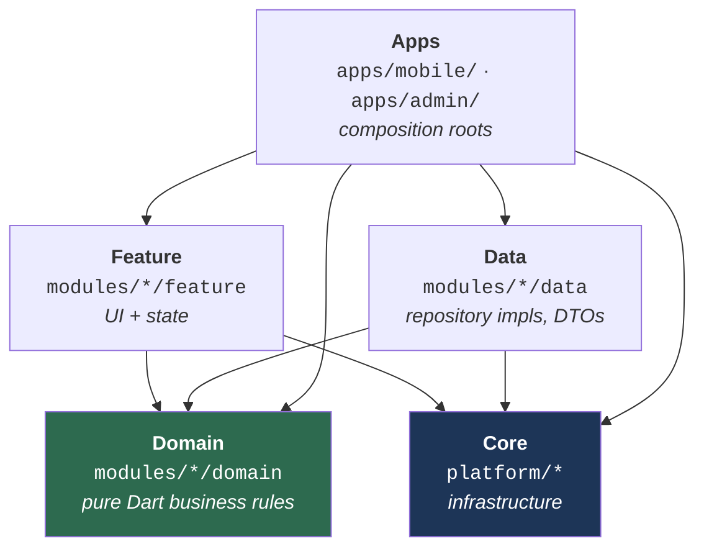

# Architecture Overview

This document answers **"how is this monorepo laid out, and which package may depend on which?"**. After reading it you should be able to place any new file in the right package and know, without guessing, whether an `import` you are about to write is legal.

For the day-to-day mechanics of *building* things, see [the guides](../guides/01_new_feature.md). For the enforceable rule list, see [`../reference/01_rules.md`](../reference/01_rules.md).

---

## 1. The one rule that generates all the others

The project follows **Clean Architecture**: dependencies always point *inward*, toward business logic. Business rules never know about Flutter, Dio, Drift, or SharedPreferences.



Read the arrows as *"may import"*. Note what is **absent**: nothing points *out of* Domain, and nothing points from Core into Feature or Data.

> [!IMPORTANT]
> **Core must never depend on a feature.** `platform/*` sits underneath everything; if it reaches back up into `modules/*/feature`, the dependency graph gains a cycle and a package can no longer be extracted or tested in isolation.
>
> The same reasoning applies inside the core ring. A state-management base needs an empty/loading placeholder, and `core_ui_kit` already has branded ones — but `core_ui_kit` depends on `provider_state_management`, so borrowing them back would close a cycle. `provider_state_management` therefore ships its own minimal
> [`DefaultLoadingWidget` / `DefaultEmptyWidget`](../../../platform/provider_state_management/lib/src/base_view/default_state_widgets.dart). When core needs a widget, core defines it.

---

## 2. The layers

| Layer | Path | Responsibility | May import | Must **never** import |
|:--|:--|:--|:--|:--|
| **App** | `apps/<id>/` | Composition root: `app_manifest.yaml`, the generated `injection.dart`, a one-line `main.dart`, what identifies the app (Firebase options) | everything | — |
| **App shell** | `platform/app_shell/` | Boot sequence, router assembly, material wrapper, storage adapters — shared by every app | core packages | any module (`arch_check` R1) |
| **Feature** | `modules/*/feature` | Pages, widgets, UI state controllers | `domain_*`, `core_di`, `core_common`, `core_base_ui`, `core_ui_kit`, `core_responsive`, one state-management package | `data_*`, another feature package |
| **Domain** | `modules/*/domain` | Entities, use cases, repository contracts | `domain_core`, annotation-only packages | Flutter, Dio, Retrofit, Drift — **anything platform-specific** |
| **Data** | `modules/*/data` | Repository implementations, DTOs, data sources | `domain_*`, `core_*` | `modules/*/feature` |
| **Core** | `platform/*` | Networking, storage, database, design system, DI contracts | other `core_*`, plus the three exceptions below | `modules/*/feature`, `modules/*/data` |

Each layer has a dedicated page:
[Core](02_core.md) · [Domain](03_domain.md) · [Data](04_data.md) · [Features](05_features.md) · [App Shell](06_app_shell.md).

### The Domain purity mandate

`modules/*/domain` is **100% pure Dart**. No `package:flutter/...`, no `package:dio/...`, no `package:drift/...`. This is what makes the business layer unit-testable without a device or a widget tree.

When domain logic needs something that *looks* UI-shaped — a colour, an icon, a screen size — it must be expressed as a primitive or an enum defined inside the domain package itself, and the feature layer decides how to render it.

### The approved exceptions

Three infrastructure packages under `platform/` depend on `domain_core`. (`data_core` does too, but it is the data layer's foundation that happens to live under `platform/` — a data package depending on domain is the normal direction, not an exception.) All three are deliberate and documented; do not "clean them up". `tools/arch_check/check.dart` holds the same list, prints it on every run, and fails the build on a fourth.

Note every one of them points at `domain_core` — the innermost ring — and none at a *product* domain. That is the line: core may know what a `Result` or an `AppFailure` is, never what an account is.

| Exception | Why it exists |
|:--|:--|
| `provider_state_management` → `domain_core` | `PaginatedViewWidget` is typed over `PaginatedEntity<T>`, and `executeOperation` unwraps `Result<T>` — both defined in `domain_core`. The state-management base exists precisely to consume those types. |
| `bloc_state_management` → `domain_core` | `BlocViewState.error` carries an `AppFailure`, which is part of the `Result` contract and therefore lives in `domain_core`. |
| `platform_kernel` → `domain_core` | `ErrorHandler.handleError()` produces an `AppFailure`. Its declaration sits with `Result<T>` in `domain_core`, and `core_common` re-exports the kernel wholesale so existing importers never noticed the move. |

Everything else in `platform/*` has **zero** local-package dependencies beyond other infrastructure packages (`platform_kernel`, `core_*`). `core_database`, notably, depends on no other workspace package at all.

---

## 3. Why a Pub Workspace monorepo

Every package is a member of the root [`pubspec.yaml`](../../../pubspec.yaml) `workspace:` list — 28 members today (25 packages, two apps, and `tools`). One `pubspec.lock`, one resolution, one `dart run build_runner build` for the whole tree.

**What you gain:** fast incremental compilation, no version drift between packages, refactors that cross package boundaries in a single commit, and physical enforcement of layering — a feature package *cannot* import `data_auth` if its `pubspec.yaml` does not declare it.

> [!WARNING]
> **The trade-off you must actively manage.** A Pub Workspace resolves one shared `package_config.json` for all members. That means a package can `import 'package:data_core/data_core.dart'` and **compile fine even if it never declared `data_core` in its own `pubspec.yaml`**.
>
> The code works today and breaks the moment anyone extracts that package or reorders the workspace. The two shapes to watch for are an import with no pubspec entry at all, and a production import whose entry sits under `dev_dependencies` — both compile inside the workspace and neither survives outside it.
>
> Declare every dependency you import, in the right section. Verify with:
> ```bash
> dart tools/unused_checker/check_unused_packages.dart
> ```

---

## 4. Who owns what

The directory layout is an ownership boundary, not a filing convention. It is shaped the way it
is so that [`.github/CODEOWNERS`](../../../.github/CODEOWNERS) can express it in one line per
team:

| Directory | Owner | What changing it means |
|:--|:--|:--|
| `platform/` | Infra | Every module depends on it, so a breaking change breaks everyone at once |
| `platform/di/` | Infra + architects | Cross-module contracts — changing one is a negotiation, not a unilateral edit |
| `modules/<name>/` | That module's team | All three layers together: the team changing the UI is the team changing the use case behind it |
| `apps/` | Tech leads | Which modules ship together, and in what order they initialise — a release decision |
| `apps/*/app_manifest.yaml` | Tech leads + architects | The composition itself. Adding a module here changes what the product *is* |

This is why a module is `modules/auth/{domain,data,feature}` rather than the auth rows of three
sibling directories. CODEOWNERS matches **paths**; under a layer-first layout it has no way to say "the auth parts
of the domain, data and features directories" — those are three unrelated paths that happen to
share a last segment. One directory per bounded context makes ownership expressible, and a git
submodule per module possible.

> [!WARNING]
> The handles in `CODEOWNERS` are placeholders. GitHub **silently ignores** a team that does not
> exist, so an unreplaced rule reads as enforced and is not. Replace them before relying on it.

---

## 5. Architectural decisions and their rationale

| Decision | Alternative rejected | Why |
|:--|:--|:--|
| **`Result<T>` instead of thrown exceptions** across layer boundaries | `throw` / `try-catch` at the call site | An exception is invisible in a function signature — the caller has no way to know it must handle failure. `Future<Result<UserEntity>>` puts the failure case *in the type*, so the compiler reminds you. The Data layer never lets an exception escape; `IBaseRepository.execute()` converts it into `Result.failure(AppFailure)`. |
| **Decentralized DI via micro-package modules** | One giant `injection.dart` listing every registration | Each package owns `lib/di/module.dart` with `@InjectableInit.microPackage()`. Adding a package means one line in an app's `app_manifest.yaml` (then `composer sync`), not editing a 500-line central file. Deleting a package removes its registrations with it. |
| **Decentralized routing via DI contracts** | Hardcoding every `GoRoute` in `app_router.dart` | Features register [`IFeatureRouteModule`](../../../platform/di/lib/src/routing/routing_interfaces.dart) / `INavDestinationModule`; `AppRouter` collects them with `getAllOrEmpty<T>()`. A feature can be deleted from the workspace without touching the app shell — the router simply collects one contribution fewer and falls back gracefully. |
| **Package-owned storage keys** | A single shared "presets" object holding every key | A shared object hands *every* injector read/write access to *every* other feature's data. Each package declares its own `StorageValue` instances with its own keys in its own `utils/` folder. See [the storage guide](../guides/06_storage.md). |
| **Package-owned database access** | One shared app-wide database injected everywhere | Same reasoning: a shared database object exposes every DAO to every injector, and forces whichever package declares it to own every table. Packages depend on [`IDatabaseHandle`](../../../platform/database/lib/src/access/i_database_handle.dart) and receive only the accessor they ask for. See [the database guide](../guides/07_database.md). |
| **Constants live in each package's `utils/`** | A central `constants/` folder in `core_common` | A central constants file becomes a god object: auth endpoints, chat channel IDs and theme keys all sitting where every package can read them. The bottom of the stack keeps only genuinely global values (`EnvConstants`, `ErrorCodes`, in `platform_kernel`). |

---

## 6. Where to go next

| If you want to… | Read |
|:--|:--|
| Get the project running | [`../getting-started/01_setup.md`](../getting-started/01_setup.md) |
| Understand a specific layer | [Core](02_core.md) · [Domain](03_domain.md) · [Data](04_data.md) · [Features](05_features.md) |
| Understand boot order and DI assembly | [App Shell](06_app_shell.md) |
| Build a new feature end to end | [`../guides/01_new_feature.md`](../guides/01_new_feature.md) |
| Check a rule before a PR | [`../reference/01_rules.md`](../reference/01_rules.md) · [`../reference/04_review_checklist.md`](../reference/04_review_checklist.md) |

> [!NOTE]
> The packages under `modules/*/domain`, `modules/*/data` and `modules/*/feature` (Auth, Cache, Home, Settings, Onboarding, Splash, Dashboard) ship as **sample implementations**. They demonstrate the wiring, not production business rules — copy the shape, then replace or delete them.
