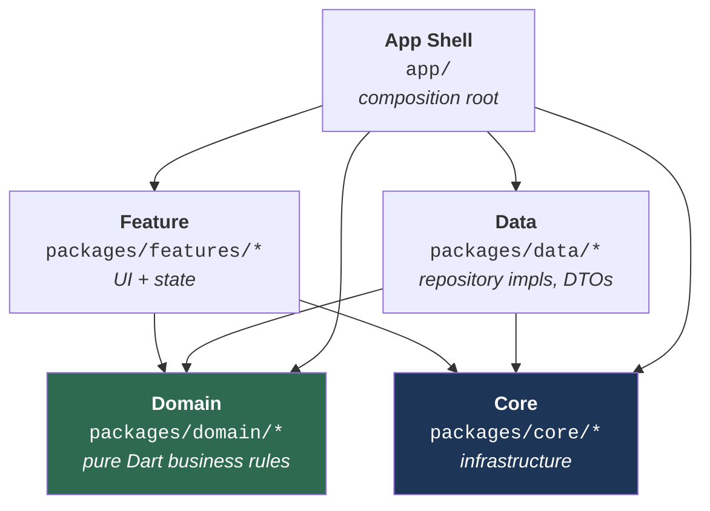

# Architecture Overview

This document answers **"how is this monorepo laid out, and which package may depend on which?"**. After reading it you should be able to place any new file in the right package and know, without guessing, whether an `import` you are about to write is legal.

For the day-to-day mechanics of *building* things, see [the guides](../guides/01_new_feature.md). For the enforceable rule list, see [`../reference/01_rules.md`](../reference/01_rules.md).

---

## 1. The one rule that generates all the others

The project follows **Clean Architecture**: dependencies always point *inward*, toward business logic. Business rules never know about Flutter, Dio, Drift, or SharedPreferences.



Read the arrows as *"may import"*. Note what is **absent**: nothing points *out of* Domain, and nothing points from Core into Feature or Data.

> [!IMPORTANT]
> **Core must never depend on a feature.** `packages/core/*` sits underneath everything; if it reaches back up into `packages/features/*`, the dependency graph gains a cycle and a package can no longer be extracted or tested in isolation.
>
> This rule was violated once and has been repaired: `provider_state_management` used to import the shared widget library (then `feature_shared`, now `core_ui_kit`) purely to reuse its `EmptyWidget` / `LoadingWidget` as fallbacks. It now ships its own minimal
> [`DefaultLoadingWidget` / `DefaultEmptyWidget`](../../../packages/core/provider_state_management/lib/src/base_view/default_state_widgets.dart) instead.

---

## 2. The layers

| Layer | Path | Responsibility | May import | Must **never** import |
|:--|:--|:--|:--|:--|
| **App Shell** | `app/` | Entry point, flavors, DI assembly, router assembly | everything | — |
| **Feature** | `packages/features/*` | Pages, widgets, UI state controllers | `domain_*`, `core_di`, `core_common`, `core_base_ui`, `core_ui_kit`, one state-management package | `data_*`, another feature package |
| **Domain** | `packages/domain/*` | Entities, use cases, repository contracts | `core_common`, `domain_core`, annotation-only packages | Flutter, Dio, Retrofit, Drift — **anything platform-specific** |
| **Data** | `packages/data/*` | Repository implementations, DTOs, data sources | `domain_*`, `core_*` | `packages/features/*` |
| **Core** | `packages/core/*` | Networking, storage, database, design system, DI contracts | other `core_*`, plus the two exceptions below | `packages/features/*`, `packages/data/*` |

Each layer has a dedicated page:
[Core](02_core.md) · [Domain](03_domain.md) · [Data](04_data.md) · [Features](05_features.md) · [App Shell](06_app_shell.md).

### The Domain purity mandate

`packages/domain/*` is **100% pure Dart**. No `package:flutter/...`, no `package:dio/...`, no `package:drift/...`. This is what makes the business layer unit-testable without a device or a widget tree.

When domain logic needs something that *looks* UI-shaped — a colour, an icon, a screen size — it must be expressed as a primitive or an enum defined in `core_common`, and the feature layer decides how to render it.

### The approved exceptions

Four `core_*` packages depend on a `domain_*` package. All are deliberate and documented; do not "clean them up". `tools/arch_check/check.dart` holds the same list and fails the build on a fifth.

| Exception | Why it exists |
|:--|:--|
| `core_di` → `domain_auth` | `core_di` is the **DI Hub** where cross-package contracts live. [`IAuthStatusStream`](../../../packages/core/di/lib/src/agnostic_streams/i_auth_status_stream.dart) exposes `Stream<UserEntity?>` — a *concrete* domain type, deliberately not a generic `<T>`. Weakening it to a generic would push type-checking onto every consumer. The Hub is contracts only, never business logic, so importing an entity type does not make it a domain package. |
| `provider_state_management` → `domain_core` | `PaginatedViewWidget` is typed over `PaginatedEntity<T>`, and `executeOperation` unwraps `Result<T>` — both defined in `domain_core`. The state-management base exists precisely to consume those types. |

Everything else in `packages/core/*` has **zero** local-package dependencies beyond other `core_*` packages. `core_database`, notably, depends on no other workspace package at all.

---

## 3. Why a Pub Workspace monorepo

Every package is a member of the root [`pubspec.yaml`](../../../pubspec.yaml) `workspace:` list — 24 members today. One `pubspec.lock`, one resolution, one `dart run build_runner build` for the whole tree.

**What you gain:** fast incremental compilation, no version drift between packages, refactors that cross package boundaries in a single commit, and physical enforcement of layering — a feature package *cannot* import `data_auth` if its `pubspec.yaml` does not declare it.

> [!WARNING]
> **The trade-off you must actively manage.** A Pub Workspace resolves one shared `package_config.json` for all members. That means a package can `import 'package:data_core/data_core.dart'` and **compile fine even if it never declared `data_core` in its own `pubspec.yaml`**.
>
> The code works today and breaks the moment anyone extracts that package or reorders the workspace. Two real instances of this were found and fixed in this repo: `data_auth` used `data_core` while declaring it under `dev_dependencies`, and `feature_splash` used `core_di` without declaring it at all.
>
> Declare every dependency you import, in the right section. Verify with:
> ```bash
> dart tools/unused_checker/check_unused_packages.dart
> ```

---

## 4. Architectural decisions and their rationale

| Decision | Alternative rejected | Why |
|:--|:--|:--|
| **`Result<T>` instead of thrown exceptions** across layer boundaries | `throw` / `try-catch` at the call site | An exception is invisible in a function signature — the caller has no way to know it must handle failure. `Future<Result<UserEntity>>` puts the failure case *in the type*, so the compiler reminds you. The Data layer never lets an exception escape; `IBaseRepository.execute()` converts it into `Result.failure(AppFailure)`. |
| **Decentralized DI via micro-package modules** | One giant `injection.dart` listing every registration | Each package owns `lib/di/module.dart` with `@InjectableInit.microPackage()`. Adding a package means adding one line to the app shell, not editing a 500-line central file. Deleting a package removes its registrations with it. |
| **Decentralized routing via DI contracts** | Hardcoding every `GoRoute` in `app_router.dart` | Features register [`IFeatureRouteModule`](../../../packages/core/di/lib/src/routing/routing_interfaces.dart) / `IDashboardTabModule`; `AppRouter` collects them with `getAllOrEmpty<T>()`. A feature can be deleted from the workspace without touching the app shell — the router simply collects one contribution fewer and falls back gracefully. |
| **Package-owned storage keys** | A single shared "presets" object holding every key | A shared object hands *every* injector read/write access to *every* other feature's data. Each package now declares its own `StorageValue` instances with its own keys in its own `utils/` folder. See [the storage guide](../guides/06_storage.md). |
| **Package-owned database access** | Injecting `AppDatabase` everywhere | Same reasoning: `AppDatabase` exposes every DAO. Packages depend on [`IDatabaseHandle`](../../../packages/core/database/lib/src/access/i_database_handle.dart) and receive only the accessor they ask for. See [the database guide](../guides/07_database.md). |
| **Constants live in each package's `utils/`** | A central `constants/` folder in `core_common` | A central constants file becomes a god object: auth endpoints, chat channel IDs and theme keys all sitting where every package can read them. `core_common` now keeps only genuinely global values (`ApiStatusConstants`, `EnvConstants`). |

---

## 5. Where to go next

| If you want to… | Read |
|:--|:--|
| Get the project running | [`../getting-started/01_setup.md`](../getting-started/01_setup.md) |
| Understand a specific layer | [Core](02_core.md) · [Domain](03_domain.md) · [Data](04_data.md) · [Features](05_features.md) |
| Understand boot order and DI assembly | [App Shell](06_app_shell.md) |
| Build a new feature end to end | [`../guides/01_new_feature.md`](../guides/01_new_feature.md) |
| Check a rule before a PR | [`../reference/01_rules.md`](../reference/01_rules.md) · [`../reference/04_review_checklist.md`](../reference/04_review_checklist.md) |

> [!NOTE]
> The packages under `packages/domain/*`, `packages/data/*` and `packages/features/*` (Auth, Home, Settings, Onboarding, Splash, Dashboard, Language) ship as **sample implementations**. They demonstrate the wiring, not production business rules — copy the shape, then replace or delete them.
