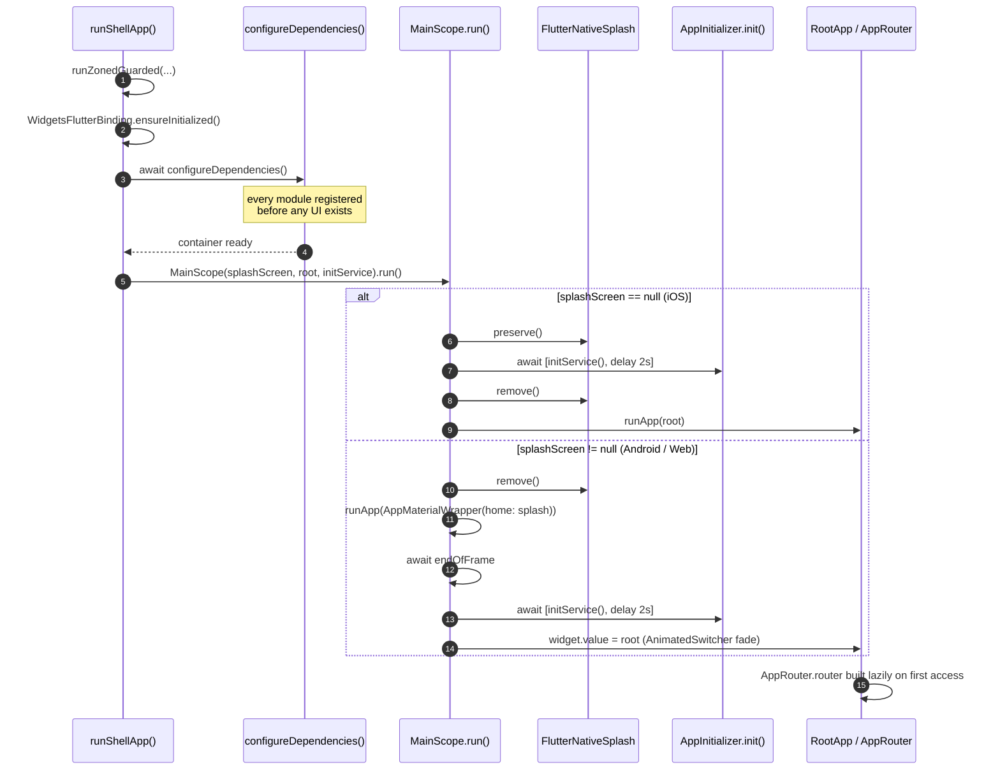

# The App Shell (`platform/app_shell/` + `apps/<id>/`)

This document answers **"what happens between tapping the icon and seeing the first screen, and who wires everything together?"**. After reading it you should be able to debug a startup failure, add a shell adapter, and understand why the DI group order in `app_manifest.yaml` is not arbitrary.

The shell is split in two, on purpose:

- **`apps/<id>/`** is the **composition root** — the only place allowed to depend on every layer, and the only place that knows the full list of modules. It holds what genuinely differs between apps and nothing else.
- **`platform/app_shell/`** (`platform_app_shell`) is everything every app needs and would otherwise copy: the boot scope, the router assembly, the material wrapper, the storage adapters and `NetworkConfigImpl`. It imports no module — `arch_check` R1 holds that, because it is a `platform/` package.

Before the split, a second app meant copying 1,369 lines across 24 files. Now an app is a manifest, a generated `injection.dart`, a one-line `main.dart`, and whatever identifies it — in the sample, its Firebase options.

---

## 1. What lives where

```
apps/mobile/                         the composition root
├── app_manifest.yaml                which modules, which DI group order
├── lib/
│   ├── main.dart                    one line: runShellApp(configureDependencies: …)
│   ├── di/injection.dart            generated by composer — never hand-edited
│   └── firebase/firebase_module.dart this app's FirebaseOptions (options files git-ignored)
├── android/  ios/  fastlane/        native projects and release lanes
└── env.dev  env.stg                 flavor values (env.prod is yours to create)

platform/app_shell/lib/              shared by every app
├── bootstrap.dart                   runShellApp — error zone, DI, splash, init
├── main_scope.dart                  splash → init → root transition
├── di/
│   ├── module.dart                  @InjectableInit.microPackage — the `shell` DI group
│   ├── theme_storage_impl.dart      IThemeStorage    → StorageValue<ThemeMode>
│   ├── language_storage_impl.dart   ILanguageStorage → StorageValue<String>
│   ├── app_boot_storage.dart        boot flags       → StorageValue<bool>
│   ├── network_config_impl.dart     NetworkConfig
│   ├── network_binding_module.dart  SslPinningConfig binding
│   └── utils/                       storage keys owned by the shell
└── presentation/
    ├── root_app.dart                the routed MaterialApp
    ├── app_material_wrapper.dart    shared MaterialApp config
    ├── navigation/app_router.dart   GoRouter assembly
    ├── providers/                   AppProvider, DeeplinkProvider
    └── widgets/                     NavigatorWrapperWidget, UndefineRouteWidget
```

---

## 2. Boot lifecycle



### Step by step

The sequence lives in `runShellApp()` ([`platform/app_shell/lib/bootstrap.dart`](../../../platform/app_shell/lib/bootstrap.dart)); an app's `main.dart` only calls it with its own generated `configureDependencies`.

1. **`runZonedGuarded`** wraps everything so uncaught async errors are reported rather than lost. Each goes to the app's optional `onError` callback — the place to wire a crash reporter — and then to `FlutterError.reportError`.
2. **`WidgetsFlutterBinding.ensureInitialized()`** — required before any plugin call.
3. **`await configureDependencies()`** runs *before* `MainScope`. By the time any widget builds, the whole container is resolved.
4. **`MainScope`** is constructed with three things: which splash widget to show (if any), the root widget, and `initService` — here `AppInitializer.init(routeObserver: getIt<AppRouter>().routeObserver)`.
5. **`mainScope.run()`** branches on whether a Dart splash widget was supplied.

### The two splash paths

`runShellApp` chooses the splash per platform, and takes it from whichever module registered `IAppSplashScreen` — in the sample, `feature_splash`:

```dart
final usesDartSplash = kIsWeb || !Platform.isIOS;
// ...
splashScreen: usesDartSplash
    ? getItOrNull<IAppSplashScreen>()?.build()
    : null,
```

| Platform | `splashScreen` | Behaviour |
|:--|:--|:--|
| iOS | `null` | Native splash is **preserved** across init, then removed once work finishes. No Dart splash is ever rendered. |
| Android, Web, desktop | `IAppSplashScreen.build()` | Native splash is removed immediately; the registered splash renders instead and cross-fades into `RootApp` via `AnimatedSwitcher`. With no splash module composed it is `null` and the iOS path applies. |

Both paths await `Future.wait([initService(), Future.delayed(_minimumDelay)])`, where `_minimumDelay` is 2 seconds. The delay is a **floor**, not an addition — fast initialisation still waits so the splash does not flicker.

> [!NOTE]
> `SplashPage` is shown by `MainScope`, **not** by GoRouter. It has no route and never appears in the navigation stack.

### `_ResponsiveWrapper`

Both paths wrap the tree in **`ResponsiveInit`** from `core_responsive`, with `AppConfig.design` (375×812), `minTextAdapt: true`, `splitScreenMode: true` and a custom `fontSizeResolver` that scales text by real screen width. It sits at the very root, so every widget below it can call `context.w(x)` / `context.h(x)` / `context.sp(x)` / `context.r(x)`.

`ResponsiveInit` publishes the metrics through a `ResponsiveScope` `InheritedWidget`, so a widget that reads them subscribes to them — there is no rebuild flag to tune. Sizing must go through `BuildContext`: there is no `num` extension, so `16.h` does not even compile. See [rule 12](../reference/01_rules.md#12-responsive-ui) for the reasoning, and note that `arch_check` rule R7 blocks the bare form on every PR.

> [!NOTE]
> Supplying a `fontSizeResolver` overrides text scaling completely, so the `minTextAdapt: true` above is inert while the resolver is set. Dropping the resolver is a deliberate visual change, not a cleanup.

---

## 3. DI assembly — and why the order matters

The order is declared in [`apps/mobile/app_manifest.yaml`](../../../apps/mobile/app_manifest.yaml) under `di_groups`, and `composer sync` generates it into [`apps/mobile/lib/di/injection.dart`](../../../apps/mobile/lib/di/injection.dart):

```dart
const _externalModulesBefore = [..._coreModules];
const _externalModulesAfter = [
    ..._shellModules,
    ..._uiModules,
    ..._domainModules,
    ..._dataModules,
    ..._featureModules,
    ..._otherModules,
];
```

Resolution order in the generated `injection.config.dart`:

| # | Registered | Notes |
|:-:|:--|:--|
| 1 | `_coreModules` | `core_common`, `core_network`, `core_storage`, `core_database`, `core_di` |
| – | the app's own `lib/` | `FirebaseModule` — per-flavour `FirebaseOptions` ([`apps/mobile/lib/firebase/firebase_module.dart`](../../../apps/mobile/lib/firebase/firebase_module.dart)) |
| 2 | `_notificationsModules` | `core_notifications` — its eager `PushNotificationService` injects those `FirebaseOptions`, so it must come after them |
| 3 | `_shellModules` | `platform_app_shell` — `AppRouter`, `AppProvider`, `DeeplinkProvider`, `AppBootStorage`, `ILanguageStorage`, `IThemeStorage`, `NetworkConfig`, `SslPinningConfig` |
| 4 | `_uiModules` | `core_base_ui` |
| 5 | `_domainModules` → `_dataModules` → `_featureModules` → `_otherModules` | |

The app package registers only what identifies it: its Firebase options, which name one bundle ID and so cannot live in `platform/`. Everything else arrives through a group.

### Why `shell` comes before `ui`

This is the single most important implicit rule in the DI setup, and the manifest says so in a comment.

`core_base_ui` registers `ThemeProvider` and `LanguageProvider`, which inject `IThemeStorage` and `ILanguageStorage`. Those two interfaces are implemented in `platform_app_shell` (`theme_storage_impl.dart`, `language_storage_impl.dart`), not in any core package the providers could depend on directly. So `shell` must initialise first. Swap the two groups and startup fails with "IThemeStorage is not registered".

It is also the same slot these registrations occupied before the shell became a package. They used to be app-local, which injectable runs *between* `…Before` and `…After`; `shell` is now the first group of `…After`. The order the app boots in did not change — only where the code lives.

### The eager-singleton ordering trap

> [!CAUTION]
> An eager `@Singleton` is constructed **at registration time**. If it depends on a type registered by a module that runs *later*, startup throws `… is not registered`.
>
> `flutter analyze` cannot detect this — it is a runtime ordering fault. Verify by reading the generated `apps/mobile/lib/di/injection.config.dart` and checking that every dependency appears *above* its consumer.

Real example: `core_base_ui`'s `ThemeProvider` injects `IThemeStorage`, which the `shell` group registers. That is why `shell` is listed before `ui` in every app's `di_groups` — reverse them and boot throws. (`NetworkConfigImpl` used to be the example here, injecting `AuthLocalDataSource` from a later module. It now resolves `IAuthSessionGateway` at call time instead, and has no cross-module constructor dependency.)

### `AppRouter` is eager, but its router is not

`AppRouter` *is* `@singleton` (eager), yet this is safe: `router` is a `late final` field.

```dart
late final GoRouter router = GoRouter( … );
```

The `GoRouter` — and the `getAllOrEmpty<IFeatureRouteModule>()` calls inside it — is not evaluated until something first reads `.router`. By then every feature module has registered. Had `router` been a plain field, the router would be assembled during step 2 and would collect **zero** feature routes.

---

## 4. Shell adapters

The shell implements the contracts that core packages declare but cannot satisfy themselves. Each owns its own `StorageValue` and keeps its keys in `platform/app_shell/lib/di/utils/`.

| File | Implements | Owns | Registration |
|:--|:--|:--|:--|
| `theme_storage_impl.dart` | `IThemeStorage` | `themeMode` (pref) | `@Singleton(as: IThemeStorage)` + `@PostConstruct(preResolve: true)` |
| `language_storage_impl.dart` | `ILanguageStorage` | `locale` (pref) | same |
| `app_boot_storage.dart` | — | `viewed_onboard` (pref) | `@singleton` + `@PostConstruct(preResolve: true)` |
| `network_config_impl.dart` | `NetworkConfig` | — | `@LazySingleton(as: NetworkConfig)` |
| `network_binding_module.dart` | binds `SslPinningConfig` | — | `@module` |

### Why `SslPinningConfig` needs a separate binding

`NetworkConfig implements SslPinningConfig`, but **GetIt resolves by exact registered type and does not walk the supertype chain**. Register only `as: NetworkConfig` and `getItOrNull<SslPinningConfig>()` returns `null`, so `AppInitializer` skips pinning entirely — silently, on every flavor.

The second type therefore needs its own module binding, the same dual-registration pattern `feature_auth` uses for `IAuthStatusStream`:

```dart
@module
abstract class NetworkBindingModule {
  @lazySingleton
  SslPinningConfig bindSslPinningConfig(NetworkConfig config) => config;
}
```

The parameter is typed `NetworkConfig`, so the upcast is compiler-checked — no `as` cast.

---

## 5. Router assembly

[`app_router.dart`](../../../platform/app_shell/lib/presentation/navigation/app_router.dart) builds GoRouter **entirely from DI contributions**.

```dart
List<RouteBase> get _featureRoutes => [
  for (final module in getAllOrEmpty<IFeatureRouteModule>()) ...module.routes,
];

List<INavDestinationModule> get _dashboardTabs =>
    getAllOrEmpty<INavDestinationModule>().toList()
      ..sort((a, b) => a.order.compareTo(b.order));
```

Structure produced:

```
GoRouter(navigatorKey: NavigatorKeys.rootKey)
└── ShellRoute(navigatorKey: appKey)          → NavigatorWrapperWidget
    ├── ..._featureRoutes                      ← IFeatureRouteModule
    └── StatefulShellRoute.indexedStack        ← INavDestinationModule (sorted by order)
        └── builder → DashboardRouteModule
```

Every collection point degrades gracefully when nothing is registered:

| Missing | Fallback |
|:--|:--|
| `IFeatureRouteModule` | empty list |
| `INavDestinationModule` | one placeholder branch at `/_empty_dashboard` rendering `SizedBox.shrink()` |
| `DashboardRouteModule` | the bare `navigationShell` — destinations without chrome |
| `IAppEntryLocation` | first dashboard tab path, else `/` |

Deleting a feature package therefore cannot crash the shell.

> [!CAUTION]
> **Never hardcode a feature route in `app_router.dart`.** Register `IFeatureRouteModule` or `INavDestinationModule` in the feature's own DI module instead. See [`../guides/04_routing.md`](../guides/04_routing.md).

`refreshListenable: getItOrNull<AuthProvider>()` makes GoRouter re-evaluate redirects when auth state changes. `errorPageBuilder` renders `UndefineRouteWidget` — a named widget, never an inline closure.

---

## 6. `NavigatorWrapperWidget` — first navigation and auth transitions

Sits inside the app `ShellRoute` and wraps every in-app route. It splits navigation into two distinct responsibilities.

**Boot redirect** runs once, in `initState`, deferred to `endOfFrame`:

```dart
WidgetsBinding.instance.endOfFrame.whenComplete(() async {
  await authProvider.ensureInitialized();
  if (!mounted) return;
  // onboarding? → login? → home
  _bootCompleted = true;
});
```

Waiting for `endOfFrame` guarantees the first frame is on screen before any redirect, and `ensureInitialized()` waits for session restore to finish so the decision is made against real state.

**Later transitions** are handled by a `ProviderStateListener<AuthProvider, UserEntity>` in `build`, gated on `_bootCompleted && authProvider.hasRestoredSession`. The gate exists so the listener does not fight the boot redirect over the very first navigation.

> [!WARNING]
> `_goToOnboarding()` sets `viewedOnboard.value = true` inside a `finally` block, so the flag is written even when the method returns `false` because a user is already signed in — that is, without the onboarding screen ever being shown. Harmless today, but the flag does not mean quite what its name suggests.

---

## 7. `AppMaterialWrapper` and `RootApp`

`AppMaterialWrapper` exists so the splash `MaterialApp` and the routed `MaterialApp` share one configuration. Two constructors: the default (plain `MaterialApp`, used for splash) and `.router` (used by `RootApp`).

Provider tree it installs:

```
MultiProvider(ThemeProvider, LanguageProvider)
└── Consumer2<ThemeProvider, LanguageProvider>
    └── AnnotatedRegion<SystemUiOverlayStyle>
        └── TooltipVisibility(visible: false)
            └── MultiProvider(AppProvider, AuthProvider, DeeplinkProvider)
                └── MaterialApp[.router]
```

The outer `Consumer2` is what makes theme and locale changes propagate app-wide.

Localization delegates are collected from DI, so features never edit this file:

```dart
final delegates = [
  ...getIt.getAll<IFeatureLocalization>().map((e) => e.delegate),
  ...AppLocalizations.localizationsDelegates,
];
```

`RootApp` supplies the four router objects from `getIt<AppRouter>().router` and adds the global `builder`: overlay hosts, `AppDialogController`, a `GestureDetector` that unfocuses the keyboard on outside taps, and `MediaQuery.withNoTextScaling` to keep layout stable.

---

## 8. Where to go next

| Task | Guide |
|:--|:--|
| Register routes from a feature | [`../guides/04_routing.md`](../guides/04_routing.md) |
| Add a DI registration correctly | [`../guides/05_di.md`](../guides/05_di.md) |
| Add a stored value | [`../guides/06_storage.md`](../guides/06_storage.md) |
| Configure networking / pinning | [`../guides/08_networking.md`](../guides/08_networking.md) |
| Understand the layers underneath | [`01_overview.md`](01_overview.md) |
