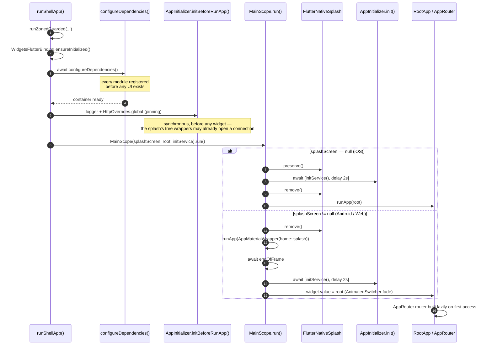

# The App Shell (`platform/app_shell/` + `apps/<id>/`)

This document answers **"what happens between tapping the icon and seeing the first screen, and who wires everything together?"**. After reading it you should be able to debug a startup failure, add a shell adapter, and understand why the DI group order in `app_manifest.yaml` is not arbitrary.

The shell is split in two, on purpose:

- **`apps/<id>/`** is the **composition root** — the only place allowed to depend on every layer, and the only place that knows the full list of modules. It holds what genuinely differs between apps and nothing else.
- **`platform/app_shell/`** (`platform_app_shell`) is everything every app needs and would otherwise copy: the boot scope, the router assembly, the material wrapper, the storage adapters and `NetworkConfigImpl`. It imports no module — `arch_check` R1 holds that, because it is a `platform/` package.

Before the split, a second app meant copying 1,369 lines across 24 files. Now an app is a manifest, a generated `injection.dart`, a one-line `main.dart`, and whatever identifies it — in the sample, its Firebase options.

---

## 1. What lives where

```
apps/mobile/                         the composition root
├── app_manifest.yaml                which modules, which DI group order
├── lib/
│   ├── main.dart                    one line: runShellApp(configureDependencies: …)
│   ├── di/injection.dart            generated by composer — never hand-edited
│   └── firebase/firebase_module.dart this app's FirebaseOptions (options files git-ignored)
├── android/  ios/  fastlane/        native projects and release lanes
└── env.dev  env.stg                 flavor values (env.prod is yours to create)

platform/app_shell/lib/              shared by every app
├── bootstrap.dart                   runShellApp — error hooks, DI, splash, init
├── main_scope.dart                  splash → init → root transition
├── di/
│   ├── module.dart                  @InjectableInit.microPackage — the `shell` DI group
│   ├── theme_storage_impl.dart      IThemeStorage    → StorageValue<ThemeMode>
│   ├── language_storage_impl.dart   ILanguageStorage → StorageValue<String>
│   ├── app_boot_storage.dart        boot flags       → StorageValue<bool>
│   ├── network_config_impl.dart     NetworkConfig
│   ├── network_binding_module.dart  SslPinningConfig binding
│   └── utils/                       storage keys owned by the shell
└── presentation/
    ├── root_app.dart                the routed MaterialApp
    ├── app_material_wrapper.dart    shared MaterialApp config
    ├── navigation/app_router.dart   GoRouter assembly
    ├── providers/                   AppProvider, DeeplinkProvider
    ├── utils/                       AppShellUiConstants (text-scale cap)
    └── widgets/                     NavigatorWrapperWidget, UndefineRouteWidget
```

### A second app: `apps/admin`

[`apps/admin`](../../../apps/admin/README.md) is the same shell composing a different subset — `auth` and `settings`, with no dashboard, splash, onboarding, home or Firebase. Its whole `lib/` is `main.dart` and `di/` — the generated `injection.dart` and its barrel. Every optional lookup in this package has a missing contribution there, so the fallbacks described below have a real composition that relies on them — once someone runs it; nothing in CI builds it yet.

---

## 2. Boot lifecycle



### Step by step

The sequence lives in `runShellApp()` ([`platform/app_shell/lib/bootstrap.dart`](../../../platform/app_shell/lib/bootstrap.dart)); an app's `main.dart` only calls it with its own generated `configureDependencies`.

1. **`runZonedGuarded`** wraps everything so uncaught async errors are reported rather than lost.
2. **`WidgetsFlutterBinding.ensureInitialized()`** — required before any plugin call — then **`installShellErrorHooks`**, which routes every uncaught error to one place (see [Errors and crash reporting](#errors-and-crash-reporting) below). It runs before `configureDependencies`, so a DI failure is reported too.
3. **`await configureDependencies()`** runs *before* `MainScope`. By the time any widget builds, the whole container is resolved.
4. **`AppInitializer.initBeforeRunApp()`** configures the logger and installs `HttpOverrides.global` — certificate pinning, or the debug + `dev`-flavor bypass — synchronously, before any widget exists. It cannot wait for `initService`: the splash is already wrapped in every feature's `IAppTreeWrapper`, so a controller created there (auth's `AuthProvider`, restoring the session with a token refresh) can open its first connection while `initService` is still pending, and Dio's `IOHttpClientAdapter` keeps the `HttpClient` it created first — an unpinned one would serve the whole session. The call is idempotent; `AppInitializer.init` makes it again and installs nothing the second time. `platform/app_shell/test/boot_order_test.dart` holds the order.
5. **`MainScope`** is constructed with three things: which splash widget to show (if any), the root widget, and `initService` — here `AppInitializer.init(routeObserver: getIt<AppRouter>().routeObserver)`, which does the rest: `OperationGlobalConfig`, GoRouter's URL reflection, `AppInfoHelper`, handing the route observer to `RouteAwareWidget`, orientation and system UI.
6. **`mainScope.run()`** branches on whether a Dart splash widget was supplied.

### Errors and crash reporting

Three kinds of error escape everything else, and the shell hooks all three:

| Hook | Catches |
|:--|:--|
| the `runZonedGuarded` handler | async errors escaping the app zone — an unawaited `Future` that throws |
| `FlutterError.onError` | errors the framework catches: build, layout, paint, image decoding, gestures |
| `PlatformDispatcher.instance.onError` | errors escaping to the engine — a platform-channel callback, a timer outside the zone |

They all end in the same place. The zone handler and the dispatcher hook re-raise through `FlutterError.reportError`; the `FlutterError.onError` hook first calls the handler that was there before it — by default `FlutterError.presentError`, the red console dump in debug — and then reports the error **once**: to the app's optional `onError` callback, then to `getItOrNull<IErrorReporter>()` with `fatal: true`. The dispatcher hook returns `true`: the error is handled, the engine does not log it a second time.

`IErrorReporter` and `IAnalytics` are optional `core_di` contracts ([`src/observability/`](../../../platform/di/lib/src/observability/)). Nothing in the template implements them, so both lookups return `null` and nothing is sent. The reporter is resolved when an error arrives, not at boot, so one registered by `configureDependencies` is picked up, and an error thrown *by* `configureDependencies` still reaches `onError`. A reporter or callback that throws is swallowed — it is never reported through itself.

A third path is non-fatal. `ErrorHandler` (`platform_kernel`) maps every repository exception to an `AppFailure`; the ones it cannot classify — a `TypeError` in a `fromJson`, a plugin exception — become the generic "Unknown error occurred" and are usually bugs. The shell points `ErrorHandler.onUnclassifiedError` at the reporter with `fatal: false`, so those are recorded while the user still gets a handled failure. Classified failures (no connection, 401, timeouts) are not reported.

**Plugging in Crashlytics or Sentry** is one registration in the app — its own `lib/`, next to `firebase/firebase_module.dart`, or a package the app composes. No shell code changes:

```dart
// apps/mobile/lib/observability/crashlytics_error_reporter.dart
@LazySingleton(as: IErrorReporter)
class CrashlyticsErrorReporter implements IErrorReporter {
  @override
  Future<void> recordError(
    Object error,
    StackTrace? stack, {
    bool fatal = false,
    String? reason,
  }) => FirebaseCrashlytics.instance.recordError(
    error,
    stack,
    fatal: fatal,
    reason: reason,
  );

  @override
  void log(String message) => FirebaseCrashlytics.instance.log(message);
}
```

For Sentry, `recordError` calls `Sentry.captureException(error, stackTrace: stack)` and `log` adds a breadcrumb; initialise the SDK in the app (`SentryFlutter.init` wraps `main`, before `runShellApp`). Do **not** also set `FlutterError.onError` yourself — the shell's hook already forwards it, and chains to whatever handler was installed before `runShellApp`. `IAnalytics` works the same way: register an implementation and every `GoRouteDataCustom` page reports its screen through `setCurrentScreen` (`RouteAwareWidget`, on push and when the route above it pops). `platform/app_shell/test/error_hooks_test.dart` holds the wiring.

### The two splash paths

`runShellApp` chooses the splash per platform, and takes it from whichever module registered `IAppSplashScreen` — in the sample, `feature_splash`:

```dart
final usesDartSplash = kIsWeb || !Platform.isIOS;
// ...
splashScreen: usesDartSplash
    ? getItOrNull<IAppSplashScreen>()?.build()
    : null,
```

| Platform | `splashScreen` | Behaviour |
|:--|:--|:--|
| iOS | `null` | Native splash is **preserved** across init, then removed once work finishes. No Dart splash is ever rendered. |
| Android, Web, desktop | `IAppSplashScreen.build()` | Native splash is removed immediately; the registered splash renders instead and cross-fades into `RootApp` via `AnimatedSwitcher`. With no splash module composed it is `null` and the iOS path applies. |

Both paths await `Future.wait([initService(), Future.delayed(_minimumDelay)])`, where `_minimumDelay` is 2 seconds. The delay is a **floor**, not an addition — fast initialisation still waits so the splash does not flicker.

> [!NOTE]
> `SplashPage` is shown by `MainScope`, **not** by GoRouter. It has no route and never appears in the navigation stack.

### `_ResponsiveWrapper`

Both paths wrap the tree in **`ResponsiveInit`** from `core_responsive`. It sits at the very root, so every widget below it can call `context.w(x)` / `context.h(x)` / `context.sp(x)` / `context.r(x)`. The configuration is the app's whole scale policy:

| Setting | Value | Effect |
|:--|:--|:--|
| `designSize` | `AppConfig.design` (375×812) | The phone artboard every window class starts from |
| `scaleBounds` / `textScaleBounds` | left at the default, `ScaleBounds.downOnly()` | A window smaller than the artboard shrinks the design; a larger one — a tablet, a desktop window — draws it 1:1 and gives the extra room to the layout |
| `profiles` | `WindowSizeClass.expanded` → `ScaleBounds.fixed()` for layout and text | From 840 wide up (and so `large` and `extraLarge` too), real logical pixels — a laptop window shorter than 812 no longer shrinks every vertical gap |
| `splitScreenMode` | `true` | Floors the height used for scaling at 700, so a short split-screen pane stays usable |

The theme scales type with `context.sp`, so it follows `textScaleBounds` like everything else. Growth on a class is an opt-in — a `ResponsiveProfile` with a capped bound, e.g. `ScaleBounds(max: 1.2)`. The full parameter table, what each window gets, and the adaptive widgets that spend the extra room are in [`11_design_system.md`](../guides/11_design_system.md) §6–§7.

`ResponsiveInit` publishes the metrics through a `ResponsiveScope` `InheritedWidget`, so a widget that reads them subscribes to them — there is no rebuild flag to tune. Sizing must go through `BuildContext`: there is no `num` extension, so `16.h` does not even compile. See [rule 12](../reference/01_rules.md#12-responsive-ui) for the reasoning, and note that `arch_check` rule R7 blocks the bare form on every PR.

> [!NOTE]
> There used to be a `fontSizeResolver` here computing the width ratio from `View.of(context).display` — the physical display, not the window. Full-screen the two agree; in split-screen or a resized window, text scaled to the whole display while every other dimension followed the window. `ResponsiveInit` measures the window through `MediaQuery`, so the default replaced the resolver. Do not bring one back to cap text either: a resolver's result is never clamped by `textScaleBounds`, which is where that cap now lives.

---

## 3. DI assembly — and why the order matters

The order is declared in [`apps/mobile/app_manifest.yaml`](../../../apps/mobile/app_manifest.yaml) under `di_groups`, and `composer sync` generates it into [`apps/mobile/lib/di/injection.dart`](../../../apps/mobile/lib/di/injection.dart):

```dart
const _externalModulesBefore = [..._coreModules];
const _externalModulesAfter = [
    ..._notificationsModules,
    ..._shellModules,
    ..._uiModules,
    ..._domainModules,
    ..._dataModules,
    ..._featureModules,
    ..._otherModules,
];
```

Resolution order in the generated `injection.config.dart`:

| # | Registered | Notes |
|:-:|:--|:--|
| 1 | `_coreModules` | `core_common`, `core_network`, `core_storage`, `core_database`, `core_di` |
| – | the app's own `lib/` | `FirebaseModule` — per-flavour `FirebaseOptions` ([`apps/mobile/lib/firebase/firebase_module.dart`](../../../apps/mobile/lib/firebase/firebase_module.dart)) |
| 2 | `_notificationsModules` | `core_notifications` — its eager `PushNotificationService` injects those `FirebaseOptions`, so it must come after them |
| 3 | `_shellModules` | `platform_app_shell` — `AppRouter`, `AppProvider`, `DeeplinkProvider`, `AppBootStorage`, `ILanguageStorage`, `IThemeStorage`, `NetworkConfig`, `SslPinningConfig` |
| 4 | `_uiModules` | `core_base_ui` |
| 5 | `_domainModules` → `_dataModules` → `_featureModules` → `_otherModules` | |

The app package registers only what identifies it: its Firebase options, which name one bundle ID and so cannot live in `platform/`. Everything else arrives through a group.

### Why `shell` comes before `ui`

This is the single most important implicit rule in the DI setup, and the manifest says so in a comment.

`core_base_ui` registers `ThemeProvider` and `LanguageProvider`, which inject `IThemeStorage` and `ILanguageStorage`. Those two interfaces are implemented in `platform_app_shell` (`theme_storage_impl.dart`, `language_storage_impl.dart`), not in any core package the providers could depend on directly. So `shell` must initialise first. Swap the two groups and startup fails with "IThemeStorage is not registered".

It is also the same slot these registrations occupied before the shell became a package. They used to be app-local, which injectable runs *between* `…Before` and `…After`; `shell` now runs early in `…After` — first in `apps/admin`, right after `notifications` in `apps/mobile`. The order the app boots in did not change — only where the code lives.

### The eager-singleton ordering trap

> [!CAUTION]
> An eager `@Singleton` is constructed **at registration time**. If it depends on a type registered by a module that runs *later*, startup throws `… is not registered`.
>
> `flutter analyze` cannot detect this — it is a runtime ordering fault. Verify by reading the generated files: `apps/mobile/lib/di/injection.config.dart` gives the module order, and each package's `lib/di/module.module.dart` its per-type registrations — every `gh<Dep>()` an eager singleton makes must be registered *above* it, or by a module that initialises earlier.

Real example: `core_base_ui`'s `ThemeProvider` injects `IThemeStorage`, which the `shell` group registers. That is why `shell` is listed before `ui` in every app's `di_groups` — reverse them and boot throws. (`NetworkConfigImpl` used to be the example here, injecting `AuthLocalDataSource` from a later module. It now resolves `IAuthSessionGateway` at call time instead, and has no cross-module constructor dependency.)

### `AppRouter` is eager, but its router is not

`AppRouter` *is* `@singleton` (eager), yet this is safe: `router` is a `late final` field.

```dart
late final GoRouter router = GoRouter( … );
```

The `GoRouter` — and the `getAllOrEmpty<IFeatureRouteModule>()` calls inside it — is not evaluated until something first reads `.router`. By then every feature module has registered. Had `router` been a plain field, the router would be assembled during step 2 and would collect **zero** feature routes.

---

## 4. Shell adapters

The shell implements the contracts that core packages declare but cannot satisfy themselves. Each owns its own `StorageValue` and keeps its keys in `platform/app_shell/lib/di/utils/`.

| File | Implements | Owns | Registration |
|:--|:--|:--|:--|
| `theme_storage_impl.dart` | `IThemeStorage` | `themeMode` (pref) | `@Singleton(as: IThemeStorage)` + `@PostConstruct(preResolve: true)` |
| `language_storage_impl.dart` | `ILanguageStorage` | `locale` (pref) | same |
| `app_boot_storage.dart` | — | `viewed_onboard` (pref) | `@singleton` + `@PostConstruct(preResolve: true)` |
| `network_config_impl.dart` | `NetworkConfig` | — | `@LazySingleton(as: NetworkConfig)` |
| `network_binding_module.dart` | binds `SslPinningConfig` | — | `@module` |

### Why `SslPinningConfig` needs a separate binding

`NetworkConfig implements SslPinningConfig`, but **GetIt resolves by exact registered type and does not walk the supertype chain**. Register only `as: NetworkConfig` and `getItOrNull<SslPinningConfig>()` returns `null`, so `AppInitializer` skips pinning entirely — silently, on every flavor.

The second type therefore needs its own module binding, the same dual-registration pattern `feature_auth` uses for `IAuthStatusStream`:

```dart
@module
abstract class NetworkBindingModule {
  @lazySingleton
  SslPinningConfig bindSslPinningConfig(NetworkConfig config) => config;
}
```

The parameter is typed `NetworkConfig`, so the upcast is compiler-checked — no `as` cast.

---

## 5. Router assembly

[`app_router.dart`](../../../platform/app_shell/lib/presentation/navigation/app_router.dart) builds GoRouter **entirely from DI contributions**.

```dart
List<RouteBase> get _featureRoutes => [
  for (final module in getAllOrEmpty<IFeatureRouteModule>()) ...module.routes,
];

List<INavDestinationModule> get _destinations =>
    getAllOrEmpty<INavDestinationModule>().toList()
      ..sort((a, b) => a.order.compareTo(b.order));
```

Structure produced:

```
GoRouter(navigatorKey: NavigatorKeys.rootKey)
└── ShellRoute(navigatorKey: appKey)          → NavigatorWrapperWidget
    ├── ..._featureRoutes                      ← IFeatureRouteModule
    └── StatefulShellRoute.indexedStack        ← INavDestinationModule (sorted by order)
        └── builder → DashboardRouteModule
```

Every collection point degrades gracefully when nothing is registered:

| Missing | Fallback |
|:--|:--|
| `IFeatureRouteModule` | empty list |
| `INavDestinationModule` | one placeholder branch at `/_empty_dashboard` rendering `SizedBox.shrink()` |
| `DashboardRouteModule` | the bare `navigationShell` — destinations without chrome |
| `IAppEntryLocation` | `AppRouter.fallbackLocation`: the first dashboard tab's path (lowest `order`), else the `/_empty_dashboard` placeholder (not `/`) |

`initialLocation` is `AppRouter.entryLocation`: the registered `IAppEntryLocation` **on the first launch only**, `fallbackLocation` on every later one. "First launch" is the shell's own `AppBootStorage.viewedOnboard`, which `NavigatorWrapperWidget` sets the first time boot runs with an entry location (§6); `AppRouter.resolveEntryLocation` is the pure decision. A returning user therefore opens on the first tab while the session restores, not on onboarding — and a signed-out one is then sent to login by the boot redirect.

Deleting a feature package therefore cannot crash the shell.

> [!CAUTION]
> **Never hardcode a feature route in `app_router.dart`.** Register `IFeatureRouteModule` or `INavDestinationModule` in the feature's own DI module instead. See [`../guides/04_routing.md`](../guides/04_routing.md).

`refreshListenable: getItOrNull<IAuthRefreshListenable>()` (which `feature_auth` binds to its `AuthProvider`) makes GoRouter re-resolve the current location — running any `redirect` on it — when auth state changes. **No redirect ships today**: there is no top-level `redirect:` and no sample route declares one, so on its own this changes nothing visible. It stays as the hook for a module that adds a guard to its own `GoRouteData.redirect`. Sign-in and sign-out *navigation* is done by `NavigatorWrapperWidget`, listening to `IAuthSessionState.sessionChanges` (§6). `errorPageBuilder` renders `UndefineRouteWidget` — a named widget, never an inline closure.

`observers: [routeObserver]` attaches `AppRouter.routeObserver` to the root navigator, and go_router forwards the root observers to every `ShellRoute` and `StatefulShellBranch` navigator (`notifyRootObserver`, on by default) — so the one observer `AppInitializer.init` hands to `RouteAwareWidget` sees pushes and pops everywhere, tabs included. `platform/app_shell/test/app_router_test.dart` checks both levels.

---

## 6. `NavigatorWrapperWidget` — first navigation and auth transitions

Sits inside the app `ShellRoute` and wraps every in-app route. It splits navigation into two distinct responsibilities.

**Boot redirect** runs once, in `initState`, deferred to `endOfFrame`:

```dart
WidgetsBinding.instance.endOfFrame.whenComplete(() async {
  await _session?.ensureInitialized(); // IAuthSessionState, via getItOrNull
  if (!mounted) return;
  // onboarding? → login? → home
  _bootCompleted = true;
});
```

Waiting for `endOfFrame` guarantees the first frame is on screen before any redirect, and `ensureInitialized()` waits for session restore to finish so the decision is made against real state. With no auth module composed, `_session` is null and the app is treated as signed out.

**Later transitions** arrive through two stream subscriptions opened in `initState` — `IAuthSessionState.sessionChanges` and `.sessionFailures` — and are gated differently. `_onSessionChanged` (which navigates) is ignored until `_bootCompleted && _session.hasRestoredSession`, so the restore's own emission does not fight the boot redirect over the very first navigation. `_onSessionFailure` (which only shows a toast) checks `_bootCompleted` alone — it never navigates, so it has nothing to fight over. `build` itself is just `Overlay.wrap(child: widget.child)`.

**Deep links** start in `_goToHome`, so they are never routed over onboarding or login. With an auth module that covers every path — leaving onboarding leads to a sign-in, and the sign-in to `_goToHome`. Without one no sign-in ever comes, so when boot stays on the entry location the widget instead starts deep links the first time the router leaves it (`navigator_wrapper_widget_test.dart`).

> [!NOTE]
> `_goToOnboarding()` sets `viewedOnboard.value = true` inside a `finally` block, so the flag is written on the first boot with an entry location even when a user is already signed in and onboarding is never shown. The flag means "the first launch is over", and that is exactly what `AppRouter.entryLocation` reads it as: the next cold start begins at `fallbackLocation`.

---

## 7. `AppMaterialWrapper` and `RootApp`

`AppMaterialWrapper` exists so the splash `MaterialApp` and the routed `MaterialApp` share one configuration. Two constructors: the default (plain `MaterialApp`, used for splash) and `.router` (used by `RootApp`).

Provider tree it installs:

```
MultiProvider(ThemeProvider, LanguageProvider)
└── Consumer2<ThemeProvider, LanguageProvider>
    └── AnnotatedRegion<SystemUiOverlayStyle>
        └── MultiProvider(AppProvider, DeeplinkProvider)
            └── every IAppTreeWrapper (e.g. feature_auth's AuthProvider)
                └── MaterialApp[.router]
```

The outer `Consumer2` is what makes theme and locale changes propagate app-wide.

There is no `TooltipVisibility(visible: false)` in the tree. There used to be one, to stop tooltips popping up on a long press — but it also removed every tooltip from the semantics tree, and a screen reader reads an icon-only button's `tooltip` as its label: the password field's show/hide toggle was announced as "button". The theme now does that job instead: `ThemeProvider` sets `tooltipTheme: TooltipThemeData(triggerMode: TooltipTriggerMode.manual)`, which stops the long-press/tap popup on touch screens and keeps the label (a mouse hover still shows the bubble — trigger modes do not apply to mice). Delete that line to get Material's long-press tooltip back. `platform/app_shell/test/accessibility_test.dart` checks the label is there.

Localization delegates are collected from DI with `getAllOrEmpty` — an app with no feature registering one still resolves the global delegates — so features never edit this file:

```dart
final delegates = [
  ...getAllOrEmpty<IFeatureLocalization>().map((e) => e.delegate),
  ...AppLocalizations.localizationsDelegates,
];
```

`RootApp` supplies the four router objects from `getIt<AppRouter>().router` and adds the global `builder`: overlay hosts, `AppDialogController` and a `GestureDetector` that unfocuses the keyboard on outside taps. `AppMaterialWrapper` wraps whatever a `builder` returns — for the splash and the router alike — in `MediaQuery.withClampedTextScaling(maxScaleFactor: AppShellUiConstants.MAX_TEXT_SCALE_FACTOR)`, so pages, toasts and dialogs share one text-scale cap.

### The OS font size is honoured, up to 2x

`RootApp`'s builder used to end in `MediaQuery.withNoTextScaling`, which pinned every text at 100% whatever the user had set — an accessibility failure (WCAG 2.2 SC 1.4.4 asks for text resizable to 200%), not a layout choice. It now clamps instead: the user's setting passes through unchanged up to `MAX_TEXT_SCALE_FACTOR` (2.0, in [`presentation/utils/app_shell_ui_constants.dart`](../../../platform/app_shell/lib/presentation/utils/app_shell_ui_constants.dart)), non-linear scalers (Android 14+) included, and nothing clamps the lower end.

This does **not** double-scale text with `core_responsive`. The two factors are independent and applied at different points:

| Factor | Applied by | Answers |
|:--|:--|:--|
| `context.sp(x)` (the theme's type scale, `AppTextStyles`) | `core_responsive`, into `TextStyle.fontSize` | "how big is this design size in this window?" — from the window width, clamped by `textScaleBounds`. It never reads `MediaQuery.textScaler` |
| `MediaQuery.textScaler` | Flutter's `Text` / `RichText`, at layout | "how much larger does this user want text?" |

A 16-unit body style is 16 × (window factor) logical pixels, then × the user's scale when drawn — once each. What does **not** grow with the text scale is layout sized with `context.h` / `context.w`: a fixed-height box holding text can overflow at 2x. Size text containers by their content (padding, `minHeight`), not a fixed height. `modules/auth/feature/test/login_page_text_scale_test.dart` and `modules/dashboard/feature/test/dashboard_text_scale_test.dart` lay out the login screen on three phone sizes and the dashboard chrome from phone to desktop at 2x, and fail on any overflow — copy them for a new screen.

---

## 8. Where to go next

| Task | Guide |
|:--|:--|
| Register routes from a feature | [`../guides/04_routing.md`](../guides/04_routing.md) |
| Add a DI registration correctly | [`../guides/05_di.md`](../guides/05_di.md) |
| Add a stored value | [`../guides/06_storage.md`](../guides/06_storage.md) |
| Configure networking / pinning | [`../guides/08_networking.md`](../guides/08_networking.md) |
| Understand the layers underneath | [`01_overview.md`](01_overview.md) |
