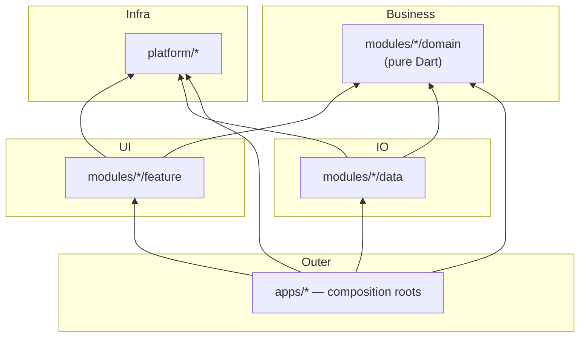

# 02 · Project Tour

**This page answers:** what is every folder for, which package owns what, and where do I go to change a given thing?

**After reading you can:** open the repo and land on the right package in one hop, without grepping blindly.

---

## 1. Top-level layout

```text
flutter-monorepo-codebase/
├── apps/                          # One directory per app — the composition roots
│   ├── admin/                     # Second app: auth + settings only — see apps/admin/README.md
│   └── mobile/
│       ├── app_manifest.yaml      # Which modules this app composes, and the DI group order
│       ├── lib/
│       │   ├── main.dart          # One line: runShellApp(configureDependencies: …)
│       │   ├── di/injection.dart  # Generated by composer from the manifest — never hand-edited
│       │   └── firebase/          # This app's FirebaseOptions (options files git-ignored)
│       ├── android/  ios/         # Native projects — build the APK from apps/mobile/, not the root
│       ├── fastlane/              # Release lanes
│       ├── env.dev  env.stg       # Flavor env files (env.prod is NOT in the repo)
│       └── pubspec.yaml           # Path deps between composer:managed markers are generated
│
├── platform/                      # Infra team's ground — every module may depend on it
│   ├── app_shell/                 # platform_app_shell: boot scope, router, material wrapper, storage adapters — shared by every app
│   ├── kernel/                    # platform_kernel: getIt helpers, ErrorHandler, pure-Dart utils
│   ├── base_ui/                   # Theme, LanguageProvider, design tokens & l10n (zero widgets)
│   ├── bloc_state_management/     # BaseBloc, BaseCubit, BlocViewState<T>
│   ├── common/                    # AppConfig, AppInitializer, Flutter-bound helpers
│   ├── database/                  # Drift mechanism: IDatabaseHandle, IDatabaseMigration, opener
│   ├── di/                        # DI Hub — every cross-module contract lives here
│   ├── network/                   # Dio + Retrofit factory, interceptor chain, SSL pinning
│   ├── notifications/             # Push Notification management module
│   ├── provider_state_management/ # BaseProvider, executeOperation, ViewStateModel
│   ├── responsive/                # Design-size scaling bound to BuildContext
│   ├── storage/                   # StorageManager + StorageValue<T> (defines NO keys)
│   ├── ui_kit/                    # core_ui_kit — reusable widgets every module may use
│   ├── domain_core/               # Result<T>, AppFailure, BaseEntity, BaseUseCase
│   └── data_core/                 # IBaseRepository, BaseModel, request models
├── modules/                       # One vertical slice per bounded context, one per team
│   ├── auth/                      # Sample: the full three-layer slice
│   │   ├── domain/                # Entities, UseCases, Repository interfaces — pure Dart
│   │   ├── data/                  # Models, DataSources, RepositoryImpl
│   │   └── feature/               # UI + Provider, login only
│   ├── cache/                     # Sample: a package-owned Drift database (domain + data, no UI)
│   ├── home/feature/              # Sample: BLoC, private Freezed events, a nav destination
│   ├── settings/feature/          # Sample: consuming another module's contract
│   ├── dashboard/feature/         # Sample: shell chrome only (bottom-bar host)
│   ├── onboarding/feature/        # Sample: IAppEntryLocation, the cold-start location
│   └── splash/feature/            # Sample: IAppSplashScreen, shown before the router exists
├── tools/                  # Dart CLI tooling (generators, checkers, sync)
├── docs/                   # This documentation (en/ + vi/)
├── .agents/                # AGENTS.md rules + skills for AI agents
│
├── pubspec.yaml            # Workspace root — lists all 28 members
├── pubspec_dependencies.yaml  # Version catalog — the single source of truth
├── pubspec.lock            # ONE lock file for the whole workspace
└── analysis_options.yaml
```

---

## 2. Every package, and what it owns

The authoritative list is the `workspace:` block in the root `pubspec.yaml`.

### Core — `platform/*`

Infrastructure shared by all layers. **Core must never depend on a feature or on the data layer.**

| Package | Path | Owns |
| :--- | :--- | :--- |
| `platform_kernel` | `platform/kernel` | Pure Dart, no Flutter (arch_check R9): `getIt` / `getItOrNull` / `getAll` / `getAllOrEmpty`, `ErrorHandler` (re-exporting `AppFailure` from `domain_core`), exceptions, enums, primitive extensions, `TypeHelper`, `ValidationHelper`, `EnvConstants`, `ApiStatusConstants` |
| `platform_app_shell` | `platform/app_shell` | The shell every app composes: `runShellApp`, `MainScope`, `AppRouter`, `AppMaterialWrapper`, `NavigatorWrapperWidget`, the theme/language/boot storage adapters, `NetworkConfigImpl`. Imports no module |
| `core_common` | `platform/common` | The Flutter-bound half: `AppConfig`, `AppInitializer`, mixins, `GoRouteDataCustom` + page transitions, formatters. Re-exports `platform_kernel`, which holds `ErrorHandler`, enums, extensions, `EnvConstants`, `ApiStatusConstants` |
| `core_di` | `platform/di` | The **DI hub**: Navigator interfaces, `I*ActionHandler`, routing contracts (`IFeatureRouteModule`, `INavDestinationModule`, `IAppEntryLocation`, `DashboardRouteModule`), `IFeatureLocalization`, `NavigatorKeys`, agnostic stream interfaces, `IThemeStorage` / `ILanguageStorage` |
| `core_base_ui` | `platform/base_ui` | Design system: colors, typography, `AppSpacing`/`AppRadius`/`AppGradients`/`AppShadows`, `ThemeProvider`, `LanguageProvider`, global assets & L10n. **Contains zero Flutter widgets.** |
| `core_ui_kit` | `platform/ui_kit` | All reusable widgets: buttons, inputs, dialogs, feedback, layout, media, navigation + `SharedUiConstants` |
| `core_network` | `platform/network` | `ApiClient` (Dio factory), `NetworkConfig` contract, Auth/Retry/Logging/RefreshToken interceptors, SSL pinning contract |
| `core_storage` | `platform/storage` | Storage **mechanism only**: `StorageInterface`, `StorageManager`, `StorageValue<T>`, `StorageType`, RAM obfuscation. Defines **no keys**. |
| `core_database` | `platform/database` | Drift/SQLite **mechanism only**: background-isolate opener, connection factory, `IDatabaseHandle`, migration contracts. Owns **no database, table or DAO** — each package declares its own. |
| `core_responsive` | `platform/responsive` | Responsive sizing: `ResponsiveInit`, `ResponsiveScope`, `ResponsiveMetrics`, and the `context.w/h/sp/r` extensions every widget scales through |
| `core_notifications` | `platform/notifications` | Push notification service + its own `NotificationConstants` |
| `provider_state_management` | `platform/provider_state_management` | `BaseProvider`, `executeOperation`, `ViewStateModel`, `ProviderStateListener`, `BaseViewWidget`, `LoadMoreMixin` |
| `bloc_state_management` | `platform/bloc_state_management` | `BaseBloc`, `BaseCubit`, `BlocViewState<T>` |

### Domain — `modules/*/domain`

**100% pure Dart.** No `package:flutter`, no `dio`, no `retrofit`.

| Package | Path | Owns |
| :--- | :--- | :--- |
| `domain_core` | `platform/domain_core` | `Result<T>`, `BaseEntity<T>`, `PaginatedEntity<T>`, `BaseUseCase`, `NoParams`, cache entry entity/usecases |
| `domain_cache` | `modules/cache/domain` | `CacheEntryEntity`, `CacheEntryParams`, `ICacheEntryRepository`, `GetCacheEntryUseCase` / `SaveCacheEntryUseCase` |
| `domain_auth` | `modules/auth/domain` | `UserEntity`, `UserRole`, `LoginParams`, `IAuthRepository`, `LoginUseCase` / `LogoutUseCase` / `RefreshTokenUseCase` |

### Data — `modules/*/data`

Implements the domain contracts. Data sources return **Models**, never entities, and never leak Drift/Dio types.

| Package | Path | Owns |
| :--- | :--- | :--- |
| `data_core` | `platform/data_core` | `IBaseRepository` (`execute()` / `executeSync()`), `BaseModel`, `BaseRequest`, `ExtraRequest` |
| `data_cache` | `modules/cache/data` | `CacheDatabase` + `CacheEntries` table + `CacheEntriesDao`, `CacheEntryModel`, `CacheEntryLocalDataSource`, `CacheEntryRepositoryImpl`, `CacheConstants` |
| `data_auth` | `modules/auth/data` | `UserModel`, `AuthRemoteDataSource` (Retrofit), `AuthLocalDataSource` (owns `token` / `auth_user`), `AuthRepositoryImpl`, `AuthStorageKeys`, `AuthApiConstants` |

### Features — `modules/*/feature`

One bounded UI concern per package. A feature may depend on `domain_*`, `core_di`, `core_common`, `core_base_ui`, `core_ui_kit`, and a state-management package — **never on `data_*` and never on another feature**.

| Package | Path | Owns |
| :--- | :--- | :--- |
| `feature_auth` | `modules/auth/feature` | A single login page, `AuthProvider` (Provider branch), `AuthNavigatorImpl`, `AuthActionHandlerImpl`, `AuthStatusStreamImpl` |
| `feature_home` | `modules/home/feature` | Home tab, `HomeProfileBloc` (BLoC branch), `HomeNavDestination` |
| `feature_settings` | `modules/settings/feature` | Settings tab, `SettingsNavDestination` |
| `feature_onboarding` | `modules/onboarding/feature` | Onboarding flow, `IAppEntryLocation` implementation |
| `feature_dashboard` | `modules/dashboard/feature` | **Shell chrome only** — the `Scaffold` + bottom navigation bar. Builds tabs from `getAllOrEmpty<INavDestinationModule>()`; owns no tab page. |
| `feature_splash` | `modules/splash/feature` | Splash page shown by `MainScope` before the router exists |

> [!NOTE]
> Everything under `domain/`, `data/`, and `features/` is **sample / reference code**. It demonstrates the wiring, not production business rules. Copy the patterns, then delete or replace the samples.

---

## 3. The dependency rule



Read it as: **arrows point at what you are allowed to depend on.**

- `Domain` is the centre. Outside `domain_core`, which it shares, it depends on no workspace package at all.
- `Data` implements domain contracts and talks to `core_network` / `core_storage` / `core_database`.
- `Features` consume domain use cases; they never see `data_*`.
- Each app under `apps/` sits outermost and is the only place allowed to know about everything at once — `apps/mobile/` and `apps/admin/` compose different subsets of the same modules.

### Core must not depend on features

`tools/arch_check/check.dart` enforces this on every PR (Gate 1 of `pr_quality_check.yml`). Three infrastructure → `domain_core` edges are approved — Domain is the innermost ring, so depending on it is legal:

| Allowed exception | Why |
| :--- | :--- |
| `provider_state_management → domain_core` | `PaginatedEntity<T>` and `Result<T>` are used in base view widgets |
| `bloc_state_management → domain_core` | `BlocViewState.error` carries an `AppFailure` |
| `platform_kernel → domain_core` | `ErrorHandler` produces an `AppFailure` |

Verify at any time:

```bash
grep -rl "package:feature_" platform/*/lib    # must print nothing
dart tools/unused_checker/check_unused_packages.dart
```

---

## 4. How Pub Workspace changes things

The root `pubspec.yaml` declares every member:

```yaml
workspace:
  # composer:managed:workspace — generated from app_manifest.yaml
  - apps/admin
  - apps/mobile
  - modules/auth/data
  # … 23 more, tools included
  # composer:end:workspace
```

The list is generated by `composer sync` from every app's manifest — edit a manifest, never this list.

Each member declares `resolution: workspace` in its own `pubspec.yaml`.

Consequences you must know:

| Consequence | What it means for you |
| :--- | :--- |
| One `pubspec.lock` at the root | Run `flutter pub get` **only** at the root |
| One shared `.dart_tool/package_config.json` | A package that **forgets** to declare a dependency still compiles — the architecture is silently broken. Always declare every import in your `pubspec.yaml`. |
| One version per dependency, repo-wide | Never hardcode versions; edit `pubspec_dependencies.yaml` then run `dart tools/dependency_sync.dart` |
| `build_runner` runs with `--workspace` | Codegen is a single pass over all packages |

---

## 5. "I want to change X — where do I go?"

| I want to… | Package / file | Guide |
| :--- | :--- | :--- |
| Add a new screen + its state | `modules/<name>/feature/` | [../guides/01_new_feature.md](../guides/01_new_feature.md) |
| Add a business rule / use case | `modules/<name>/domain/` | [../guides/02_new_domain_data.md](../guides/02_new_domain_data.md) |
| Add an API endpoint | `modules/<name>/data/lib/src/data_sources/remote/` + `utils/*_api_constants.dart` | [../guides/08_networking.md](../guides/08_networking.md) |
| Persist a key/value | The **owning** package's `utils/*_storage_keys.dart` | [../guides/06_storage.md](../guides/06_storage.md) |
| Add a database table | The owning package's own `src/database/tables/` (reference: `modules/cache/data/lib/src/database/tables/`) | [../guides/07_database.md](../guides/07_database.md) |
| Add a route / navigate between features | `<feature>/src/routing/` + `core_di/src/navigators/` | [../guides/04_routing.md](../guides/04_routing.md) |
| Register something in DI | `<package>/lib/di/module.dart` | [../guides/05_di.md](../guides/05_di.md) |
| Change colors / spacing / typography | `platform/base_ui/lib/src/styles/` | [../guides/09_localization_theming.md](../guides/09_localization_theming.md) |
| Add a translated string | `modules/<name>/feature/assets/language/*.arb` | [../guides/09_localization_theming.md](../guides/09_localization_theming.md) |
| Share a widget between features | `platform/ui_kit/` | [../guides/10_cross_feature.md](../guides/10_cross_feature.md) |
| Let feature A trigger something in feature B | `core_di/src/actions/` or `src/agnostic_streams/` | [../guides/10_cross_feature.md](../guides/10_cross_feature.md) |
| Bump a dependency version | `pubspec_dependencies.yaml` | [03_daily_workflow.md](03_daily_workflow.md) |
| Change the CI pipeline | `.github/workflows/`, `azure-ci-cd.yml` | [../operations/01_cicd.md](../operations/01_cicd.md) |

---

## Where to go next

| You want to… | Read |
| :--- | :--- |
| Learn the day-to-day commands | [03_daily_workflow.md](03_daily_workflow.md) |
| Understand the layering in depth | [../architecture/01_overview.md](../architecture/01_overview.md) |
| See the enforced rules | [../reference/01_rules.md](../reference/01_rules.md) |
