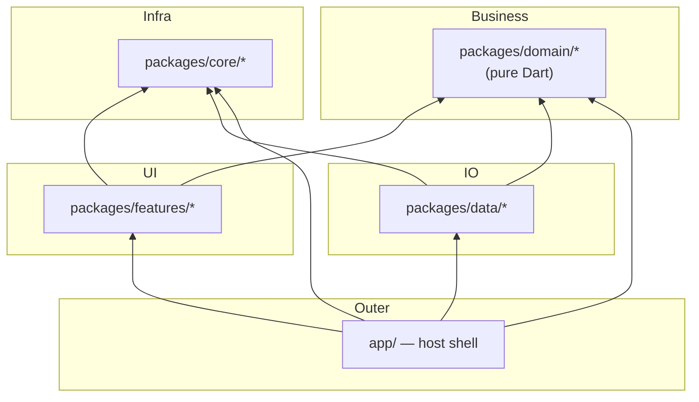

# 02 · Project Tour

**This page answers:** what is every folder for, which package owns what, and where do I go to change a given thing?

**After reading you can:** open the repo and land on the right package in one hop, without grepping blindly.

---

## 1. Top-level layout

```text
flutter-monorepo-codebase/
├── app/                    # Host app shell — entrypoint, DI assembly, router, flavors
│   ├── lib/                #   main.dart, main_scope.dart, di/, presentation/
│   ├── android/            #   Gradle project (build APK from HERE, not from root)
│   ├── ios/                #   Xcode project
│   ├── fastlane/           #   Mobile CI lanes
│   ├── env.dev / env.stg   #   Flavor env files (env.prod is NOT in the repo)
│   └── pubspec.yaml
│
├── packages/
│   ├── core/               # Infrastructure — usable by every layer
│   ├── domain/             # Pure-Dart business logic (no Flutter, no Dio)
│   ├── data/               # Repository implementations, models, data sources
│   └── features/           # UI modules, one bounded concern per package
│
├── tools/                  # Dart CLI tooling (generators, checkers, sync)
├── docs/                   # This documentation (en/ + vi/)
├── .agents/                # AGENTS.md rules + skills for AI agents
│
├── pubspec.yaml            # Workspace root — lists all 24 members
├── pubspec_dependencies.yaml  # Version catalog — the single source of truth
├── pubspec.lock            # ONE lock file for the whole workspace
└── analysis_options.yaml
```

---

## 2. Every package, and what it owns

The authoritative list is the `workspace:` block in the root `pubspec.yaml`.

### Core — `packages/core/*`

Infrastructure shared by all layers. **Core must never depend on a feature or on the data layer.**

| Package | Path | Owns |
| :--- | :--- | :--- |
| `core_common` | `packages/core/common` | `AppConfig`, `AppInitializer`, enums, `AppFailure`, `ErrorHandler`, extensions, mixins, `EnvConstants`, `ApiStatusConstants`, Firebase options module |
| `core_di` | `packages/core/di` | The **DI hub**: Navigator interfaces, `I*ActionHandler`, routing contracts (`IFeatureRouteModule`, `IDashboardTabModule`, `IAppEntryLocation`, `DashboardRouteModule`), `IFeatureLocalization`, `NavigatorKeys`, agnostic stream interfaces, `IThemeStorage` / `ILanguageStorage` |
| `core_base_ui` | `packages/core/base_ui` | Design system: colors, typography, `AppSpacing`/`AppRadius`/`AppGradients`/`AppShadows`, `ThemeProvider`, `LanguageProvider`, global assets & L10n. **Contains zero Flutter widgets.** |
| `core_ui_kit` | `packages/core/ui_kit` | All reusable widgets: buttons, inputs, dialogs, feedback, layout, media, navigation + `SharedUiConstants` |
| `core_network` | `packages/core/network` | `ApiClient` (Dio factory), `NetworkConfig` contract, Auth/Retry/Logging/RefreshToken interceptors, SSL pinning contract |
| `core_storage` | `packages/core/storage` | Storage **mechanism only**: `StorageInterface`, `StorageManager`, `StorageValue<T>`, `StorageType`, RAM obfuscation. Defines **no keys**. |
| `core_database` | `packages/core/database` | Drift/SQLite on a background isolate: `AppDatabase`, connection factory, migration contracts, sample `CacheEntries` table + DAO |
| `core_notifications` | `packages/core/notifications` | Push notification service + its own `NotificationConstants` |
| `provider_state_management` | `packages/core/provider_state_management` | `BaseProvider`, `executeOperation`, `ViewStateModel`, `ProviderStateListener`, `BaseViewWidget`, `LoadMoreMixin` |
| `bloc_state_management` | `packages/core/bloc_state_management` | `BaseBloc`, `BaseCubit`, `BlocViewState<T>` |

### Domain — `packages/domain/*`

**100% pure Dart.** No `package:flutter`, no `dio`, no `retrofit`.

| Package | Path | Owns |
| :--- | :--- | :--- |
| `domain_core` | `packages/domain/core` | `Result<T>`, `BaseEntity<T>`, `PaginatedEntity<T>`, `BaseUseCase`, `NoParams`, cache entry entity/usecases |
| `domain_auth` | `packages/domain/auth` | `UserEntity`, `UserRole`, `LoginParams`, `IAuthRepository`, `LoginUseCase` / `LogoutUseCase` / `RefreshTokenUseCase` |
| `domain_language` | `packages/domain/language` | `ILanguageRepository`, `GetLanguageUseCase`, `SetLanguageUseCase` |

### Data — `packages/data/*`

Implements the domain contracts. Data sources return **Models**, never entities, and never leak Drift/Dio types.

| Package | Path | Owns |
| :--- | :--- | :--- |
| `data_core` | `packages/data/core` | `IBaseRepository` (`execute()` / `executeSync()`), `BaseModel`, `BaseRequest`, `CacheEntryModel`, cache data source + repository |
| `data_auth` | `packages/data/auth` | `UserModel`, `AuthRemoteDataSource` (Retrofit), `AuthLocalDataSource` (owns `token` / `auth_user`), `AuthRepositoryImpl`, `AuthStorageKeys`, `AuthApiConstants` |
| `data_language` | `packages/data/language` | `LanguageRepositoryImpl` (owns the `locale` key), `LanguageStorageKeys` |

### Features — `packages/features/*`

One bounded UI concern per package. A feature may depend on `domain_*`, `core_di`, `core_common`, `core_base_ui`, `core_ui_kit`, and a state-management package — **never on `data_*` and never on another feature**.

| Package | Path | Owns |
| :--- | :--- | :--- |
| `feature_auth` | `packages/features/auth` | Login / Register / Forgot-password pages, `AuthProvider` (Provider branch), `AuthNavigatorImpl`, `AuthActionHandlerImpl`, `AuthStatusStreamImpl` |
| `feature_home` | `packages/features/home` | Home tab, `HomeProfileBloc` (BLoC branch), `HomeDashboardTabModule` |
| `feature_settings` | `packages/features/settings` | Settings tab, `SettingsDashboardTabModule` |
| `feature_onboarding` | `packages/features/onboarding` | Onboarding flow, `IAppEntryLocation` implementation |
| `feature_dashboard` | `packages/features/dashboard` | **Shell chrome only** — the `Scaffold` + bottom navigation bar. Builds tabs from `getAllOrEmpty<IDashboardTabModule>()`; owns no tab page. |
| `feature_splash` | `packages/features/splash` | Splash page shown by `MainScope` before the router exists |

> [!NOTE]
> Everything under `domain/`, `data/`, and `features/` is **sample / reference code**. It demonstrates the wiring, not production business rules. Copy the patterns, then delete or replace the samples.

---

## 3. The dependency rule



Read it as: **arrows point at what you are allowed to depend on.**

- `Domain` is the centre. It depends on nothing but `core_common` and `domain_core`.
- `Data` implements domain contracts and talks to `core_network` / `core_storage` / `core_database`.
- `Features` consume domain use cases; they never see `data_*`.
- `app/` sits outermost and is the only place allowed to know about everything at once.

### Core must not depend on features

`tools/arch_check/check.dart` enforces this on every PR (Gate 1 of `pr_quality_check.yml`). Four exceptions are approved:

| Allowed exception | Why |
| :--- | :--- |
| `core_di → domain_auth` | Agnostic streams expose a concrete `UserEntity`; the DI hub needs the type |
| `provider_state_management → domain_core` | `PaginatedEntity<T>` and `Result<T>` are used in base view widgets |

Verify at any time:

```bash
grep -rl "package:feature_" packages/core/*/lib    # must print nothing
dart tools/unused_checker/check_unused_packages.dart
```

---

## 4. How Pub Workspace changes things

The root `pubspec.yaml` declares every member:

```yaml
workspace:
  - app
  - tools
  - packages/core/common
  # … 20 more
```

Each member declares `resolution: workspace` in its own `pubspec.yaml`.

Consequences you must know:

| Consequence | What it means for you |
| :--- | :--- |
| One `pubspec.lock` at the root | Run `flutter pub get` **only** at the root |
| One shared `.dart_tool/package_config.json` | A package that **forgets** to declare a dependency still compiles — the architecture is silently broken. Always declare every import in your `pubspec.yaml`. |
| One version per dependency, repo-wide | Never hardcode versions; edit `pubspec_dependencies.yaml` then run `dart tools/dependency_sync.dart` |
| `build_runner` runs with `--workspace` | Codegen is a single pass over all packages |

---

## 5. "I want to change X — where do I go?"

| I want to… | Package / file | Guide |
| :--- | :--- | :--- |
| Add a new screen + its state | `packages/features/<name>/` | [../guides/01_new_feature.md](../guides/01_new_feature.md) |
| Add a business rule / use case | `packages/domain/<name>/` | [../guides/02_new_domain_data.md](../guides/02_new_domain_data.md) |
| Add an API endpoint | `packages/data/<name>/src/data_sources/remote/` + `utils/*_api_constants.dart` | [../guides/08_networking.md](../guides/08_networking.md) |
| Persist a key/value | The **owning** package's `utils/*_storage_keys.dart` | [../guides/06_storage.md](../guides/06_storage.md) |
| Add a database table | `packages/data/core/lib/src/database/tables/` | [../guides/07_database.md](../guides/07_database.md) |
| Add a route / navigate between features | `<feature>/src/routing/` + `core_di/src/navigators/` | [../guides/04_routing.md](../guides/04_routing.md) |
| Register something in DI | `<package>/lib/di/module.dart` | [../guides/05_di.md](../guides/05_di.md) |
| Change colors / spacing / typography | `packages/core/base_ui/lib/src/styles/` | [../guides/09_localization_theming.md](../guides/09_localization_theming.md) |
| Add a translated string | `packages/features/<name>/assets/language/*.arb` | [../guides/09_localization_theming.md](../guides/09_localization_theming.md) |
| Share a widget between features | `packages/core/ui_kit/` | [../guides/10_cross_feature.md](../guides/10_cross_feature.md) |
| Let feature A trigger something in feature B | `core_di/src/actions/` or `src/agnostic_streams/` | [../guides/10_cross_feature.md](../guides/10_cross_feature.md) |
| Bump a dependency version | `pubspec_dependencies.yaml` | [03_daily_workflow.md](03_daily_workflow.md) |
| Change the CI pipeline | `.github/workflows/`, `azure-ci-cd.yml` | [../operations/01_cicd.md](../operations/01_cicd.md) |

---

## Where to go next

| You want to… | Read |
| :--- | :--- |
| Learn the day-to-day commands | [03_daily_workflow.md](03_daily_workflow.md) |
| Understand the layering in depth | [../architecture/01_overview.md](../architecture/01_overview.md) |
| See the enforced rules | [../reference/01_rules.md](../reference/01_rules.md) |
