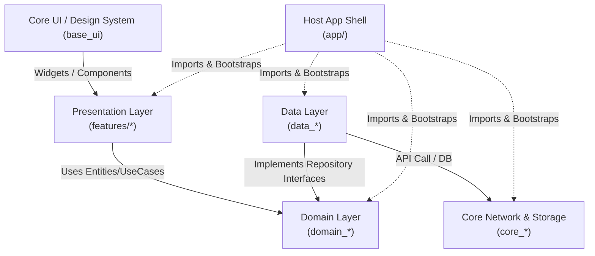
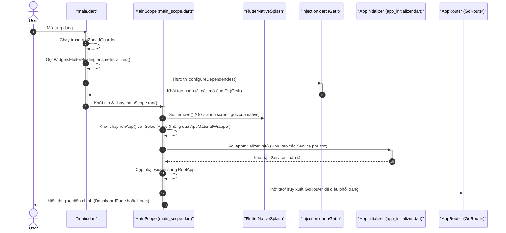

# 00. Tổng Quan Kiến Trúc Monorepo (System Architecture & Overview)

Tài liệu này cung cấp cái nhìn toàn cảnh về triết lý thiết kế hệ thống, cơ cấu tổ chức mã nguồn, và cơ chế vận hành của monorepo **Codebase Provider Workspace**. Đây là cẩm nang bắt buộc phải đọc đối với mọi thành viên phát triển để duy trì tính đồng nhất của hệ thống.

---

## 🏛️ 1. Triết Lý Thiết Kế Hệ Thống (Architectural Philosophy)

Hệ thống được xây dựng trên sự kết hợp giữa **Clean Architecture** (Kiến trúc Sạch), nguyên lý **SOLID** và mô hình **MVVM + Provider/BLoC** dành cho quản lý trạng thái giao diện.

### Tách biệt Mối quan tâm (Separation of Concerns)
Mục tiêu tối thượng là cô lập logic nghiệp vụ cốt lõi (Business Logic) khỏi các chi tiết hạ tầng có khả năng thay đổi thường xuyên (như Flutter UI, Cơ sở dữ liệu cục bộ, Thư viện kết nối mạng Dio/Http). Nhờ đó:
- **Dễ dàng Kiểm thử (High Testability)**: Có thể viết Unit Test cho tầng nghiệp vụ (Domain) hoàn toàn bằng Dart thuần mà không cần khởi động giả lập thiết bị hay render widget.
- **Tính Linh hoạt (UI-Independence)**: Lớp giao diện (Presentation) có thể được thiết kế lại hoàn toàn hoặc mở rộng sang các nền tảng khác (Web, Desktop) mà không cần chỉnh sửa một dòng logic nghiệp vụ nào.
- **Tính Mô-đun hóa (Micro-packages Monorepo)**: Chia nhỏ dự án thành nhiều gói con độc lập giúp tăng tốc độ biên dịch (incremental compilation), giảm thiểu xung đột git merge trong các đội ngũ lớn, và tăng tính tái sử dụng mã nguồn.

---

## 🗺️ 2. Đồ Thị Phụ Thuộc Đồng Trục (The Dependency Flow)

Nguyên tắc bất di bất dịch của Clean Architecture là **Chiều Phụ Thuộc Luôn Hướng Vào Trong**:

- **Domain Layer (packages/domain/* - Micro-packages)**: Là hạt nhân trung tâm. Gói này **KHÔNG ĐƯỢC PHÉP DEPEND** vào bất kỳ gói nào khác ngoại trừ `core_common` và `domain_core`. Domain hoàn toàn không biết về giao diện UI hay nguồn dữ liệu thô từ internet.
- **Data Layer (packages/data/* - Micro-packages)**: Phụ thuộc vào `domain` tương ứng để kế thừa và triển khai các Interface (Contracts). Nó cũng phụ thuộc vào `core_network`, `core_storage` và `core_database` để giao tiếp API, cache key-value bảo mật hoặc lưu SQL cục bộ.
- **Presentation Layer (packages/features/*)**: Phụ thuộc vào `domain` để lấy thực thể dữ liệu và kích hoạt UseCases. Nó phụ thuộc vào `core_di` để giao tiếp định tuyến/tiêm phụ thuộc chéo, `core_base_ui` cho các design tokens/tài nguyên thiết kế và `feature_shared` cho các UI components dùng chung.
- **Host App Shell (app/)**: Đứng ở tầng ngoài cùng, có nhiệm vụ import tất cả các gói con, khởi tạo container DI toàn cục (`get_it`), cấu hình môi trường chạy (Flavors), và khởi động ứng dụng.

---

## 📂 3. Khảo Sát Chi Tiết Các Tầng Kiến Trúc

### A. Tầng Nghiệp Vụ Cốt Lõi: Domain Packages (`packages/domain/*`)
Tầng Domain định nghĩa bản sắc nghiệp vụ của ứng dụng dưới dạng các micro-package độc lập:
- **`domain_core`**: Chứa `Result<T>` dùng chung, `BaseEntity<T>` và các tiện ích lõi.
- **`domain_auth`**: Entities, UseCases, và Contracts cho Xác thực.
- **`domain_language`**: Entities và UseCases cho nghiệp vụ Ngôn ngữ.

Mỗi package chứa:
- **Entities**: Lớp thực thể thuần túy chứa dữ liệu cốt lõi (ví dụ: `UserEntity`). Tất cả các lớp này đều sử dụng thư viện `freezed` để đảm bảo tính bất biến (Immutable State).
- **Use Cases**: Đại diện cho các tác vụ nghiệp vụ cụ thể của hệ thống (ví dụ: `LoginUseCase`, `GetLanguageUseCase`). Trả về kết quả dưới dạng Class bao bọc an toàn lỗi `Result<T>`.
- **Repository Interfaces**: Định nghĩa các hợp đồng (contracts) mà tầng Data bắt buộc phải triển khai.

### B. Tầng Triển Khai Tích Hợp: Data Packages (`packages/data/*`)
Tầng Data chịu trách nhiệm kéo dữ liệu thô về và chuyển hóa thành dữ liệu nghiệp vụ sạch:
- **`data_core`**: Cung cấp `IBaseRepository` tích hợp sẵn xử lý lỗi tự động.
- **`data_auth`**: Triển khai nghiệp vụ xác thực.
- **`data_language`**: Triển khai nghiệp vụ lưu trữ locale.

Thành phần chính:
- **Models (DTOs)**: Các đối tượng truyền dữ liệu (Data Transfer Objects) có khả năng tự động phân tích cú pháp JSON (`fromJson`/`toJson`) được sinh tự động bởi `json_serializable`.
- **Data Sources**: Các nguồn cung cấp dữ liệu trực tiếp:
  - *Remote Data Source*: Gọi các endpoint API thông qua Dio Client.
  - *Local Data Source*: Đọc/ghi cơ sở dữ liệu cục bộ, Secure Storage.
- **Repository Implementations**: Lớp kế thừa giao diện từ Domain và kế thừa `IBaseRepository` từ `data_core`.

### C. Tầng Giao Diện Người Dùng: Feature Packages (`packages/features/*`)
Mỗi module tính năng độc lập (ví dụ: `feature_auth`) chứa:
- **Pages / Widgets**: Giao diện hiển thị cụ thể được xây dựng bằng các thành phần của `feature_shared` và các design tokens của `core_base_ui`.
- **Providers / Blocs**: Ưu tiên `BaseProvider` hoặc `BaseBloc` (Cubit chỉ khi không cần event). Chịu trách nhiệm quản lý luồng dữ liệu 1 chiều (Unidirectional Data Flow):
  1. *View* gửi các hành động (Actions) đến *Controller*.
  2. *Controller* kích hoạt các *UseCases* của Domain và lắng nghe kết quả.
  3. *Controller* cập nhật UI state bất biến (`ViewState<T>` hoặc Freezed state tùy chỉnh khi cần).
  4. *View* tự động render lại khi trạng thái thay đổi.

### D. Tầng Hạ Tầng Chung: Core Packages (`packages/core/*`)
Cung cấp các công cụ và tiện ích nền móng cho toàn bộ hệ thống:
- **`core_common`**: Định nghĩa các enums, mixins, hằng số tĩnh và `ErrorHandler` xử lý lỗi tập trung.
- **`core_di`**: Trạm trung chuyển Navigator / ActionHandler, hợp đồng đóng góp route (`IFeatureRouteModule`, `IDashboardTabModule`, `IAppEntryLocation`, `DashboardRouteModule`), và `NavigatorKeys`.
- **`core_base_ui`**: Quản lý hệ thống thiết kế (Design System).
- **`core_network`**: Client HTTP cấu hình sẵn Interceptor.
- **`core_storage`**: Bộ nhớ đệm reactive có bảo mật hai lớp.
- **`core_database`**: Database quan hệ Drift/SQLite trên background isolate.
- **`core_notifications`**: Module quản lý push notifications.
- **`provider_state_management`** & **`bloc_state_management`**: Khung sườn quản lý trạng thái UI.

> **Ghi chú template:** Các package trong `packages/domain/*`, `packages/data/*`, và `packages/features/*` (trừ widget tái sử dụng ở `feature_shared`) là **mã mẫu / tham chiếu** (Auth, Home, Settings, Onboarding, Splash, Dashboard, Language). Khi làm sản phẩm thật hãy thay hoặc xóa — chúng minh họa pattern, không phải business rule production. **Một feature package = một bounded UI concern** (Home và Settings là hai package; Dashboard chỉ ghép route).

---

## 🚦 4. Chu Trình Khởi Động & Khởi Tạo Ứng Dụng (Application Boot Lifecycle)

Khi người dùng mở ứng dụng, lớp Host App Shell (`app/`) sẽ điều khiển luồng khởi tạo thông qua `MainScope` (`app/lib/main_scope.dart`) để đảm bảo hệ thống hoàn toàn sẵn sàng trước khi hiển thị giao diện chính:

### 📦 Lớp Bọc Ứng Dụng Nhất Quán (AppMaterialWrapper)

Để tránh lặp lại cấu hình `MaterialApp` giữa màn hình Splash (khi DI đang tải) và `RootApp` chính (khi DI đã sẵn sàng), hệ thống cung cấp lớp bọc **`AppMaterialWrapper`** tại tầng `app/`:

*   **Hai chế độ hoạt động**:
    *   `AppMaterialWrapper(...)`: Dành cho màn hình Splash thô, không truy cập DI để tránh crash khi DI chưa khởi tạo xong.
    *   `AppMaterialWrapper.router(...)`: Dành cho ứng dụng định tuyến chính (`RootApp`).
*   **Tự động hóa Global Providers**:
    *   Wrapper tự động bọc cây widget trong `MultiProvider` với các singleton được quản lý bởi GetIt (`AppProvider`, `ThemeProvider`, `AuthProvider`, `DeeplinkProvider`).
    *   Sử dụng `Consumer2<ThemeProvider, LanguageProvider>` để lắng nghe thời gian thực sự thay đổi về Theme (Sáng/Tối) và Ngôn ngữ (Locale), tự động đồng bộ hóa màu sắc và System UI Overlay (`AnnotatedRegion<SystemUiOverlayStyle>`).
    *   Giúp mã nguồn của `RootApp` và `MainScope` trở nên vô cùng ngắn gọn và tập trung.

---
*Copyright (c) 2026 CaoGiaHieu-dev. All rights reserved.*
