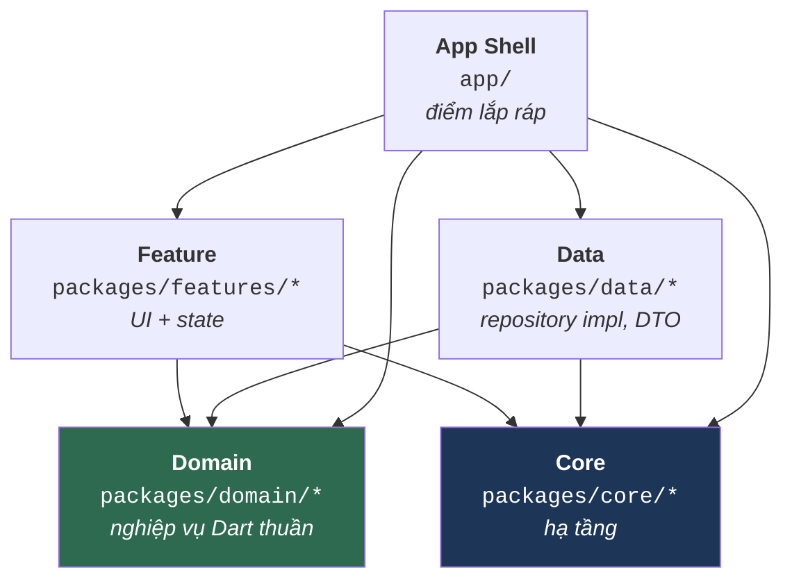

# Tổng quan kiến trúc

Tài liệu này trả lời câu hỏi **"monorepo này được bố trí ra sao, và package nào được phép phụ thuộc package nào?"**. Đọc xong bạn sẽ biết đặt một file mới vào đúng package, và biết chắc — không phải đoán — rằng dòng `import` sắp viết có hợp lệ hay không.

Muốn biết cách *làm* từng việc cụ thể, xem [phần hướng dẫn](../guides/01_new_feature.md). Muốn tra danh sách luật, xem [`../reference/01_rules.md`](../reference/01_rules.md).

---

## 1. Một luật duy nhất sinh ra mọi luật khác

Dự án theo **Clean Architecture**: phụ thuộc luôn hướng *vào trong*, về phía nghiệp vụ. Logic nghiệp vụ không bao giờ biết đến Flutter, Dio, Drift hay SharedPreferences.



Mũi tên đọc là *"được phép import"*. Hãy chú ý những mũi tên **không có**: không gì trỏ ra khỏi Domain, và không gì trỏ từ Core lên Feature hay Data.

> [!IMPORTANT]
> **Core tuyệt đối không được phụ thuộc feature.** `packages/core/*` nằm dưới cùng; nếu nó với ngược lên `packages/features/*` thì đồ thị phụ thuộc có chu trình, và package đó không còn tách ra hay test độc lập được nữa.
>
> Luật này từng bị vi phạm và đã được sửa: `provider_state_management` trước đây import thư viện widget dùng chung (khi đó tên là `feature_shared`, nay là `core_ui_kit`) chỉ để dùng lại `EmptyWidget` / `LoadingWidget` làm widget mặc định. Nay nó tự có
> [`DefaultLoadingWidget` / `DefaultEmptyWidget`](../../../packages/core/provider_state_management/lib/src/base_view/default_state_widgets.dart) tối giản của riêng mình.

---

## 2. Các tầng

| Tầng | Đường dẫn | Trách nhiệm | Được import | **Cấm** import |
|:--|:--|:--|:--|:--|
| **App Shell** | `app/` | Điểm khởi động, flavor, lắp ráp DI và router | tất cả | — |
| **Feature** | `packages/features/*` | Trang, widget, controller state của UI | `domain_*`, `core_di`, `core_common`, `core_base_ui`, `core_ui_kit`, một package state-management | `data_*`, feature package khác |
| **Domain** | `packages/domain/*` | Entity, use case, hợp đồng repository | `core_common`, `domain_core`, các package chỉ chứa annotation | Flutter, Dio, Retrofit, Drift — **mọi thứ gắn với nền tảng** |
| **Data** | `packages/data/*` | Hiện thực repository, DTO, data source | `domain_*`, `core_*` | `packages/features/*` |
| **Core** | `packages/core/*` | Mạng, lưu trữ, database, design system, hợp đồng DI | `core_*` khác, cộng bốn ngoại lệ bên dưới | `packages/features/*`, `packages/data/*` |

Mỗi tầng có trang riêng:
[Core](02_core.md) · [Domain](03_domain.md) · [Data](04_data.md) · [Feature](05_features.md) · [App Shell](06_app_shell.md).

### Yêu cầu Dart thuần của tầng Domain

`packages/domain/*` là **Dart thuần 100%**. Không `package:flutter/...`, không `package:dio/...`, không `package:drift/...`. Chính điều này khiến tầng nghiệp vụ unit-test được mà không cần thiết bị hay cây widget.

Khi domain cần thứ *trông giống* UI — màu sắc, icon, kích thước — phải quy về kiểu nguyên thuỷ hoặc enum khai trong `core_common`, còn tầng feature mới quyết định vẽ nó ra sao.

### Các ngoại lệ đã được duyệt

Có hai package `core_*` phụ thuộc `domain_*`. Cả hai đều có chủ đích và đã được ghi nhận — đừng "dọn dẹp" chúng.

| Ngoại lệ | Vì sao tồn tại |
|:--|:--|
| `core_di` → `domain_auth` | `core_di` là **DI Hub**, nơi đặt hợp đồng liên package. [`IAuthStatusStream`](../../../packages/core/di/lib/src/agnostic_streams/i_auth_status_stream.dart) phơi ra `Stream<UserEntity?>` — kiểu domain *cụ thể*, cố ý không dùng generic `<T>`. Hạ xuống generic sẽ đẩy gánh nặng ép kiểu sang mọi nơi tiêu thụ. Hub chỉ chứa hợp đồng, không chứa nghiệp vụ, nên việc import một kiểu entity không biến nó thành package domain. |
| `provider_state_management` → `domain_core` | `PaginatedViewWidget` định kiểu theo `PaginatedEntity<T>`, còn `executeOperation` bóc `Result<T>` — cả hai khai trong `domain_core`. Lớp nền state-management sinh ra chính là để tiêu thụ hai kiểu đó. |

Ngoài hai trường hợp trên, mọi package trong `packages/core/*` **không** phụ thuộc package cục bộ nào khác ngoài các `core_*`. Riêng `core_database` không phụ thuộc bất kỳ package nào trong workspace.

---

## 3. Vì sao dùng Pub Workspace monorepo

Mọi package đều là thành viên trong danh sách `workspace:` của [`pubspec.yaml`](../../../pubspec.yaml) gốc — hiện có 24 thành viên. Một `pubspec.lock`, một lần resolve, một lệnh `dart run build_runner build` cho cả cây.

**Cái được:** biên dịch tăng dần nhanh, không lệch version giữa các package, refactor xuyên package gọn trong một commit, và ràng buộc phân tầng ở mức vật lý — một feature package *không thể* import `data_auth` nếu `pubspec.yaml` của nó không khai.

> [!WARNING]
> **Cái giá bạn phải chủ động quản lý.** Pub Workspace dùng chung một `package_config.json` cho mọi thành viên. Nghĩa là một package có thể `import 'package:data_core/data_core.dart'` và **vẫn biên dịch bình thường dù chưa hề khai `data_core` trong `pubspec.yaml` của nó**.
>
> Code chạy được hôm nay, và vỡ ngay khi ai đó tách package ra hoặc đổi thứ tự workspace. Repo này đã dính đúng hai lần và đều đã sửa: `data_auth` dùng `data_core` nhưng khai ở `dev_dependencies`, còn `feature_splash` dùng `core_di` mà không khai gì cả.
>
> Hãy khai đủ mọi dependency bạn import, đúng mục. Kiểm tra bằng:
> ```bash
> dart tools/unused_checker/check_unused_packages.dart
> ```

---

## 4. Các quyết định kiến trúc và lý do

| Quyết định | Phương án bị loại | Vì sao |
|:--|:--|:--|
| **Dùng `Result<T>` thay vì ném exception** qua ranh giới tầng | `throw` / `try-catch` tại nơi gọi | Exception vô hình trong chữ ký hàm — người gọi không có cách nào biết mình phải xử lý lỗi. `Future<Result<UserEntity>>` đưa nhánh lỗi *vào trong kiểu*, nên trình biên dịch nhắc bạn. Tầng Data không bao giờ để exception lọt ra; `IBaseRepository.execute()` chuyển nó thành `Result.failure(AppFailure)`. |
| **DI phi tập trung theo micro-package** | Một `injection.dart` khổng lồ liệt kê mọi đăng ký | Mỗi package tự giữ `lib/di/module.dart` với `@InjectableInit.microPackage()`. Thêm package chỉ là thêm một dòng ở app shell, không phải sửa file 500 dòng. Xoá package thì các đăng ký của nó biến mất theo. |
| **Routing phi tập trung qua hợp đồng DI** | Hardcode mọi `GoRoute` trong `app_router.dart` | Feature đăng ký [`IFeatureRouteModule`](../../../packages/core/di/lib/src/routing/routing_interfaces.dart) / `IDashboardTabModule`; `AppRouter` gom bằng `getAllOrEmpty<T>()`. Xoá một feature khỏi workspace không cần đụng app shell — router chỉ gom thiếu một đóng góp và tự lùi về phương án dự phòng. |
| **Storage key do package sở hữu** | Một object "presets" dùng chung chứa mọi key | Object dùng chung trao cho *mọi* nơi inject quyền đọc/ghi dữ liệu của *mọi* feature khác. Nay mỗi package tự khai `StorageValue` với key của mình trong thư mục `utils/` của chính nó. Xem [hướng dẫn storage](../guides/06_storage.md). |
| **Truy cập database do package sở hữu** | Inject `AppDatabase` khắp nơi | Cùng lý do: `AppDatabase` phơi ra mọi DAO. Nay package phụ thuộc [`IDatabaseHandle`](../../../packages/core/database/lib/src/access/i_database_handle.dart) và chỉ nhận đúng accessor mình cần. Xem [hướng dẫn database](../guides/07_database.md). |
| **Constants nằm trong `utils/` của từng package** | Một thư mục `constants/` tập trung ở `core_common` | File constants tập trung sẽ thành god object: endpoint auth, channel ID của chat và key theme cùng nằm ở nơi mọi package đọc được. `core_common` giờ chỉ giữ giá trị thật sự toàn cục (`ApiStatusConstants`, `EnvConstants`). |

---

## 5. Đi tiếp từ đâu

| Nếu bạn muốn… | Đọc |
|:--|:--|
| Chạy được dự án | [`../getting-started/01_setup.md`](../getting-started/01_setup.md) |
| Hiểu một tầng cụ thể | [Core](02_core.md) · [Domain](03_domain.md) · [Data](04_data.md) · [Feature](05_features.md) |
| Hiểu thứ tự khởi động và lắp ráp DI | [App Shell](06_app_shell.md) |
| Dựng một feature từ đầu đến cuối | [`../guides/01_new_feature.md`](../guides/01_new_feature.md) |
| Tra luật trước khi mở PR | [`../reference/01_rules.md`](../reference/01_rules.md) · [`../reference/04_review_checklist.md`](../reference/04_review_checklist.md) |

> [!NOTE]
> Các package trong `packages/domain/*`, `packages/data/*` và `packages/features/*` (Auth, Home, Settings, Onboarding, Splash, Dashboard, Language) là **code mẫu**. Chúng minh hoạ cách đấu nối, không phải nghiệp vụ thật — hãy copy hình dạng rồi thay hoặc xoá.
