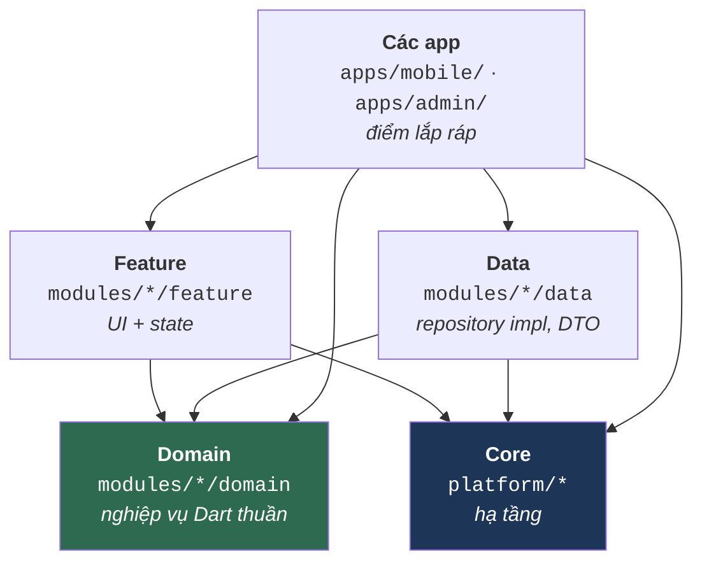

# Tổng quan kiến trúc

Tài liệu này trả lời câu hỏi **"monorepo này được bố trí ra sao, và package nào được phép phụ thuộc package nào?"**. Đọc xong bạn sẽ biết đặt một file mới vào đúng package, và biết chắc — không phải đoán — rằng dòng `import` sắp viết có hợp lệ hay không.

Muốn biết cách *làm* từng việc cụ thể, xem [phần hướng dẫn](../guides/01_new_feature.md). Muốn tra danh sách luật, xem [`../reference/01_rules.md`](../reference/01_rules.md).

---

## 1. Một luật duy nhất sinh ra mọi luật khác

Dự án theo **Clean Architecture**: phụ thuộc luôn hướng *vào trong*, về phía nghiệp vụ. Logic nghiệp vụ không bao giờ biết đến Flutter, Dio, Drift hay SharedPreferences.



Mũi tên đọc là *"được phép import"*. Hãy chú ý những mũi tên **không có**: không gì trỏ ra khỏi Domain, và không gì trỏ từ Core lên Feature hay Data.

> [!IMPORTANT]
> **Core tuyệt đối không được phụ thuộc feature.** `platform/*` nằm dưới cùng; nếu nó với ngược lên `modules/*/feature` thì đồ thị phụ thuộc có chu trình, và package đó không còn tách ra hay test độc lập được nữa.
>
> Lập luận đó áp dụng y hệt bên trong vòng core. Một lớp nền state-management cần widget placeholder cho trạng thái rỗng/đang tải, và `core_ui_kit` đã có sẵn bản có nhận diện thương hiệu — nhưng `core_ui_kit` lại phụ thuộc `provider_state_management`, nên mượn ngược lại là khép một chu trình. Vì vậy `provider_state_management` tự mang
> [`DefaultLoadingWidget` / `DefaultEmptyWidget`](../../../platform/provider_state_management/lib/src/base_view/default_state_widgets.dart) tối giản của riêng nó. Core cần widget thì core tự định nghĩa.

---

## 2. Các tầng

| Tầng | Đường dẫn | Trách nhiệm | Được import | **Cấm** import |
|:--|:--|:--|:--|:--|
| **App** | `apps/<id>/` | Điểm lắp ráp: `app_manifest.yaml`, `injection.dart` được sinh, `main.dart` một dòng, thứ định danh app (Firebase options) | tất cả | — |
| **App shell** | `platform/app_shell/` | Trình tự boot, lắp ráp router, material wrapper, storage adapter — dùng chung cho mọi app | các package core | mọi module (`arch_check` R1) |
| **Feature** | `modules/*/feature` | Trang, widget, controller state của UI | `domain_*`, `core_di`, `core_common`, `core_base_ui`, `core_ui_kit`, `core_responsive`, một package state-management | `data_*`, feature package khác |
| **Domain** | `modules/*/domain` | Entity, use case, hợp đồng repository | `domain_core`, các package chỉ chứa annotation | Flutter, Dio, Retrofit, Drift — **mọi thứ gắn với nền tảng** |
| **Data** | `modules/*/data` | Hiện thực repository, DTO, data source | `domain_*`, `core_*` | `modules/*/feature` |
| **Core** | `platform/*` | Mạng, lưu trữ, database, design system, hợp đồng DI | `core_*` khác, cộng ba ngoại lệ bên dưới | `modules/*/feature`, `modules/*/data` |

Mỗi tầng có trang riêng:
[Core](02_core.md) · [Domain](03_domain.md) · [Data](04_data.md) · [Feature](05_features.md) · [App Shell](06_app_shell.md).

### Yêu cầu Dart thuần của tầng Domain

`modules/*/domain` là **Dart thuần 100%**. Không `package:flutter/...`, không `package:dio/...`, không `package:drift/...`. Chính điều này khiến tầng nghiệp vụ unit-test được mà không cần thiết bị hay cây widget.

Khi domain cần thứ *trông giống* UI — màu sắc, icon, kích thước — phải quy về kiểu nguyên thuỷ hoặc enum khai ngay trong chính package domain đó, còn tầng feature mới quyết định vẽ nó ra sao.

### Các ngoại lệ đã được duyệt

Có ba package hạ tầng dưới `platform/` phụ thuộc vào `domain_core`. (`data_core` cũng vậy, nhưng nó là nền của tầng data và chỉ tình cờ nằm dưới `platform/` — package data phụ thuộc domain là chiều bình thường, không phải ngoại lệ.) Cả ba đều có chủ đích và đã được ghi nhận; đừng "dọn dẹp" chúng. `tools/arch_check/check.dart` giữ đúng danh sách này, in ra ở mỗi lần chạy, và sẽ đánh hỏng build nếu xuất hiện cạnh thứ tư.

Lưu ý cả ba đều trỏ tới `domain_core` — vòng trong cùng — chứ không trỏ tới một domain *sản phẩm* nào. Đó chính là ranh giới: core được phép biết `Result` hay `AppFailure` là gì, nhưng không bao giờ biết một tài khoản là gì.

| Ngoại lệ | Vì sao tồn tại |
|:--|:--|
| `provider_state_management` → `domain_core` | `PaginatedViewWidget` định kiểu theo `PaginatedEntity<T>`, còn `executeOperation` bóc `Result<T>` — cả hai khai trong `domain_core`. Lớp nền state-management sinh ra chính là để tiêu thụ hai kiểu đó. |
| `bloc_state_management` → `domain_core` | `BlocViewState.error` mang thẳng một `AppFailure`, vốn là một phần của hợp đồng `Result` nên nằm trong `domain_core`. |
| `platform_kernel` → `domain_core` | `ErrorHandler.handleError()` sinh ra `AppFailure`. Khai báo của nó nằm cùng `Result<T>` trong `domain_core`; `core_common` re-export toàn bộ kernel nên các nơi đang import sẵn không hề bị ảnh hưởng. |

Ngoài ba trường hợp trên, mọi package trong `platform/*` **không** phụ thuộc package cục bộ nào khác ngoài các package hạ tầng (`platform_kernel`, `core_*`). Riêng `core_database` không phụ thuộc bất kỳ package nào trong workspace.

---

## 3. Vì sao dùng Pub Workspace monorepo

Mọi package đều là thành viên trong danh sách `workspace:` của [`pubspec.yaml`](../../../pubspec.yaml) gốc — hiện có 28 thành viên (25 package, hai app, và `tools`). Một `pubspec.lock`, một lần resolve, một lệnh `dart run build_runner build` cho cả cây.

**Cái được:** biên dịch tăng dần nhanh, không lệch version giữa các package, refactor xuyên package gọn trong một commit, và ràng buộc phân tầng ở mức vật lý — một feature package *không thể* import `data_auth` nếu `pubspec.yaml` của nó không khai.

> [!WARNING]
> **Cái giá bạn phải chủ động quản lý.** Pub Workspace dùng chung một `package_config.json` cho mọi thành viên. Nghĩa là một package có thể `import 'package:data_core/data_core.dart'` và **vẫn biên dịch bình thường dù chưa hề khai `data_core` trong `pubspec.yaml` của nó**.
>
> Code chạy được hôm nay, và vỡ ngay khi ai đó tách package ra hoặc đổi thứ tự workspace. Có hai hình dạng cần canh chừng: một `import` hoàn toàn không có mục tương ứng trong pubspec, và một import dùng cho production nhưng mục của nó lại nằm dưới `dev_dependencies` — cả hai đều biên dịch trót lọt bên trong workspace và không cái nào sống sót khi ra ngoài.
>
> Hãy khai đủ mọi dependency bạn import, đúng mục. Kiểm tra bằng:
> ```bash
> dart tools/unused_checker/check_unused_packages.dart
> ```

---

## 4. Ai sở hữu cái gì

Cấu trúc thư mục là một ranh giới sở hữu, không phải quy ước xếp file. Nó được định hình đúng như
vậy để [`.github/CODEOWNERS`](../../../.github/CODEOWNERS) diễn đạt được bằng một dòng cho mỗi team:

| Thư mục | Chủ sở hữu | Thay đổi nó nghĩa là gì |
|:--|:--|:--|
| `platform/` | Infra | Mọi module đều phụ thuộc, nên một thay đổi phá vỡ sẽ phá vỡ tất cả cùng lúc |
| `platform/di/` | Infra + architect | Hợp đồng liên module — sửa một cái là một cuộc thương lượng, không phải chỉnh sửa đơn phương |
| `modules/<name>/` | Team của module đó | Cả ba tầng đi cùng nhau: team sửa UI cũng chính là team sửa use case phía sau |
| `apps/` | Tech lead | Những module nào ship cùng nhau, và khởi tạo theo thứ tự nào — đó là quyết định phát hành |
| `apps/*/app_manifest.yaml` | Tech lead + architect | Chính là bản thân phép lắp ráp. Thêm một module ở đây là thay đổi sản phẩm *là gì* |

Đây là lý do một module nằm ở `modules/auth/{domain,data,feature}` thay vì là các dòng auth rải
trong ba thư mục anh em. CODEOWNERS khớp theo **đường dẫn**; với bố cục chia theo tầng, nó không có cách nào nói "phần auth
của thư mục domain, data và features" — đó là ba đường dẫn không liên quan, chỉ tình cờ trùng đoạn
cuối. Mỗi bounded context một thư mục khiến quyền sở hữu diễn đạt được, và khiến mỗi module một git
submodule trở nên khả thi.

> [!WARNING]
> Các handle trong `CODEOWNERS` chỉ là placeholder. GitHub **âm thầm bỏ qua** một team không tồn tại,
> nên một rule chưa thay tên đọc thì tưởng đang có hiệu lực mà thực ra không. Hãy thay trước khi dựa vào nó.

---

## 5. Các quyết định kiến trúc và lý do

| Quyết định | Phương án bị loại | Vì sao |
|:--|:--|:--|
| **Dùng `Result<T>` thay vì ném exception** qua ranh giới tầng | `throw` / `try-catch` tại nơi gọi | Exception vô hình trong chữ ký hàm — người gọi không có cách nào biết mình phải xử lý lỗi. `Future<Result<UserEntity>>` đưa nhánh lỗi *vào trong kiểu*, nên trình biên dịch nhắc bạn. Tầng Data không bao giờ để exception lọt ra; `IBaseRepository.execute()` chuyển nó thành `Result.failure(AppFailure)`. |
| **DI phi tập trung theo micro-package** | Một `injection.dart` khổng lồ liệt kê mọi đăng ký | Mỗi package tự giữ `lib/di/module.dart` với `@InjectableInit.microPackage()`. Thêm package chỉ là thêm một dòng vào `app_manifest.yaml` của app (rồi `composer sync`), không phải sửa file 500 dòng. Xoá package thì các đăng ký của nó biến mất theo. |
| **Routing phi tập trung qua hợp đồng DI** | Hardcode mọi `GoRoute` trong `app_router.dart` | Feature đăng ký [`IFeatureRouteModule`](../../../platform/di/lib/src/routing/routing_interfaces.dart) / `INavDestinationModule`; `AppRouter` gom bằng `getAllOrEmpty<T>()`. Xoá một feature khỏi workspace không cần đụng app shell — router chỉ gom thiếu một đóng góp và tự lùi về phương án dự phòng. |
| **Storage key do package sở hữu** | Một object "presets" dùng chung chứa mọi key | Object dùng chung trao cho *mọi* nơi inject quyền đọc/ghi dữ liệu của *mọi* feature khác. Mỗi package tự khai `StorageValue` với key của mình trong thư mục `utils/` của chính nó. Xem [hướng dẫn storage](../guides/06_storage.md). |
| **Truy cập database do package sở hữu** | Một database dùng chung cho cả app, inject khắp nơi | Cùng lý do: một database dùng chung phơi mọi DAO ra cho mọi nơi inject, và ép package nào khai nó phải sở hữu toàn bộ bảng. Package phụ thuộc [`IDatabaseHandle`](../../../platform/database/lib/src/access/i_database_handle.dart) và chỉ nhận đúng accessor mình cần. Xem [hướng dẫn database](../guides/07_database.md). |
| **Constants nằm trong `utils/` của từng package** | Một thư mục `constants/` tập trung ở `core_common` | File constants tập trung sẽ thành god object: endpoint auth, channel ID của chat và key theme cùng nằm ở nơi mọi package đọc được. Đáy ngăn xếp chỉ giữ giá trị thật sự toàn cục (`EnvConstants`, `ErrorCodes`, trong `platform_kernel`). |

---

## 6. Đi tiếp từ đâu

| Nếu bạn muốn… | Đọc |
|:--|:--|
| Chạy được dự án | [`../getting-started/01_setup.md`](../getting-started/01_setup.md) |
| Hiểu một tầng cụ thể | [Core](02_core.md) · [Domain](03_domain.md) · [Data](04_data.md) · [Feature](05_features.md) |
| Hiểu thứ tự khởi động và lắp ráp DI | [App Shell](06_app_shell.md) |
| Dựng một feature từ đầu đến cuối | [`../guides/01_new_feature.md`](../guides/01_new_feature.md) |
| Tra luật trước khi mở PR | [`../reference/01_rules.md`](../reference/01_rules.md) · [`../reference/04_review_checklist.md`](../reference/04_review_checklist.md) |

> [!NOTE]
> Các package trong `modules/*/domain`, `modules/*/data` và `modules/*/feature` (Auth, Cache, Home, Settings, Onboarding, Splash, Dashboard) là **code mẫu**. Chúng minh hoạ cách đấu nối, không phải nghiệp vụ thật — hãy copy hình dạng rồi thay hoặc xoá.
