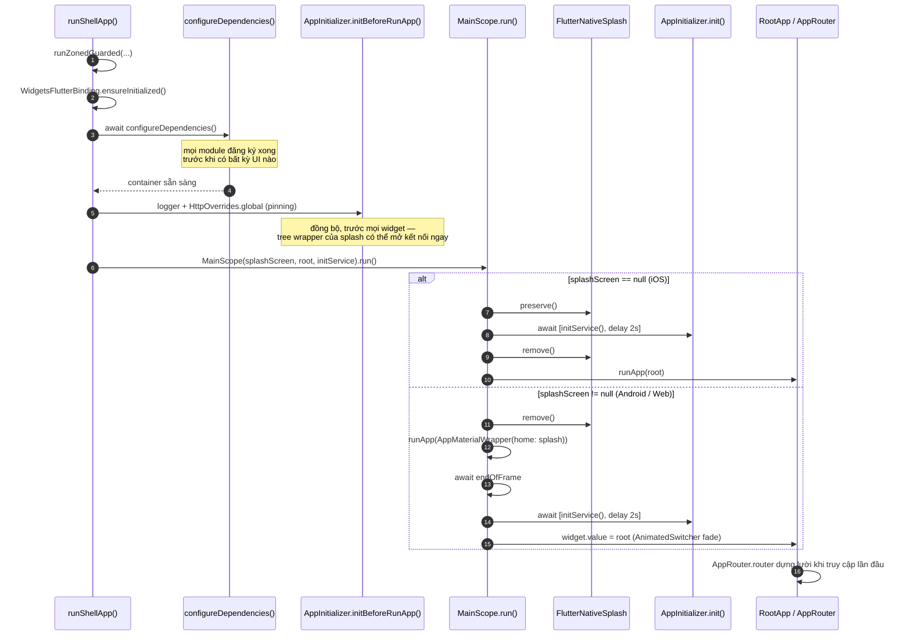

<!-- translated-from: docs/en/architecture/06_app_shell.md@b65f8b3 -->
# App Shell (`platform/shell/` + `apps/<id>/`)

Tài liệu này trả lời câu hỏi **"từ lúc chạm icon đến khi thấy màn hình đầu tiên, chuyện gì xảy ra, và ai lắp ráp mọi thứ lại?"**. Đọc xong bạn sẽ gỡ được lỗi khởi động, thêm được adapter cho shell, và hiểu vì sao thứ tự các nhóm DI trong `app_manifest.yaml` không hề tuỳ tiện.

Shell được tách làm hai, có chủ đích:

- **`apps/<id>/`** là **điểm lắp ráp (composition root)** — nơi duy nhất được phép phụ thuộc mọi tầng, và nơi duy nhất biết danh sách đầy đủ các module. Nó chỉ chứa những gì thực sự khác nhau giữa các app, ngoài ra không có gì khác.
- **`platform/shell/app_shell/`** (`platform_app_shell`) là mọi thứ app nào cũng cần và lẽ ra phải copy: boot scope, lắp ráp router, material wrapper và các provider cấp app. Các adapter hạ tầng của nó — storage adapter, `AppBootStorage` và `NetworkConfigImpl` — nằm ngay cạnh trong **`platform/shell/adapters/`** (`platform_shell_adapters`), để package shell chỉ giữ phần lắp ráp, UI và state cấp app; `platform_app_shell` phụ thuộc package adapter, không bao giờ ngược lại. Cả hai đều không import module nào — `arch_check` R1 giữ điều đó, vì cả hai là package `platform/`.

Trước khi tách, thêm app thứ hai nghĩa là copy 1.369 dòng qua 24 file. Giờ một app chỉ là một manifest, một `injection.dart` được sinh ra, một `main.dart` dài một dòng, và những gì định danh chính nó — ở app mẫu là Firebase options.

---

## 1. Cái gì nằm ở đâu

```
apps/mobile/                         điểm lắp ráp
├── app_manifest.yaml                module nào, thứ tự nhóm DI ra sao
├── lib/
│   ├── main.dart                    một dòng: runShellApp(configureDependencies: …)
│   ├── di/injection.dart            do composer sinh — không bao giờ sửa tay
│   └── firebase/firebase_module.dart FirebaseOptions của app này (file options bị git-ignore)
├── android/  ios/  fastlane/        project native và lane phát hành
└── env.dev  env.stg                 giá trị theo flavor (env.prod bạn tự tạo)

platform/shell/app_shell/lib/              dùng chung cho mọi app
├── bootstrap.dart                   runShellApp — error hook, DI, splash, init
├── main_scope.dart                  splash → init → chuyển sang root
├── di/module.dart                   @InjectableInit.microPackage — AppRouter, AppProvider, DeeplinkProvider
└── presentation/
    ├── root_app.dart                MaterialApp có router
    ├── app_material_wrapper.dart    cấu hình MaterialApp dùng chung
    ├── navigation/app_router.dart   lắp ráp GoRouter
    ├── providers/                   AppProvider, DeeplinkProvider
    ├── utils/                       AppShellUiConstants (trần text scale)
    └── widgets/                     NavigatorWrapperWidget, UndefineRouteWidget

platform/shell/adapters/lib/               adapter hạ tầng của shell (platform_shell_adapters)
├── di/
│   ├── module.dart                  @InjectableInit.microPackage — đứng đầu nhóm DI `shell`
│   └── network_binding_module.dart  binding SslPinningConfig
└── src/
    ├── theme_storage_impl.dart      IThemeStorage    → StorageValue<ThemeMode>
    ├── language_storage_impl.dart   ILanguageStorage → StorageValue<String>
    ├── app_boot_storage.dart        cờ khởi động    → StorageValue<bool>
    ├── network_config_impl.dart     NetworkConfig
    └── utils/                       storage key do adapter sở hữu
```

### App thứ hai: `apps/admin`

[`apps/admin`](../../../apps/admin/README.md) là cùng shell này ghép một tập con khác — `auth` và `settings`, không có dashboard, splash, onboarding, home hay Firebase. Toàn bộ `lib/` của nó là `main.dart` và `di/` — `injection.dart` được sinh ra cùng barrel của nó. Mọi lookup tuỳ chọn trong package này đều thiếu đóng góp ở đó, nên các fallback mô tả bên dưới có một bản ghép thật dựa vào chúng — khi có người chạy nó; hiện CI chưa build app này.

---

## 2. Vòng đời khởi động



### Từng bước

Trình tự này nằm trong `runShellApp()` ([`platform/shell/app_shell/lib/bootstrap.dart`](../../../platform/shell/app_shell/lib/bootstrap.dart)); `main.dart` của app chỉ gọi nó với `configureDependencies` được sinh cho chính app đó.

1. **`runZonedGuarded`** bọc toàn bộ để lỗi bất đồng bộ không bắt được vẫn được báo cáo thay vì mất tăm.
2. **`WidgetsFlutterBinding.ensureInitialized()`** — bắt buộc trước mọi lời gọi plugin — rồi **`installShellErrorHooks`**, dồn mọi lỗi không bắt được về một chỗ (xem [Lỗi và crash reporting](#lỗi-và-crash-reporting) bên dưới). Nó chạy trước `configureDependencies`, nên lỗi DI cũng được báo cáo.
3. **`await configureDependencies()`** chạy *trước* `MainScope`. Đến lúc widget đầu tiên build, cả container đã phân giải xong.
4. **`AppInitializer.initBeforeRunApp()`** cấu hình logger và cài `HttpOverrides.global` — certificate pinning, hoặc bypass khi build debug + flavor `dev` — một cách đồng bộ, trước khi có bất kỳ widget nào. Không thể đợi tới `initService`: splash đã được bọc trong `IAppTreeWrapper` của mọi feature, nên một controller tạo ở đó (`AuthProvider` của auth, khôi phục phiên bằng một lần refresh token) có thể mở kết nối đầu tiên khi `initService` còn đang chạy, và `IOHttpClientAdapter` của Dio giữ lại `HttpClient` nó tạo đầu tiên — một client không pin sẽ phục vụ cả phiên. Lời gọi này idempotent; `AppInitializer.init` gọi lại và lần thứ hai không cài gì. `platform/shell/app_shell/test/boot_order_test.dart` giữ thứ tự này. Trên **web** nó không cài gì và ghi log, mức `INFO`, rằng trình duyệt tự xác thực chứng chỉ — ở đó không có `HttpClient` nào để pin (xem [hiện trạng web của tầng core](02_core.md)).
5. **`MainScope`** được dựng với ba thứ: hiển thị splash widget nào (nếu có), widget gốc, và `initService` — ở đây là `AppInitializer.init(routeObserver: getIt<AppRouter>().routeObserver)`, lo phần còn lại: `OperationGlobalConfig`, URL reflection của GoRouter, `AppInfoHelper`, trao route observer cho `RouteAwareWidget`, hướng màn hình và system UI.
6. **`mainScope.run()`** rẽ nhánh tuỳ theo có truyền splash widget Dart hay không.

### Lỗi và crash reporting

Có ba loại lỗi lọt qua mọi thứ khác, và shell móc vào cả ba:

| Hook | Bắt được |
|:--|:--|
| handler của `runZonedGuarded` | lỗi bất đồng bộ thoát khỏi zone của app — một `Future` không được await mà throw |
| `FlutterError.onError` | lỗi framework bắt được: build, layout, paint, giải mã ảnh, gesture |
| `PlatformDispatcher.instance.onError` | lỗi thoát ra tới engine — callback của platform channel, timer nằm ngoài zone |

Cả ba đổ về cùng một chỗ. Handler của zone và hook của dispatcher ném lại qua `FlutterError.reportError`; hook `FlutterError.onError` trước hết gọi handler đã có trước nó — mặc định là `FlutterError.presentError`, bản dump đỏ trên console ở debug — rồi báo lỗi **một lần**: tới callback `onError` (tuỳ chọn) của app, rồi tới `getItOrNull<IErrorReporter>()` với `fatal: true`. Hook của dispatcher trả về `true`: lỗi đã được xử lý, engine không log thêm lần nữa.

`IErrorReporter` và `IAnalytics` là các contract tuỳ chọn trong `core_di` ([`src/observability/`](../../../platform/foundation/contracts/lib/src/observability/)). Template không implement cái nào, nên cả hai lookup trả `null` và không gửi gì đi. Reporter được resolve lúc lỗi xảy ra, không phải lúc boot, nên reporter do `configureDependencies` đăng ký vẫn được dùng, và lỗi do *chính* `configureDependencies` ném ra vẫn tới được `onError`. Reporter hay callback nào tự throw sẽ bị nuốt — không bao giờ bị báo cáo qua chính nó.

Còn một đường thứ ba, non-fatal. `ErrorHandler` (`platform_kernel`) chuyển mọi exception của repository thành `AppFailure`; những cái nó không phân loại được — một `TypeError` trong `fromJson`, một exception của plugin — thành lỗi chung "Unknown error occurred" và thường là bug. Shell trỏ `ErrorHandler.onUnclassifiedError` tới reporter với `fatal: false`, nên những lỗi đó được ghi lại trong khi người dùng vẫn nhận một failure đã được xử lý. Failure đã phân loại (mất mạng, 401, timeout) không được báo cáo.

**Gắn Crashlytics hay Sentry** chỉ là một lần đăng ký trong app — trong `lib/` của chính nó, cạnh `firebase/firebase_module.dart`, hoặc trong một package mà app ghép vào. Không phải sửa code shell:

```dart
// apps/mobile/lib/observability/crashlytics_error_reporter.dart
@LazySingleton(as: IErrorReporter)
class CrashlyticsErrorReporter implements IErrorReporter {
  @override
  Future<void> recordError(
    Object error,
    StackTrace? stack, {
    bool fatal = false,
    String? reason,
  }) => FirebaseCrashlytics.instance.recordError(
    error,
    stack,
    fatal: fatal,
    reason: reason,
  );

  @override
  void log(String message) => FirebaseCrashlytics.instance.log(message);
}
```

Với Sentry, `recordError` gọi `Sentry.captureException(error, stackTrace: stack)` và `log` thêm một breadcrumb; khởi tạo SDK trong app (`SentryFlutter.init` bọc `main`, trước `runShellApp`). **Đừng** tự gán `FlutterError.onError` nữa — hook của shell đã chuyển tiếp nó, và nối tiếp handler nào đã được cài trước `runShellApp`. `IAnalytics` hoạt động y như vậy: đăng ký một implementation là mọi trang `GoRouteDataCustom` báo màn hình của nó qua `setCurrentScreen` (`RouteAwareWidget`, khi push và khi route phía trên pop). `platform/shell/app_shell/test/error_hooks_test.dart` giữ phần nối dây này.

### Hai đường splash

`runShellApp` chọn splash theo nền tảng, và lấy nó từ module nào đã đăng ký `IAppSplashScreen` — ở app mẫu là `feature_splash`:

```dart
final usesDartSplash = kIsWeb || !Platform.isIOS;
// ...
splashScreen: usesDartSplash
    ? getItOrNull<IAppSplashScreen>()?.build()
    : null,
```

| Nền tảng | `splashScreen` | Hành vi |
|:--|:--|:--|
| iOS | `null` | Splash native được **giữ lại** suốt quá trình init rồi mới gỡ. Không có splash Dart nào được vẽ. |
| Android, Web, desktop | `IAppSplashScreen.build()` | Splash native gỡ ngay lập tức; splash đã đăng ký được vẽ thay thế, rồi mờ dần sang `RootApp` qua `AnimatedSwitcher`. Không ghép module splash nào thì giá trị là `null` và đi theo đường của iOS. |

Cả hai đường đều `await Future.wait([initService(), Future.delayed(_minimumDelay)])`, với `_minimumDelay` là 2 giây. Độ trễ này là **sàn**, không phải cộng thêm — init nhanh vẫn phải chờ để splash không bị nháy.

> [!NOTE]
> `SplashPage` do `MainScope` hiển thị, **không** phải do GoRouter. Nó không có route và không bao giờ xuất hiện trong ngăn xếp điều hướng.

> [!WARNING]
> **Web:** `MainScope` cũng gọi `FlutterNativeSplash.remove()` ở nhánh này, và trên web lệnh đó ném `PlatformException(… removeSplashFromWeb …)` nếu `flutter_native_splash` chưa sinh asset web cho app. App vẫn khởi động — đã đo trên `apps/admin` — nhưng lỗi không được bắt sẽ tới `IErrorReporter` ở mỗi lần mở. Hiện chưa app nào có thư mục `web/`.

### `_ResponsiveWrapper`

Cả hai đường đều bọc cây widget trong **`ResponsiveInit`** (từ `core_responsive`). Nó nằm ở đúng gốc cây, nên mọi widget phía dưới đều gọi được `context.w(x)` / `context.h(x)` / `context.sp(x)` / `context.r(x)`. Cấu hình này chính là toàn bộ chính sách scale của app:

| Thiết lập | Giá trị | Tác dụng |
|:--|:--|:--|
| `designSize` | `AppConfig.design` (375×812) | Khung điện thoại mà mọi lớp cửa sổ bắt đầu từ đó |
| `scaleBounds` / `textScaleBounds` | để mặc định, `ScaleBounds.downOnly()` | Cửa sổ nhỏ hơn khung thì thiết kế thu nhỏ; cửa sổ lớn hơn — tablet, cửa sổ desktop — vẽ 1:1 và để chỗ dư cho layout |
| `profiles` | `WindowSizeClass.expanded` → `ScaleBounds.fixed()` cho layout và chữ | Từ rộng 840 trở lên (nên cả `large` và `extraLarge`), dùng logical pixel thật — cửa sổ laptop thấp hơn 812 không còn làm mọi khoảng cách dọc nhỏ đi |
| `splitScreenMode` | `true` | Chặn dưới chiều cao dùng để scale ở 700, để một ô chia đôi màn hình thấp vẫn dùng được |

Theme scale chữ bằng `context.sp`, nên nó đi theo `textScaleBounds` như mọi thứ khác. Cho một lớp phóng to là opt-in — một `ResponsiveProfile` với bound có chặn, ví dụ `ScaleBounds(max: 1.2)`. Bảng tham số đầy đủ, mỗi cửa sổ nhận được gì, và các widget thích ứng dùng chỗ dư nằm ở [`11_design_system.md`](../guides/11_design_system.md) §6–§7.

`ResponsiveInit` là `StatelessWidget`: nó đọc `MediaQuery.sizeOf(context)` — dependency **chỉ theo size** — nên tự rebuild khi màn hình đổi kích thước và bỏ qua thay đổi brightness / textScale / padding. Metrics được phát xuống qua `ResponsiveScope`, một `InheritedWidget`, nên widget nào đọc metrics là tự đăng ký theo dõi chúng — không có cờ rebuild nào để tinh chỉnh.

> [!NOTE]
> Trước đây ở đây có một `fontSizeResolver` tính tỉ lệ chiều rộng từ `View.of(context).display` — màn hình vật lý, không phải cửa sổ. Khi toàn màn hình thì hai cái khớp nhau; khi split-screen hay đổi kích thước cửa sổ, chữ scale theo cả màn hình trong khi mọi kích thước khác theo cửa sổ. `ResponsiveInit` đo cửa sổ qua `MediaQuery`, nên mặc định đã thay được resolver. Cũng đừng đưa resolver trở lại để chặn cỡ chữ: kết quả của resolver không bao giờ bị `textScaleBounds` kẹp, mà mức chặn đó giờ nằm chính ở `textScaleBounds`.

Việc scale vẫn phải đi qua `BuildContext` — `core_responsive` **không có extension trên `num`**, nên `16.h` đơn giản là không biên dịch được. Xem [luật 12](../reference/01_rules.md#12-responsive-ui), và lưu ý luật R7 của `arch_check` chặn mọi dạng bare còn sót ở mọi PR.

---

## 3. Lắp ráp DI — và vì sao thứ tự quan trọng

Thứ tự được khai trong [`apps/mobile/app_manifest.yaml`](../../../apps/mobile/app_manifest.yaml) ở mục `di_groups`, rồi `composer sync` sinh nó vào [`apps/mobile/lib/di/injection.dart`](../../../apps/mobile/lib/di/injection.dart):

```dart
const _externalModulesBefore = [..._coreModules];
const _externalModulesAfter = [
    ..._notificationsModules,
    ..._shellModules,
    ..._uiModules,
    ..._domainModules,
    ..._dataModules,
    ..._featureModules,
    ..._otherModules,
];
```

Thứ tự resolve trong file sinh ra `injection.config.dart`:

| # | Đăng ký | Ghi chú |
|:-:|:--|:--|
| 1 | `_coreModules` | `core_common`, `core_network` (đăng ký `DioFailureClassifier` vào `ErrorHandler` tại đây), `core_storage`, `core_database`, `core_di` |
| – | `lib/` của chính app | `FirebaseModule` — `FirebaseOptions` theo flavor ([`apps/mobile/lib/firebase/firebase_module.dart`](../../../apps/mobile/lib/firebase/firebase_module.dart)) |
| 2 | `_notificationsModules` | `core_notifications` — `PushNotificationService` (eager) inject chính các `FirebaseOptions` đó, nên phải đứng sau |
| 3 | `_shellModules` | `platform_shell_adapters` — `ILanguageStorage`, `IThemeStorage`, `AppBootStorage`, `NetworkConfig`, `SslPinningConfig`; rồi `platform_app_shell` — `AppRouter`, `AppProvider`, `DeeplinkProvider` |
| 4 | `_uiModules` | `core_base_ui` |
| 5 | `_domainModules` → `_dataModules` → `_featureModules` → `_otherModules` | `domain_core`, rồi package domain của từng module; `data_core`, rồi package data của từng module; package feature của từng module; provider / bloc state management |

Package app chỉ đăng ký thứ định danh nó: Firebase options, vốn gắn với một bundle ID nên không thể nằm trong `platform/`. Mọi thứ khác đều đến qua một nhóm. Injectable chạy phần đăng ký *của chính package* nằm giữa hai phase, và chỗ của app nằm ở đó. Có ba vị trí là cố ý và không được "dọn dẹp": `shell` trước `ui`, database sau các migration của nó, và `notifications` nằm ngoài `core` — mỗi cái có một mục con bên dưới.

### Mỗi package một module

Mỗi package sở hữu một DI module tại `lib/di/module.dart`:

```dart
import 'package:injectable/injectable.dart';

@InjectableInit.microPackage()
void initMicroPackage() {}
```

`build_runner` biến nó thành `lib/di/module.module.dart`, phơi ra ví dụ `CoreStoragePackageModule`. Mỗi app lắp tất cả lại trong `apps/<id>/lib/di/injection.dart` của nó.

Bạn chỉ cần gắn annotation lên class, nó tự vào module của package đó — không bao giờ phải sửa file generated.

### Vì sao `shell` đứng trước `ui`

Đây là luật ngầm quan trọng nhất trong phần DI, và manifest có ghi rõ trong một comment.

`core_base_ui` đăng ký `ThemeProvider` và `LanguageProvider`, hai provider này inject `IThemeStorage` và `ILanguageStorage`. Hai interface đó được hiện thực trong `platform_shell_adapters` (`theme_storage_impl.dart`, `language_storage_impl.dart`), không phải trong package core nào mà các provider có thể phụ thuộc trực tiếp. Vì vậy `shell` phải khởi tạo trước — và bên trong nhóm, `platform_shell_adapters` đứng trước `platform_app_shell` (`packages: [platform_shell_adapters, platform_app_shell]`), để không gì shell đăng ký có thể phụ thuộc một adapter chưa có mặt. Đảo hai nhóm là app hỏng lúc khởi động với lỗi "IThemeStorage is not registered".

Đây cũng đúng là vị trí mà các đăng ký này chiếm trước khi shell thành package. Trước đây chúng là đăng ký cục bộ của app, thứ mà injectable chạy *giữa* `…Before` và `…After`; giờ `shell` chạy sớm trong `…After` — đầu tiên ở `apps/admin`, ngay sau `notifications` ở `apps/mobile`. Thứ tự app khởi động không đổi — chỉ chỗ đặt code là đổi.

### Database mở sau khi các migration của nó đã đăng ký

Package mở database phải chạy sau mọi thứ đóng góp migration cho nó. Mở database là `@preResolve`, và chính việc mở là thứ chạy các bước `IDatabaseMigration` đã thu thập — nên mọi bước phải được đăng ký trước khi mở. Bên trong package sở hữu, `@Order(1)` trên hàm mở giải quyết việc đó (`modules/cache/data/lib/di/module.dart`): injectable đăng ký các mục của một package theo `@Order` tăng dần, nên các bước của chính package (order mặc định 0) được đăng ký trước. Nhưng `@Order` không vươn sang module khác. `data_cache` (module mẫu `cache`) mở `CacheDatabase` của nó khi nhóm `data` khởi tạo, nên một migration do package thuộc nhóm *sau* đóng góp — ví dụ một feature — đơn giản là chưa có mặt, và bị bỏ qua mà không báo lỗi. Database của riêng bạn cũng cần `@Order(1)` y như vậy trên hàm mở. Bản thân `core_database` không đăng ký gì (nó chỉ là cơ chế), nên nó nằm trong `core` được.

### Vì sao `notifications` không nằm trong `core`

`PushNotificationService` là `@singleton` eager inject `FirebaseOptions`, mà `FirebaseOptions` lại do chính app đăng ký, giữa hai phase — chúng gắn với một bundle ID, nên không package platform nào được sở hữu. Đặt ở `before` thì service sẽ resolve chúng trước khi chúng tồn tại và ném lỗi lúc khởi động. App nào không gửi push notification thì bỏ nhóm này, và cũng không cần `lib/firebase/`.

### Cái bẫy thứ tự với eager singleton

> [!CAUTION]
> Một `@Singleton` eager được dựng **ngay lúc đăng ký**. Nếu nó phụ thuộc một kiểu do module chạy *sau* đăng ký, khởi động sẽ ném `… is not registered`.
>
> `flutter analyze` không thể phát hiện lỗi này (RULE-13) — đây là lỗi thứ tự lúc chạy, và smoke test DI bên dưới là thứ bắt được nó. Để chẩn đoán, đọc các file sinh ra: `apps/mobile/lib/di/injection.config.dart` cho thứ tự module, còn `lib/di/module.module.dart` của từng package cho đăng ký theo type — mọi `gh<Dep>()` mà một singleton eager gọi phải được đăng ký *phía trên* nó, hoặc bởi một module khởi tạo sớm hơn.

Hoặc để test đọc giúp: `test/di_smoke_test.dart` của mỗi app chạy `configureDependencies()` được sinh ra cho từng flavor, với plugin được thay bằng test double (storage trong bộ nhớ, thư mục tạm cho `path_provider`, test API Firebase core của FlutterFire và channel messaging / local-notification giả trong `apps/mobile`), rồi dựng mọi lazy singleton và resolve từng contract `core_di` cùng `AppRouter.router`. Gate 3 của CI chạy nó như test của mọi package. Đảo `shell` và `ui` là test hỏng đúng với lỗi boot bên dưới.

Ví dụ thật: `ThemeProvider` của `core_base_ui` inject `IThemeStorage`, do nhóm `shell` đăng ký (qua `platform_shell_adapters`). Smoke test còn đòi `AppBootStorage`, `NetworkConfig` và `SslPinningConfig`, và đòi `DioFailureClassifier` của `core_network` đã tự đăng ký vào `ErrorHandler` trong nhóm `core`. Đó là lý do `shell` được xếp trước `ui` trong `di_groups` của mọi app — đảo lại là app hỏng lúc boot. (`NetworkConfigImpl` từng là ví dụ ở đây, vì inject `AuthLocalDataSource` từ một module chạy sau. Giờ nó resolve `ISessionGateway` ngay lúc gọi, và không còn dependency constructor nào xuyên module.)

Một ca thật theo chiều an toàn. `ThemeStorageImpl` là một `@Singleton(as: IThemeStorage)` eager trong nhóm `shell`. Dependency duy nhất trong constructor của nó là `StorageManager`, do `core_storage` đăng ký ở nhóm 1 — đúng chiều. Nếu nó inject thêm, chẳng hạn, `AuthLocalDataSource` từ `data_auth` (nhóm 6), app sẽ hỏng lúc boot ở mọi lần mở. Cách sửa chỉ là một từ — đổi thành `@LazySingleton` — hoặc tốt hơn, đừng phụ thuộc vào module nào cả.

Đó chính là điều `NetworkConfigImpl` làm. Nó từng inject `AuthLocalDataSource` và `RefreshTokenUseCase`, và phải lazy đúng vì lý do này. Giờ nó chỉ nhận `ILanguageStorage` từ chính nhóm của mình và đọc phiên đăng nhập qua `ISessionGateway` ngay lúc gọi:

```dart
@LazySingleton(as: NetworkConfig)
class NetworkConfigImpl implements NetworkConfig {
  NetworkConfigImpl(this._languageStorage);

  /// Null in a build that composes no auth module.
  ISessionGateway? get _session => getItOrNull<ISessionGateway>();
  // ...
}
```

### `AppRouter` là eager, nhưng router của nó thì không

`AppRouter` *đúng là* `@singleton` (eager), nhưng vẫn an toàn: `router` là trường `late final`.

```dart
late final GoRouter router = GoRouter( … );
```

`GoRouter` — cùng các lời gọi `getAllOrEmpty<IFeatureRouteModule>()` bên trong nó — không được tính toán cho tới khi có ai đó đọc `.router` lần đầu. Lúc đó mọi feature module đã đăng ký xong. Nếu `router` là trường thường, router sẽ được lắp trong bước 2 và gom được **không** route feature nào.

---

## 4. Adapter của shell

Shell hiện thực những hợp đồng mà package core khai báo nhưng tự nó không thể thoả mãn. Các hiện thực nằm trong package riêng, `platform_shell_adapters` (`platform/shell/adapters/`), được đăng ký đầu tiên trong nhóm DI `shell`. Mỗi adapter sở hữu `StorageValue` riêng và giữ key trong `platform/shell/adapters/lib/src/utils/`. `NetworkConfigImpl` hiển thị `RetryDialog` của `core_ui_kit` khi timeout — lý do duy nhất package này phụ thuộc nhóm ui.

| File | Hiện thực | Sở hữu | Cách đăng ký |
|:--|:--|:--|:--|
| `theme_storage_impl.dart` | `IThemeStorage` | `themeMode` (pref) | `@Singleton(as: IThemeStorage)` + `@PostConstruct(preResolve: true)` |
| `language_storage_impl.dart` | `ILanguageStorage` | `locale` (pref) | như trên |
| `app_boot_storage.dart` | — | `viewed_onboard` (pref) | `@singleton` + `@PostConstruct(preResolve: true)` |
| `network_config_impl.dart` | `NetworkConfig` | — | `@LazySingleton(as: NetworkConfig)` |
| `network_binding_module.dart` | bind `SslPinningConfig` | — | `@module` |

### Vì sao `SslPinningConfig` cần binding riêng

`NetworkConfig implements SslPinningConfig`, nhưng **GetIt phân giải theo đúng kiểu đã đăng ký và không đi ngược chuỗi supertype**. Chỉ đăng ký `as: NetworkConfig` khiến `getItOrNull<SslPinningConfig>()` trả `null`, nên `AppInitializer` bỏ qua pinning hoàn toàn — âm thầm, trên mọi flavor.

Vì vậy kiểu thứ hai cần một binding riêng qua module, đúng mẫu dual-registration mà `feature_auth` dùng cho `ISessionStatusStream`:

```dart
@module
abstract class NetworkBindingModule {
  @lazySingleton
  SslPinningConfig bindSslPinningConfig(NetworkConfig config) => config;
}
```

Tham số khai kiểu `NetworkConfig` nên phép upcast được trình biên dịch kiểm tra — không cần ép kiểu `as`.

---

## 5. Lắp ráp router

[`app_router.dart`](../../../platform/shell/app_shell/lib/presentation/navigation/app_router.dart) dựng GoRouter **hoàn toàn từ các đóng góp qua DI**.

```dart
List<RouteBase> get _featureRoutes => [
  for (final module in getAllOrEmpty<IFeatureRouteModule>()) ...module.routes,
];

List<INavDestinationModule> get _destinations =>
    getAllOrEmpty<INavDestinationModule>().toList()
      ..sort((a, b) => a.order.compareTo(b.order));
```

Cấu trúc tạo ra:

```
GoRouter(navigatorKey: NavigatorKeys.rootKey)
└── ShellRoute(navigatorKey: appKey)          → NavigatorWrapperWidget
    ├── ..._featureRoutes                      ← IFeatureRouteModule
    └── StatefulShellRoute.indexedStack        ← INavDestinationModule (sắp theo order)
        └── builder → IDashboardRouteModule
```

Mọi điểm gom đều lùi về phương án dự phòng khi không có đóng góp nào:

| Thiếu | Dự phòng |
|:--|:--|
| `IFeatureRouteModule` | danh sách rỗng — không có route stack; app vẫn dựng được |
| `INavDestinationModule` | một nhánh giữ chỗ tại `/_empty_dashboard` vẽ `SizedBox.shrink()`, giữ `StatefulShellRoute` hợp lệ |
| `IDashboardRouteModule` | chính `navigationShell` — các tab không có chrome. (Trước đây là `SizedBox.shrink()`: app có tab mà không có dashboard sẽ mở ra màn hình trắng) |
| `IAppEntryLocation` | `AppRouter.fallbackLocation`: path của tab dashboard đầu tiên (`order` nhỏ nhất), nếu không có thì placeholder `/_empty_dashboard` (không phải `/`). Không có entry location nghĩa là không có onboarding để hiện, nên boot đi tiếp tới bước kiểm tra đăng nhập |
| `ISignInLocation` | Không redirect tới màn đăng nhập, lúc boot hay khi đăng xuất — đúng khi không có module sở hữu phiên |
| `IPostSignInLocation` | Sau khi đăng nhập, app đi tới `fallbackLocation` thay vì đứng yên ở màn hình login |

`initialLocation` là `AppRouter.entryLocation`: `IAppEntryLocation` đã đăng ký **chỉ ở lần chạy đầu tiên**, `fallbackLocation` ở mọi lần sau. "Lần chạy đầu tiên" là cờ riêng của shell, `AppBootStorage.viewedOnboard`, được `NavigatorWrapperWidget` gán ở lần boot đầu tiên có entry location (§6); `AppRouter.resolveEntryLocation` là phần quyết định thuần. Vì vậy người dùng quay lại mở app ở tab đầu tiên trong lúc phiên đang khôi phục, không phải ở onboarding — và nếu đã đăng xuất thì redirect khởi động đưa họ tới màn đăng nhập.

Nhờ vậy, xoá một feature package không thể làm sập shell.

> [!CAUTION]
> **Tuyệt đối không hardcode route của feature vào `app_router.dart`.** Thêm `$myFeatureRoute` vào đó là buộc app shell dính chặt vào feature của bạn, phá vỡ cam kết "gỡ feature ra app vẫn chạy". Hãy đăng ký `IFeatureRouteModule` hoặc `INavDestinationModule` trong DI module của chính feature đó. Xem [`../guides/04_routing.md`](../guides/04_routing.md).

`refreshListenable: getItOrNull<ISessionRefreshListenable>()` (được `feature_auth` bind vào `AuthProvider` của nó) khiến GoRouter phân giải lại vị trí hiện tại — chạy mọi `redirect` gắn trên nó — khi trạng thái đăng nhập đổi. **Hiện không có redirect nào**: không có `redirect:` cấp cao nhất và không route mẫu nào khai báo, nên tự nó không tạo ra thay đổi nào thấy được. Nó được giữ làm điểm móc cho module nào thêm guard vào `GoRouteData.redirect` của riêng mình. Việc *điều hướng* khi đăng nhập / đăng xuất do `NavigatorWrapperWidget` làm, bằng cách lắng nghe `ISessionState.sessionChanges` (§6). `errorPageBuilder` vẽ `UndefineRouteWidget` — một widget có tên, không bao giờ dùng closure ẩn danh.

`observers: [routeObserver]` gắn `AppRouter.routeObserver` vào navigator gốc, và go_router chuyển tiếp các observer gốc tới mọi navigator của `ShellRoute` và `StatefulShellBranch` (`notifyRootObserver`, mặc định bật) — nên chính observer mà `AppInitializer.init` trao cho `RouteAwareWidget` thấy mọi lần push và pop, kể cả trong tab. `platform/shell/app_shell/test/app_router_test.dart` kiểm tra cả hai cấp.

### Entry location và fallback location

Mọi lần tra cứu trong `app_router.dart` đều chịu được việc thiếu đóng góp — đây chính là thứ khiến feature gỡ được:

```dart
String get fallbackLocation {
  final tabs = _destinations;
  if (tabs.isNotEmpty) return tabs.first.path;
  return _emptyDestinationPath;
}

String get entryLocation {
  final entry = getItOrNull<IAppEntryLocation>();
  return resolveEntryLocation(
    entryPath: entry?.path,
    // The shell's own first-launch flag, set by NavigatorWrapperWidget.
    entrySeen:
        entry != null &&
        (getItOrNull<AppBootStorage>()?.viewedOnboard.value ?? false),
    fallback: fallbackLocation,
  );
}
```

```dart
builder: (context, state, navigationShell) {
  return getItOrNull<IDashboardRouteModule>()?.builder(
        context,
        state,
        navigationShell,
      ) ??
      navigationShell;
},
```

Có hai vị trí, và chúng khác nhau có chủ đích. `entryLocation` là nơi khởi động nguội đáp xuống — onboarding khi được ghép, nhưng **chỉ ở lần chạy đầu tiên**: khi `NavigatorWrapperWidget` đã ghi nhận là đã xem (cờ `AppBootStorage.viewedOnboard` của shell), mọi lần khởi động nguội sau đó đáp xuống `fallbackLocation`, nên người dùng quay lại không phải thấy onboarding trong lúc phiên đang khôi phục. `fallbackLocation` là "trang chủ": `back()` khi không còn gì để pop, nút "về trang chủ" của `UndefineRouteWidget`, và sau khi đăng nhập nếu không có `IPostSignInLocation`. Nó luôn là một route đã đăng ký, không bao giờ là onboarding — người vừa đăng nhập không được đưa ngược về onboarding.

Path không khớp sẽ rơi vào `errorPageBuilder` → `UndefineRouteWidget` (một widget class thật, không bao giờ dùng widget vô danh inline).

### Vì sao `NavigatorKeys` nằm ở `core_di`

Một `ShellRoute` và các route con của nó phải tham chiếu **cùng một** instance `GlobalKey`. Shell do app shell lắp ráp; route con lại khai bên trong feature package. Đặt key ở một trong hai phía đều phạm luật — shell (`platform_app_shell`) là core nên không được phụ thuộc feature (R1), còn feature thì không được phụ thuộc shell. `core_di`, thứ mà cả hai phía đều đã phụ thuộc, là nơi trung lập.

DI Hub không khai key nào mang tên feature. `nested(id)` trả về đúng cùng một instance cho cùng một id, nên shell route và route con khớp nhau mà không cần khai báo tập trung — và bề mặt công khai của `core_di` không phình thêm từ vựng sản phẩm. Cách xin một key: [`../guides/04_routing.md` § 7](../guides/04_routing.md#7-cho-module-một-back-stack-riêng).

---

## 6. `NavigatorWrapperWidget` — điều hướng đầu tiên và các chuyển đổi auth

Nằm bên trong app `ShellRoute` và bọc mọi route trong app. Nó tách điều hướng thành hai trách nhiệm riêng biệt.

**Redirect lúc khởi động** chỉ chạy một lần, trong `initState`, hoãn tới `endOfFrame`:

```dart
WidgetsBinding.instance.endOfFrame.whenComplete(() async {
  await _session?.ensureInitialized(); // ISessionState, via getItOrNull
  if (!mounted) return;
  // entry location? → ISignInLocation? → IPostSignInLocation (else fallbackLocation)
  _bootCompleted = true;
});
```

Chờ `endOfFrame` bảo đảm khung hình đầu tiên đã lên màn hình trước mọi redirect, còn `ensureInitialized()` chờ việc khôi phục phiên hoàn tất để quyết định được đưa ra dựa trên trạng thái thật. Không ghép module nào sở hữu phiên đăng nhập thì `_session` là null và app được coi như chưa đăng nhập. Mỗi trường hợp đi tới đâu do thêm hai hợp đồng `core_di` quyết định, cả hai resolve bằng `getItOrNull`: `ISignInLocation` (do `feature_auth` đóng góp: đường dẫn login) cho người dùng chưa đăng nhập — không có ai đăng ký thì không redirect — và `IPostSignInLocation` (do `feature_home` đóng góp: tab home) cho người đã đăng nhập — không có ai đăng ký thì về `AppRouter.fallbackLocation`. Widget tự gọi `context.go(path)`; nó không gọi tên module hay luồng sản phẩm nào.

**Các chuyển đổi về sau** đến qua hai stream subscription mở trong `initState` — `ISessionState.sessionChanges` và `.sessionFailures` — và được chặn theo hai cách khác nhau. `_onSessionChanged` (có điều hướng) bị bỏ qua cho tới khi `_bootCompleted && _session.hasRestoredSession`, để chính lần phát của bước khôi phục phiên không tranh giành lần điều hướng đầu tiên với redirect khởi động. `_onSessionFailure` (chỉ hiện toast) chỉ kiểm tra `_bootCompleted` — nó không điều hướng, nên không có gì để tranh giành. Bản thân `build` chỉ là `Overlay.wrap(child: widget.child)`.

**Deep link** được khởi động trong `_goToPostSignIn`, nên không bao giờ được route đè lên onboarding hay màn đăng nhập. Có module sở hữu phiên đăng nhập thì mọi đường đều được phủ — rời onboarding dẫn tới đăng nhập, và đăng nhập dẫn tới `_goToPostSignIn`. Không có module auth thì không bao giờ có lần đăng nhập nào, nên khi boot dừng ở entry location, widget sẽ khởi động deep link vào lần đầu router rời khỏi đó (`navigator_wrapper_widget_test.dart`).

> [!NOTE]
> `_goToOnboarding()` gán `viewedOnboard.value = true` trong khối `finally`, nên cờ được ghi ở lần boot đầu tiên có entry location, kể cả khi người dùng đã đăng nhập sẵn và onboarding chưa từng hiện. Cờ này nghĩa là "lần chạy đầu tiên đã qua", và `AppRouter.entryLocation` đọc nó đúng theo nghĩa đó: lần khởi động nguội kế tiếp bắt đầu ở `fallbackLocation`.

---

## 7. `AppMaterialWrapper` và `RootApp`

`AppMaterialWrapper` tồn tại để `MaterialApp` của splash và `MaterialApp` có router dùng chung một cấu hình. Hai constructor: mặc định (`MaterialApp` thường, dùng cho splash) và `.router` (dùng bởi `RootApp`).

Cây provider mà nó cài đặt:

```
MultiProvider(ThemeProvider, LanguageProvider)
└── Consumer2<ThemeProvider, LanguageProvider>
    └── AnnotatedRegion<SystemUiOverlayStyle>
        └── MultiProvider(AppProvider, DeeplinkProvider)
            └── every IAppTreeWrapper (e.g. feature_auth's AuthProvider)
                └── MaterialApp[.router]
```

Chính `Consumer2` ở lớp ngoài là thứ khiến thay đổi theme và ngôn ngữ lan ra toàn app.

Trong cây không có `TooltipVisibility(visible: false)`. Trước đây có, để tooltip không bật lên khi nhấn giữ — nhưng nó cũng gỡ mọi tooltip khỏi cây semantics, mà screen reader đọc `tooltip` của một nút chỉ có icon làm nhãn của nút: nút ẩn/hiện mật khẩu bị đọc thành "button". Giờ theme làm việc đó thay: `ThemeProvider` đặt `tooltipTheme: TooltipThemeData(triggerMode: TooltipTriggerMode.manual)`, chặn popup khi nhấn giữ/chạm trên màn hình cảm ứng mà vẫn giữ nhãn (di chuột vẫn hiện bong bóng — trigger mode không áp dụng cho chuột). Xoá dòng đó nếu muốn lấy lại tooltip nhấn giữ mặc định của Material. `platform/shell/app_shell/test/accessibility_test.dart` kiểm tra nhãn vẫn còn.

Các delegate localization được gom từ DI bằng `getAllOrEmpty` — app không có feature nào đăng ký delegate vẫn resolve được bộ delegate toàn cục — nên feature không bao giờ phải sửa file này:

```dart
final delegates = [
  ...getAllOrEmpty<IFeatureLocalization>().map((e) => e.delegate),
  ...AppLocalizations.localizationsDelegates,
];
```

`RootApp` cấp bốn đối tượng router từ `getIt<AppRouter>().router` và bổ sung `builder` toàn cục: các overlay host, `AppDialogController` và một `GestureDetector` bỏ focus bàn phím khi chạm ra ngoài. `AppMaterialWrapper` bọc mọi thứ một `builder` trả về — cho cả splash lẫn router — trong `MediaQuery.withClampedTextScaling(maxScaleFactor: AppShellUiConstants.MAX_TEXT_SCALE_FACTOR)`, nên trang, toast và dialog dùng chung một trần text scale.

### Bản dịch của feature tới `MaterialApp` thế nào

Mỗi feature tự sở hữu bản dịch của mình. App shell không hề biết tên chúng.

| Ở đâu | Chứa gì |
|---|---|
| `modules/<f>/feature/assets/language/*.arb` | File dịch của feature |
| `modules/<f>/feature/l10n.yaml` | Cấu hình codegen cho feature đó |
| `modules/<f>/feature/lib/src/gen/language/` | Delegate + class được sinh ra |
| `modules/<f>/feature/lib/di/localization.dart` | Phần implement `IFeatureLocalization` |
| `core_base_ui` | Chuỗi global / fallback dùng chung |

> [!CAUTION]
> Một feature **tuyệt đối không** được sửa `platform/shell/app_shell/lib/presentation/root_app.dart` hay `app_material_wrapper.dart` để đăng ký delegate của nó. Việc đăng ký đi qua DI:

```dart
// platform/shell/app_shell/lib/presentation/app_material_wrapper.dart
// `getAllOrEmpty`, not `getIt.getAll`: the latter throws when no feature
// registers `IFeatureLocalization`. Every feature package is removable, so
// an app built without any of them must still resolve its delegates —
// falling back to the global `core_base_ui` ones.
final delegates = [
  ...getAllOrEmpty<IFeatureLocalization>().map((e) => e.delegate),
  ...AppLocalizations.localizationsDelegates,
];
```

Chính `getAllOrEmpty` là thứ khiến feature có thể gỡ bỏ được: xoá package đi thì danh sách chỉ đơn giản là ngắn lại.

Hợp đồng, trong `core_di`:

```dart
// platform/foundation/contracts/lib/src/i_feature_localization.dart
/// Interface for feature localization delegates.
/// Enables safe registration and retrieval via getAllOrEmpty<IFeatureLocalization>() in the app shell.
abstract class IFeatureLocalization {
  LocalizationsDelegate get delegate;
}
```

Cách thêm một chuỗi hay một ngôn ngữ: [`../guides/09_localization_theming.md`](../guides/09_localization_theming.md).

### Cỡ chữ của hệ điều hành được tôn trọng, tối đa 2x

`builder` của `RootApp` trước đây kết thúc bằng `MediaQuery.withNoTextScaling`, ghim mọi chữ ở 100% bất kể người dùng đặt gì — một lỗi accessibility (WCAG 2.2 SC 1.4.4 yêu cầu chữ phóng được tới 200%), không phải một lựa chọn bố cục. Giờ nó kẹp (clamp) thay vì tắt: cài đặt của người dùng đi qua nguyên vẹn tới `MAX_TEXT_SCALE_FACTOR` (2.0, trong [`presentation/utils/app_shell_ui_constants.dart`](../../../platform/shell/app_shell/lib/presentation/utils/app_shell_ui_constants.dart)), kể cả scaler phi tuyến (Android 14+), và đầu dưới không bị kẹp.

Điều này **không** scale chữ hai lần với `core_responsive`. Hai hệ số độc lập và được áp ở hai chỗ khác nhau:

| Hệ số | Ai áp | Trả lời câu hỏi |
|:--|:--|:--|
| `context.sp(x)` (thang chữ của theme, `AppTextStyles`) | `core_responsive`, vào `TextStyle.fontSize` | "cỡ thiết kế này to bao nhiêu trong cửa sổ này?" — theo chiều rộng cửa sổ, kẹp bởi `textScaleBounds`. Nó không bao giờ đọc `MediaQuery.textScaler` |
| `MediaQuery.textScaler` | `Text` / `RichText` của Flutter, lúc layout | "người dùng muốn chữ to hơn bao nhiêu?" |

Một style body 16 đơn vị là 16 × (hệ số cửa sổ) logical pixel, rồi × tỉ lệ của người dùng khi vẽ — mỗi cái đúng một lần. Thứ **không** lớn theo text scale là bố cục đặt kích thước bằng `context.h` / `context.w`: một hộp cao cố định chứa chữ có thể tràn ở 2x. Hãy để khung chứa chữ tự co theo nội dung (padding, `minHeight`), đừng đặt chiều cao cố định. `modules/auth/feature/test/login_page_text_scale_test.dart` và `modules/dashboard/feature/test/dashboard_text_scale_test.dart` dựng màn hình đăng nhập trên ba cỡ điện thoại và phần chrome của dashboard từ điện thoại tới desktop ở 2x, và fail khi có bất kỳ overflow nào — hãy chép chúng cho màn hình mới.

---

## 8. Đi tiếp từ đâu

| Việc cần làm | Hướng dẫn |
|:--|:--|
| Đăng ký route từ một feature | [`../guides/04_routing.md`](../guides/04_routing.md) |
| Thêm một đăng ký DI cho đúng | [`../guides/05_di.md`](../guides/05_di.md) |
| Thêm một giá trị lưu trữ | [`../guides/06_storage.md`](../guides/06_storage.md) |
| Cấu hình mạng / pinning | [`../guides/08_networking.md`](../guides/08_networking.md) |
| Hiểu các tầng bên dưới | [`01_overview.md`](01_overview.md) |
