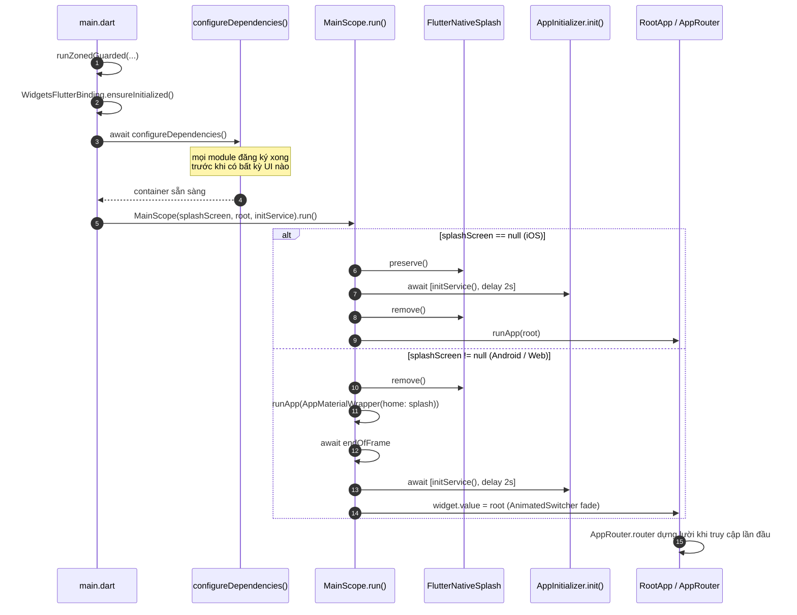

# App Shell (`app/`)

Tài liệu này trả lời câu hỏi **"từ lúc chạm icon đến khi thấy màn hình đầu tiên, chuyện gì xảy ra, và ai lắp ráp mọi thứ lại?"**. Đọc xong bạn sẽ gỡ được lỗi khởi động, thêm được adapter cục bộ cho app, và hiểu vì sao thứ tự module trong `injection.dart` không hề tuỳ tiện.

App shell là **điểm lắp ráp (composition root)**. Đây là nơi duy nhất được phép phụ thuộc mọi tầng, và cũng là nơi duy nhất biết danh sách đầy đủ các package.

---

## 1. Trong này có gì

```
app/lib/
├── main.dart                    điểm khởi động, vùng bắt lỗi
├── main_scope.dart              chuyển tiếp splash → init → root
├── app.dart                     barrel
├── di/
│   ├── injection.dart           lắp ráp DI (thứ tự module rất quan trọng)
│   ├── theme_storage_impl.dart      IThemeStorage    → StorageValue<ThemeMode>
│   ├── language_storage_impl.dart   ILanguageStorage → StorageValue<String>
│   ├── app_boot_storage.dart        cờ khởi động     → StorageValue<bool>
│   ├── network_config_impl.dart     NetworkConfig
│   ├── network_binding_module.dart  binding SslPinningConfig
│   └── utils/                   storage key do shell sở hữu
└── presentation/
    ├── root_app.dart            MaterialApp có router
    ├── app_material_wrapper.dart cấu hình MaterialApp dùng chung
    ├── navigation/app_router.dart lắp ráp GoRouter
    ├── providers/               AppProvider, DeeplinkProvider
    └── widgets/                 NavigatorWrapperWidget, UndefineRouteWidget
```

---

## 2. Vòng đời khởi động



### Từng bước

1. **`runZonedGuarded`** bọc toàn bộ để lỗi bất đồng bộ không bắt được vẫn được báo cáo thay vì mất tăm. Móc nối Crashlytics cho bản release đã có sẵn nhưng đang bị comment.
2. **`WidgetsFlutterBinding.ensureInitialized()`** — bắt buộc trước mọi lời gọi plugin.
3. **`await configureDependencies()`** chạy *trước* `MainScope`. Đến lúc widget đầu tiên build, cả container đã phân giải xong.
4. **`MainScope`** được dựng với ba thứ: hiển thị splash widget nào (nếu có), widget gốc, và `initService` — ở đây là `AppInitializer.init(routeObserver: getIt<AppRouter>().routeObserver)`.
5. **`mainScope.run()`** rẽ nhánh tuỳ theo có truyền splash widget Dart hay không.

### Hai đường splash

`main.dart` chọn splash theo nền tảng:

```dart
splashScreen: kIsWeb
    ? const SplashPage()
    : Platform.isIOS
    ? null
    : const SplashPage(),
```

| Nền tảng | `splashScreen` | Hành vi |
|:--|:--|:--|
| iOS | `null` | Splash native được **giữ lại** suốt quá trình init rồi mới gỡ. Không có splash Dart nào được vẽ. |
| Android, Web | `SplashPage()` | Splash native gỡ ngay lập tức; một `SplashPage` Dart được vẽ thay thế, rồi mờ dần sang `RootApp` qua `AnimatedSwitcher`. |

Cả hai đường đều `await Future.wait([initService(), Future.delayed(_minimumDelay)])`, với `_minimumDelay` là 2 giây. Độ trễ này là **sàn**, không phải cộng thêm — init nhanh vẫn phải chờ để splash không bị nháy.

> [!NOTE]
> `SplashPage` do `MainScope` hiển thị, **không** phải do GoRouter. Nó không có route và không bao giờ xuất hiện trong ngăn xếp điều hướng.

### `_ResponsiveWrapper`

Cả hai đường đều bọc cây widget trong **`ResponsiveInit`** (từ `core_responsive`) với `AppConfig.design` (375×812), `minTextAdapt: true`, `splitScreenMode: true` và một `fontSizeResolver` tuỳ biến co giãn chữ theo chiều rộng màn hình thật. Nó nằm ở đúng gốc cây, nên mọi widget phía dưới đều gọi được `context.w(x)` / `context.h(x)` / `context.sp(x)` / `context.r(x)`.

`ResponsiveInit` là `StatelessWidget`: nó đọc `MediaQuery.sizeOf(context)` — dependency **chỉ theo size** — nên tự rebuild khi màn hình đổi kích thước và bỏ qua thay đổi brightness / textScale / padding. Metrics được phát xuống qua `ResponsiveScope`, một `InheritedWidget`. Không có `autoRebuild`, không có singleton toàn cục.

> [!NOTE]
> `fontSizeResolver` được bê nguyên từ package cũ sang để thang chữ không dịch chuyển. Ghi chú ngay trong `main_scope.dart` nói rõ: khi đã đặt resolver thì nó **ghi đè toàn bộ** cách tính cỡ chữ, nên `minTextAdapt: true` ở trên đang nằm im. Bỏ resolver đi thì `minTextAdapt` mới có tác dụng (chữ sẽ scale theo trục nhỏ hơn thay vì theo chiều rộng) — đó là một thay đổi thị giác, hãy làm có chủ đích chứ đừng để nó xảy ra như tác dụng phụ.

Việc scale vẫn phải đi qua `BuildContext` — `core_responsive` **không có extension trên `num`**, nên `16.h` đơn giản là không biên dịch được. Xem [luật 12](../reference/01_rules.md#12-responsive-ui), và lưu ý luật R7 của `arch_check` chặn mọi dạng bare còn sót ở mọi PR.

---

## 3. Lắp ráp DI — và vì sao thứ tự quan trọng

[`app/lib/di/injection.dart`](../../../app/lib/di/injection.dart) khai báo thứ tự module:

```dart
@InjectableInit(
  externalPackageModulesBefore: [..._coreModules],
  externalPackageModulesAfter: [
    ..._uiModules,       // CoreBaseUiPackageModule
    ..._domainModules,
    ..._dataModules,
    ..._featureModules,
    ..._otherModules,
  ],
)
```

Thứ tự phân giải trong file sinh ra `injection.config.dart`:

| # | Đăng ký | Ghi chú |
|:-:|:--|:--|
| 1 | `_coreModules` | `core_common`, `core_network`, `core_notifications`, `core_storage`, `core_database`, `core_di` |
| 2 | **binding cục bộ của app** | `AppRouter`, `AppProvider`, `DeeplinkProvider`, `AppBootStorage`, `ILanguageStorage`, `IThemeStorage`, `NetworkConfig`, `SslPinningConfig` |
| 3 | `_uiModules` | `core_base_ui` |
| 4 | `_domainModules` → `_dataModules` → `_featureModules` → `_otherModules` | |

### Vì sao `CoreBaseUiPackageModule` nằm ở `_uiModules` chứ không phải `_coreModules`

Đây là luật ngầm quan trọng nhất trong toàn bộ hệ DI, và chính file nguồn cũng ghi chú điều này.

`core_base_ui` đăng ký `ThemeProvider` và `LanguageProvider`, hai lớp này inject `IThemeStorage` và `ILanguageStorage`. Hai interface đó được hiện thực **cục bộ trong app** (`theme_storage_impl.dart`, `language_storage_impl.dart`) — chúng không thuộc package core nào. Các binding cục bộ được sinh ra *ở giữa* `…Before` và `…After`, nên `core_base_ui` buộc phải chạy ở nhóm `…After`. Chuyển nó vào `_coreModules` thì app sẽ chết lúc khởi động với lỗi "IThemeStorage is not registered".

### Cái bẫy thứ tự với eager singleton

> [!CAUTION]
> Một `@Singleton` eager được dựng **ngay lúc đăng ký**. Nếu nó phụ thuộc một kiểu do module chạy *sau* đăng ký, khởi động sẽ ném `… is not registered`.
>
> `flutter analyze` không thể phát hiện lỗi này — đây là lỗi thứ tự lúc chạy. Hãy kiểm chứng bằng cách đọc file sinh ra `app/lib/di/injection.config.dart` và xác nhận mọi phụ thuộc xuất hiện *phía trên* nơi tiêu thụ nó.

Ví dụ thật: `NetworkConfigImpl` phụ thuộc `AuthLocalDataSource` nằm trong `data_auth` — đăng ký ở bước 4, sau khối cục bộ ở bước 2. Vì vậy nó được khai `@LazySingleton(as: NetworkConfig)` để hoãn việc dựng tới lần dùng đầu tiên. Nơi tiêu thụ duy nhất của nó là `ApiClient` cũng lazy, nên không mất gì.

### `AppRouter` là eager, nhưng router của nó thì không

`AppRouter` *đúng là* `@singleton` (eager), nhưng vẫn an toàn: `router` là trường `late final`.

```dart
late final GoRouter router = GoRouter( … );
```

`GoRouter` — cùng các lời gọi `getAllOrEmpty<IFeatureRouteModule>()` bên trong nó — không được tính toán cho tới khi có ai đó đọc `.router` lần đầu. Lúc đó mọi feature module đã đăng ký xong. Nếu `router` là trường thường, router sẽ được lắp trong bước 2 và gom được **không** route feature nào.

---

## 4. Adapter cục bộ của app

Shell hiện thực những hợp đồng mà package core khai báo nhưng tự nó không thể thoả mãn. Mỗi adapter sở hữu `StorageValue` riêng và giữ key trong `app/lib/di/utils/`.

| File | Hiện thực | Sở hữu | Cách đăng ký |
|:--|:--|:--|:--|
| `theme_storage_impl.dart` | `IThemeStorage` | `themeMode` (pref) | `@Singleton(as: IThemeStorage)` + `@PostConstruct(preResolve: true)` |
| `language_storage_impl.dart` | `ILanguageStorage` | `locale` (pref) | như trên |
| `app_boot_storage.dart` | — | `viewed_onboard` (pref) | `@singleton` + `@PostConstruct(preResolve: true)` |
| `network_config_impl.dart` | `NetworkConfig` | — | `@LazySingleton(as: NetworkConfig)` |
| `network_binding_module.dart` | bind `SslPinningConfig` | — | `@module` |

### Vì sao `SslPinningConfig` cần binding riêng

`NetworkConfig implements SslPinningConfig`, nhưng **GetIt phân giải theo đúng kiểu đã đăng ký và không đi ngược chuỗi supertype**. Chỉ đăng ký `as: NetworkConfig` khiến `getItOrNull<SslPinningConfig>()` trả `null`, nên `AppInitializer` bỏ qua pinning hoàn toàn — âm thầm, trên mọi flavor.

Cách sửa là bind qua module, đúng mẫu dual-registration mà `feature_auth` dùng cho `IAuthStatusStream`:

```dart
@module
abstract class NetworkBindingModule {
  @lazySingleton
  SslPinningConfig bindSslPinningConfig(NetworkConfig config) => config;
}
```

Tham số khai kiểu `NetworkConfig` nên phép upcast được trình biên dịch kiểm tra — không cần ép kiểu `as`.

---

## 5. Lắp ráp router

[`app_router.dart`](../../../app/lib/presentation/navigation/app_router.dart) dựng GoRouter **hoàn toàn từ các đóng góp qua DI**.

```dart
List<RouteBase> get _featureRoutes => [
  for (final module in getAllOrEmpty<IFeatureRouteModule>()) ...module.routes,
];

List<IDashboardTabModule> get _dashboardTabs =>
    getAllOrEmpty<IDashboardTabModule>().toList()
      ..sort((a, b) => a.order.compareTo(b.order));
```

Cấu trúc tạo ra:

```
GoRouter(navigatorKey: NavigatorKeys.rootKey)
└── ShellRoute(navigatorKey: appKey)          → NavigatorWrapperWidget
    ├── ..._featureRoutes                      ← IFeatureRouteModule
    └── StatefulShellRoute.indexedStack        ← IDashboardTabModule (sắp theo order)
        └── builder → DashboardRouteModule
```

Mọi điểm gom đều lùi về phương án dự phòng khi không có đóng góp nào:

| Thiếu | Dự phòng |
|:--|:--|
| `IFeatureRouteModule` | danh sách rỗng |
| `IDashboardTabModule` | một nhánh giữ chỗ tại `/_empty_dashboard` vẽ `SizedBox.shrink()` |
| `DashboardRouteModule` | `SizedBox.shrink()` |
| `IAppEntryLocation` | path của tab dashboard đầu tiên, nếu không có thì `/` |

Nhờ vậy, xoá một feature package không thể làm sập shell.

> [!CAUTION]
> **Tuyệt đối không hardcode route của feature vào `app_router.dart`.** Hãy đăng ký `IFeatureRouteModule` hoặc `IDashboardTabModule` trong DI module của chính feature đó. Xem [`../guides/04_routing.md`](../guides/04_routing.md).

`refreshListenable: getItOrNull<AuthProvider>()` khiến GoRouter đánh giá lại redirect khi trạng thái đăng nhập đổi. `errorPageBuilder` vẽ `UndefineRouteWidget` — một widget có tên, không bao giờ dùng closure ẩn danh.

---

## 6. `NavigatorWrapperWidget` — điều hướng đầu tiên và các chuyển đổi auth

Nằm bên trong app `ShellRoute` và bọc mọi route trong app. Nó tách điều hướng thành hai trách nhiệm riêng biệt.

**Redirect lúc khởi động** chỉ chạy một lần, trong `initState`, hoãn tới `endOfFrame`:

```dart
WidgetsBinding.instance.endOfFrame.whenComplete(() async {
  await authProvider.ensureInitialized();
  if (!mounted) return;
  // onboarding? → login? → home
  _bootCompleted = true;
});
```

Chờ `endOfFrame` bảo đảm khung hình đầu tiên đã lên màn hình trước mọi redirect, còn `ensureInitialized()` chờ việc khôi phục phiên hoàn tất để quyết định được đưa ra dựa trên trạng thái thật.

**Các chuyển đổi về sau** do `ProviderStateListener<AuthProvider, UserEntity>` trong `build` xử lý, có điều kiện `_bootCompleted && authProvider.hasRestoredSession`. Điều kiện này tồn tại để listener không tranh giành lần điều hướng đầu tiên với redirect khởi động.

> [!WARNING]
> `_goToOnboarding()` gán `viewedOnboard.value = true` trong khối `finally`, nên cờ vẫn được ghi ngay cả khi hàm trả về `false` vì người dùng đã đăng nhập sẵn. Trong trường hợp đó màn onboarding chưa từng được hiển thị. Hiện tại vô hại, nhưng cờ này không mang đúng ý nghĩa như tên gọi của nó.

---

## 7. `AppMaterialWrapper` và `RootApp`

`AppMaterialWrapper` tồn tại để `MaterialApp` của splash và `MaterialApp` có router dùng chung một cấu hình. Hai constructor: mặc định (`MaterialApp` thường, dùng cho splash) và `.router` (dùng bởi `RootApp`).

Cây provider mà nó cài đặt:

```
MultiProvider(ThemeProvider, LanguageProvider)
└── Consumer2<ThemeProvider, LanguageProvider>
    └── AnnotatedRegion<SystemUiOverlayStyle>
        └── TooltipVisibility(visible: false)
            └── MultiProvider(AppProvider, AuthProvider, DeeplinkProvider)
                └── MaterialApp[.router]
```

Chính `Consumer2` ở lớp ngoài là thứ khiến thay đổi theme và ngôn ngữ lan ra toàn app.

Các delegate localization được gom từ DI, nên feature không bao giờ phải sửa file này:

```dart
final delegates = [
  ...getIt.getAll<IFeatureLocalization>().map((e) => e.delegate),
  ...AppLocalizations.localizationsDelegates,
];
```

`RootApp` cấp bốn đối tượng router từ `getIt<AppRouter>().router` và bổ sung `builder` toàn cục: các overlay host, `AppDialogController`, một `GestureDetector` bỏ focus bàn phím khi chạm ra ngoài, và `MediaQuery.withNoTextScaling` để bố cục không bị xô lệch.

---

## 8. Đi tiếp từ đâu

| Việc cần làm | Hướng dẫn |
|:--|:--|
| Đăng ký route từ một feature | [`../guides/04_routing.md`](../guides/04_routing.md) |
| Thêm một đăng ký DI cho đúng | [`../guides/05_di.md`](../guides/05_di.md) |
| Thêm một giá trị lưu trữ | [`../guides/06_storage.md`](../guides/06_storage.md) |
| Cấu hình mạng / pinning | [`../guides/08_networking.md`](../guides/08_networking.md) |
| Hiểu các tầng bên dưới | [`01_overview.md`](01_overview.md) |
