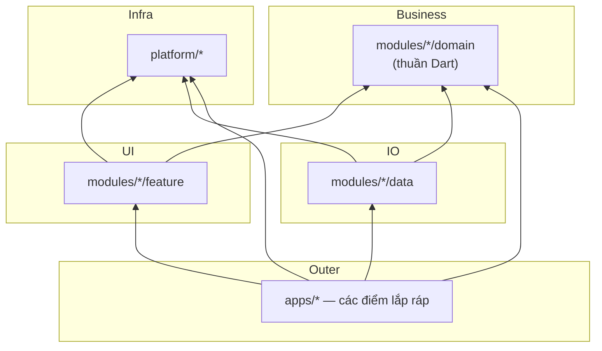

<!-- translated-from: docs/en/getting-started/02_project_tour.md@b65f8b3 -->
# 02 · Dạo quanh dự án

**Trang này trả lời:** mỗi thư mục để làm gì, package nào sở hữu cái gì, và muốn sửa một thứ cụ thể thì vào đâu?

**Đọc xong bạn có thể:** mở repo và nhảy thẳng đến đúng package chỉ trong một bước, không phải grep mò.

---

## 1. Bố cục cấp cao nhất

```text
flutter-monorepo-codebase/
├── apps/                          # Mỗi app một thư mục — các điểm lắp ráp
│   ├── admin/                     # App thứ hai: chỉ auth + settings — xem apps/admin/README.md
│   └── mobile/                    # Mọi module mẫu — xem apps/mobile/README.md
│       ├── app_manifest.yaml      # App này ghép những module nào, và thứ tự nhóm DI
│       ├── lib/
│       │   ├── main.dart          # Một dòng: runShellApp(configureDependencies: …)
│       │   ├── di/injection.dart  # Do composer sinh từ manifest — không bao giờ sửa tay
│       │   └── firebase/          # FirebaseOptions của app này (file options bị git-ignore)
│       ├── android/  ios/         # Project native — build APK từ apps/mobile/, không phải từ gốc
│       ├── fastlane/              # Lane phát hành
│       ├── env.dev  env.stg       # File env theo flavor (env.prod KHÔNG có trong repo)
│       └── pubspec.yaml           # Path dep giữa các marker composer:managed là do máy sinh
│
├── platform/                      # Phần đất của team infra — mọi module đều được phép phụ thuộc
│   ├── foundation/                # Nền thuần mà mọi thứ dựng lên: getIt/lỗi, hợp đồng DI, helper Flutter
│   │   ├── kernel/                # platform_kernel: helper getIt, ErrorHandler, tiện ích thuần Dart
│   │   ├── contracts/             # core_di: DI Hub — hợp đồng trung lập với sản phẩm (session, location, routing)
│   │   └── common/                # core_common: AppConfig, AppInitializer, helper gắn với Flutter
│   ├── layers/                    # Hợp đồng nền của tầng domain và data
│   │   ├── domain/                # domain_core: Result<T>, AppFailure, BaseEntity, BaseUseCase
│   │   └── data/                  # data_core: BaseRepository, BaseModel, request model
│   ├── infra/                     # Cơ chế I/O: mạng, lưu trữ, database, push
│   │   ├── network/               # core_network: Factory Dio + Retrofit, chuỗi interceptor, SSL pinning
│   │   ├── storage/               # core_storage: StorageManager + StorageValue<T> (KHÔNG định nghĩa key nào)
│   │   ├── database/              # core_database: Cơ chế Drift: IDatabaseHandle, IDatabaseMigration, opener
│   │   └── notifications/         # core_notifications: Module quản lý Push Notification
│   ├── ui/                        # Scale, design system, widget dùng chung
│   │   ├── responsive/            # core_responsive: Scale theo design-size, gắn với BuildContext
│   │   ├── design_system/         # core_base_ui: Theme, LanguageProvider, design token & l10n (không có widget)
│   │   └── ui_kit/                # core_ui_kit — widget tái sử dụng cho mọi module
│   ├── state/                     # Nền quản lý state (Provider, BLoC)
│   │   ├── provider/              # provider_state_management: BaseProvider, executeOperation, ViewStateModel
│   │   └── bloc/                  # bloc_state_management: BaseBloc, BaseCubit, BlocViewState<T>
│   └── shell/                     # App shell mà mọi app compose
│       ├── adapters/              # platform_shell_adapters: NetworkConfigImpl, storage adapter theme/ngôn ngữ, AppBootStorage
│       └── app_shell/             # platform_app_shell: boot scope, router, material wrapper, provider cấp app — dùng chung cho mọi app
├── modules/                       # Mỗi bounded context một lát cắt dọc, mỗi team một module
│   ├── auth/                      # Mẫu: lát cắt đủ ba tầng, cộng package API của nó
│   │   ├── api/                   # auth_api: AuthNavigator, IAuthActionHandler — cho feature khác
│   │   ├── domain/                # Entity, UseCase, interface Repository — thuần Dart
│   │   ├── data/                  # Model, DataSource, RepositoryImpl
│   │   └── feature/               # UI + Provider, chỉ còn màn login
│   ├── cache/                     # Mẫu: database Drift do package tự sở hữu (domain + data, không UI)
│   ├── home/{api,feature}/        # Mẫu: BLoC, Freezed event private, một nav destination; home_api: HomeNavigator
│   ├── settings/feature/          # Mẫu: tiêu thụ hợp đồng của module khác
│   ├── dashboard/feature/         # Mẫu: chỉ là khung vỏ (bottom bar ở compact, NavigationRail từ medium, dạng mở rộng từ large)
│   ├── onboarding/feature/        # Mẫu: IAppEntryLocation, vị trí của lần mở đầu tiên
│   └── splash/feature/            # Mẫu: IAppSplashScreen, hiện trước khi router tồn tại
├── tools/                  # CLI viết bằng Dart (generator, checker, sync)
├── docs/                   # Chính bộ tài liệu này (en/ + vi/), kèm history/
├── .agents/                # AGENTS.md — điểm vào cho công cụ AI khác Claude Code
├── .claude/skills/         # Công thức tác vụ cho AI agent
├── CLAUDE.md               # Bản tóm lược cho Claude Code — trích bảng đăng ký luật
│
├── pubspec.yaml            # Gốc workspace — liệt kê đủ 31 thành viên
├── pubspec_dependencies.yaml  # Catalog version — nguồn chân lý duy nhất
├── pubspec.lock            # MỘT file lock cho cả workspace — được commit
└── analysis_options.yaml
```

---

## 2. Từng package và thứ nó sở hữu

Danh sách chuẩn nằm ở khối `workspace:` trong `pubspec.yaml` gốc.

### Core — `platform/*`

Hạ tầng dùng chung cho mọi tầng. **Core tuyệt đối không được phụ thuộc feature hay tầng data.**

| Package | Đường dẫn | Sở hữu |
| :--- | :--- | :--- |
| `platform_kernel` | `platform/foundation/kernel` | Dart thuần, không Flutter (arch_check R9): `getIt` / `getItOrNull` / `getAll` / `getAllOrEmpty`, `ErrorHandler` (re-export `AppFailure` từ `domain_core`), exception, enum, extension cho kiểu nguyên thuỷ, `TypeHelper`, `ValidationHelper`, `EnvConstants` |
| `platform_app_shell` | `platform/shell/app_shell` | Shell mà mọi app ghép vào: `runShellApp`, `MainScope`, `AppRouter`, `AppMaterialWrapper`, `NavigatorWrapperWidget`, `AppProvider`, `DeeplinkProvider`. Không import module nào |
| `platform_shell_adapters` | `platform/shell/adapters` | Các adapter hạ tầng của shell: storage adapter cho theme/ngôn ngữ/cờ boot và `NetworkConfigImpl` (+ binding `SslPinningConfig`). Không import module nào |
| `core_common` | `platform/foundation/common` | Nửa gắn với Flutter: `AppConfig`, `AppInitializer`, mixin, `GoRouteDataCustom`, formatter. Re-export `platform_kernel`, nơi chứa `ErrorHandler`, enum, extension, `EnvConstants` |
| `core_di` | `platform/foundation/contracts` | **Trạm DI**, chỉ hợp đồng trung lập với sản phẩm: routing (`IFeatureRouteModule`, `INavDestinationModule`, `IAppEntryLocation`, `ISignInLocation`, `IPostSignInLocation`, `IDashboardRouteModule`), `IFeatureLocalization`, `NavigatorKeys`, các hợp đồng session (`ISessionState`, `ISessionStatusStream`, …), `IThemeStorage` / `ILanguageStorage`. Navigator / action handler của một module nằm trong package `modules/<id>/api` của chính nó |
| `core_base_ui` | `platform/ui/design_system` | Design system: màu, typography, `AppSpacing`/`AppRadius`/`AppGradients`/`AppShadows`, `ThemeProvider`, `LanguageProvider`, asset & L10n toàn cục. **Không chứa một Flutter widget nào.** |
| `core_ui_kit` | `platform/ui/ui_kit` | Toàn bộ widget dùng lại: button, input, dialog, feedback, layout, media, navigation (kể cả `BottomTransitionPage`) + `SharedUiConstants` |
| `core_network` | `platform/infra/network` | `ApiClient` (factory Dio), hợp đồng `NetworkConfig`, interceptor Auth/Retry/Logging/RefreshToken, hợp đồng SSL pinning, `DioFailureClassifier` (Dio → `AppFailure`) |
| `core_storage` | `platform/infra/storage` | **Chỉ cơ chế** lưu trữ: `StorageInterface`, `StorageManager`, `StorageValue<T>`, `StorageType`, che dữ liệu trong RAM. **Không định nghĩa key nào.** |
| `core_database` | `platform/infra/database` | **Chỉ cơ chế** Drift/SQLite: bộ mở database trên isolate nền, connection factory, `IDatabaseHandle`, hợp đồng migration. **Không sở hữu database, bảng hay DAO nào** — mỗi package tự khai của mình. |
| `core_responsive` | `platform/ui/responsive` | Sizing đáp ứng: `ResponsiveInit`, `ResponsiveScope`, `ResponsiveMetrics`, và bộ extension `context.w/h/sp/r` mà mọi widget dùng để scale (mặc định chỉ thu nhỏ); lớp kích thước cửa sổ và các widget layout thích ứng (`context.adaptive`, `AdaptiveLayout`, `AdaptiveSplitView`, `AdaptiveContent`) |
| `core_notifications` | `platform/infra/notifications` | Service push notification + `NotificationConstants` của riêng nó |
| `provider_state_management` | `platform/state/provider` | `BaseProvider`, `executeOperation`, `ViewStateModel`, `ProviderStateListener`, `BaseViewWidget`, `LoadMoreMixin`, `LoadMoreListView` |
| `bloc_state_management` | `platform/state/bloc` | `BaseBloc`, `BaseCubit`, `BlocViewState<T>` |

### Domain — `modules/*/domain`

**Thuần Dart 100%.** Không `package:flutter`, không `dio`, không `retrofit`.

| Package | Đường dẫn | Sở hữu |
| :--- | :--- | :--- |
| `domain_core` | `platform/layers/domain` | `Result<T>`, `BaseEntity<T>`, `PaginatedEntity<T>`, `BaseUseCase`, `NoParams`, `AppFailure` |
| `domain_cache` | `modules/cache/domain` | `CacheEntryEntity`, `CacheEntryParams`, `ICacheEntryRepository`, `GetCacheEntryUseCase` / `SaveCacheEntryUseCase` |
| `domain_auth` | `modules/auth/domain` | `UserEntity`, `UserRole`, `LoginParams`, `IAuthRepository`, `LoginUseCase` / `LogoutUseCase` / `RefreshTokenUseCase` |

### Data — `modules/*/data`

Hiện thực hợp đồng của domain. Data source trả về **Model**, không trả entity, và không để lộ type của Drift/Dio ra ngoài.

| Package | Đường dẫn | Sở hữu |
| :--- | :--- | :--- |
| `data_core` | `platform/layers/data` | `BaseRepository` (`execute()` / `executeSync()`), `BaseModel`, `BaseRequest`, `ExtraRequest` |
| `data_cache` | `modules/cache/data` | `CacheDatabase` + bảng `CacheEntries` + `CacheEntriesDao`, `CacheEntryModel`, `CacheEntryLocalDataSource`, `CacheEntryRepositoryImpl`, `CacheConstants` |
| `data_auth` | `modules/auth/data` | `UserModel`, `AuthRemoteDataSource` (Retrofit), `AuthLocalDataSource` (sở hữu key `token` / `auth_user`), `AuthRepositoryImpl`, `AuthStorageKeys`, `AuthApiConstants` |

### Features — `modules/*/feature`

Mỗi package đúng một mối quan tâm UI. Feature được phép phụ thuộc `domain_*`, `core_di`, `core_common`, `core_base_ui`, `core_ui_kit`, và một package state-management — **không bao giờ phụ thuộc `data_*`, cũng không phụ thuộc feature khác**.

| Package | Đường dẫn | Sở hữu |
| :--- | :--- | :--- |
| `feature_auth` | `modules/auth/feature` | Một trang login duy nhất, `AuthProvider` (nhánh Provider), `AuthNavigatorImpl`, `AuthActionHandlerImpl` (implement `auth_api`), `AuthStatusStreamImpl`, `AuthSignInLocation` |
| `feature_home` | `modules/home/feature` | Tab Home, `HomeProfileBloc` (nhánh BLoC), `HomeNavDestination` |
| `feature_settings` | `modules/settings/feature` | Tab Settings, `SettingsNavDestination` |
| `feature_onboarding` | `modules/onboarding/feature` | Luồng onboarding, hiện thực `IAppEntryLocation` |
| `feature_dashboard` | `modules/dashboard/feature` | **Chỉ là khung vỏ** — `Scaffold` + điều hướng chính: bottom bar khi cửa sổ `compact`, `NavigationRail` từ `medium` trở lên (dạng mở rộng từ `large`). Dựng các destination từ `getAllOrEmpty<INavDestinationModule>()`; không sở hữu trang tab nào. |
| `feature_splash` | `modules/splash/feature` | Trang splash do `MainScope` hiển thị trước khi router tồn tại |

> [!NOTE]
> Mọi thứ trong `domain/`, `data/`, `features/` đều là **code mẫu / tham khảo**. Chúng minh hoạ cách đấu nối, không phải nghiệp vụ production. Hãy copy pattern rồi xoá hoặc thay bằng nghiệp vụ thật.

---

## 3. Luật hướng phụ thuộc



Đọc sơ đồ như sau: **mũi tên chỉ vào thứ bạn được phép phụ thuộc.**

- `Domain` là trung tâm. Ngoài `domain_core` mà các package domain dùng chung, nó không phụ thuộc bất kỳ package nào trong workspace.
- `Data` hiện thực hợp đồng domain và nói chuyện với `core_network` / `core_storage` / `core_database`.
- `Features` tiêu thụ use case của domain; chúng không bao giờ nhìn thấy `data_*`.
- Mỗi app trong `apps/` nằm ngoài cùng và là nơi duy nhất được phép biết tất cả cùng lúc — `apps/mobile/` và `apps/admin/` ghép hai tập con khác nhau của cùng các module.

### Core không được phụ thuộc feature

`tools/arch_check/check.dart` cưỡng chế luật này ở mọi PR (Gate 1 của `pr_quality_check.yml`). Ba cạnh hạ tầng → `domain_core` được duyệt — Domain là vòng trong cùng, nên phụ thuộc vào nó là hợp lệ:

| Ngoại lệ được phép | Lý do |
| :--- | :--- |
| `provider_state_management → domain_core` | `PaginatedEntity<T>` và `Result<T>` được dùng trong base view widget |
| `bloc_state_management → domain_core` | `BlocViewState.error` mang theo một `AppFailure` |
| `platform_kernel → domain_core` | `ErrorHandler` sinh ra `AppFailure` |

Kiểm tra bất cứ lúc nào:

```bash
grep -rl "package:feature_" platform/*/*/lib    # phải không in ra gì
dart tools/arch_check/check.dart              # R1: không có cạnh platform/* → feature_/data_/domain_ nào ngoài ba cạnh trên
```

---

## 4. Pub Workspace thay đổi điều gì

`pubspec.yaml` gốc khai báo mọi thành viên:

```yaml
workspace:
  # composer:managed:workspace — generated from app_manifest.yaml
  - apps/admin
  - apps/mobile
  - modules/auth/data
  # … và 25 thành viên nữa, kể cả tools
  # composer:end:workspace
```

Danh sách này do `composer sync` sinh ra từ manifest của mọi app — hãy sửa manifest, đừng sửa danh sách.

Mỗi thành viên khai `resolution: workspace` trong `pubspec.yaml` của chính nó.

Những hệ quả bạn bắt buộc phải biết:

| Hệ quả | Nghĩa là với bạn |
| :--- | :--- |
| Chỉ một `pubspec.lock` ở root, và được commit | Chỉ chạy `flutter pub get` **tại root**, và commit file lock khi thay đổi dependency làm nó đổi theo |
| Chung một `.dart_tool/package_config.json` | Package **quên** khai dependency vẫn compile được — kiến trúc hỏng trong im lặng. Luôn khai đủ mọi import vào `pubspec.yaml` của bạn. |
| Mỗi dependency chỉ một version cho cả repo | Không hardcode version; sửa `pubspec_dependencies.yaml` rồi chạy `dart tools/dependency_sync.dart` |
| `build_runner` chạy kèm `--workspace` | Codegen quét một lượt qua mọi package |

---

## 5. "Tôi muốn sửa X — vào đâu?"

| Tôi muốn… | Package / file | Hướng dẫn |
| :--- | :--- | :--- |
| Thêm màn hình mới + state của nó | `modules/<tên>/feature/` | [../guides/01_new_feature.md](../guides/01_new_feature.md) |
| Thêm quy tắc nghiệp vụ / use case | `modules/<tên>/domain/` | [../guides/02_new_domain_data.md](../guides/02_new_domain_data.md) |
| Thêm endpoint API | `modules/<tên>/data/lib/src/data_sources/remote/` + `utils/*_api_constants.dart` | [../guides/08_networking.md](../guides/08_networking.md) |
| Lưu một cặp key/value | Thư mục `utils/*_storage_keys.dart` của package **sở hữu** | [../guides/06_storage.md](../guides/06_storage.md) |
| Thêm bảng database | Thư mục `src/database/tables/` của chính package sở hữu (tham chiếu: `modules/cache/data/lib/src/database/tables/`) | [../guides/07_database.md](../guides/07_database.md) |
| Thêm route / điều hướng giữa các feature | `<feature>/src/routing/` + `modules/<id>/api/lib/src/navigators/` của module đích | [../guides/04_routing.md](../guides/04_routing.md) |
| Đăng ký thứ gì đó vào DI | `<package>/lib/di/module.dart` | [../guides/05_di.md](../guides/05_di.md) |
| Đổi màu / khoảng cách / typography | `platform/ui/design_system/lib/src/styles/` | [../guides/09_localization_theming.md](../guides/09_localization_theming.md) |
| Thêm chuỗi cần dịch | `modules/<tên>/feature/assets/language/*.arb` | [../guides/09_localization_theming.md](../guides/09_localization_theming.md) |
| Chia sẻ widget giữa các feature | `platform/ui/ui_kit/` | [../guides/10_cross_feature.md](../guides/10_cross_feature.md) |
| Cho feature A kích hoạt hành động ở feature B | `modules/<id>/api/lib/src/actions/` của B, hoặc `core_di/src/session/` cho session | [../guides/10_cross_feature.md](../guides/10_cross_feature.md) |
| Nâng version một thư viện | `pubspec_dependencies.yaml` | [03_daily_workflow.md](03_daily_workflow.md) |
| Sửa pipeline CI | `.github/workflows/`, `azure-ci-cd.yml` | [../operations/01_cicd.md](../operations/01_cicd.md) |

---

## Đọc tiếp ở đâu

| Bạn muốn… | Đọc |
| :--- | :--- |
| Nắm các lệnh dùng hằng ngày | [03_daily_workflow.md](03_daily_workflow.md) |
| Hiểu sâu cách phân tầng | [../architecture/01_overview.md](../architecture/01_overview.md) |
| Xem các luật bắt buộc | [../reference/01_rules.md](../reference/01_rules.md) |
