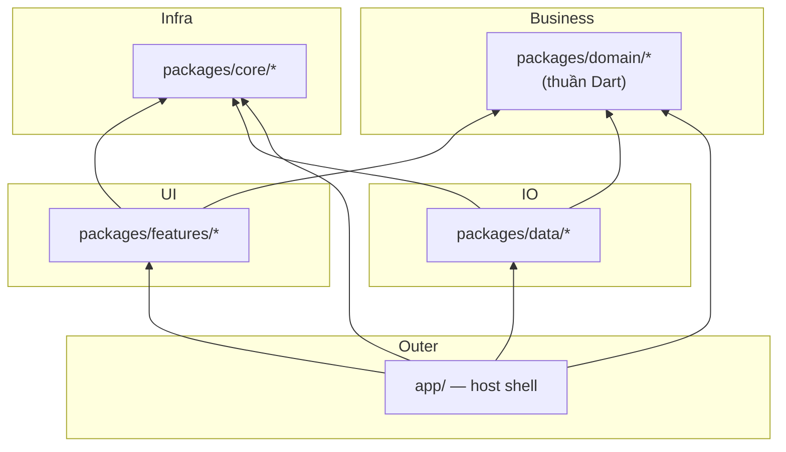

# 02 · Dạo quanh dự án

**Trang này trả lời:** mỗi thư mục để làm gì, package nào sở hữu cái gì, và muốn sửa một thứ cụ thể thì vào đâu?

**Đọc xong bạn có thể:** mở repo và nhảy thẳng đến đúng package chỉ trong một bước, không phải grep mò.

---

## 1. Bố cục cấp cao nhất

```text
flutter-monorepo-codebase/
├── app/                    # Host app shell — entrypoint, lắp DI, router, flavor
│   ├── lib/                #   main.dart, main_scope.dart, di/, presentation/
│   ├── android/            #   Project Gradle (build APK TỪ ĐÂY, không phải từ root)
│   ├── ios/                #   Project Xcode
│   ├── fastlane/           #   Lane CI cho mobile
│   ├── env.dev / env.stg   #   File env theo flavor (env.prod KHÔNG có trong repo)
│   └── pubspec.yaml
│
├── packages/
│   ├── core/               # Hạ tầng — mọi tầng đều dùng được
│   ├── domain/             # Business logic thuần Dart (không Flutter, không Dio)
│   ├── data/               # Repository impl, model, data source
│   └── features/           # Module UI, mỗi package một mối quan tâm
│
├── tools/                  # CLI viết bằng Dart (generator, checker, sync)
├── docs/                   # Chính bộ tài liệu này (en/ + vi/)
├── .agents/                # Luật AGENTS.md + skills cho AI agent
│
├── pubspec.yaml            # Gốc workspace — liệt kê đủ 24 thành viên
├── pubspec_dependencies.yaml  # Catalog version — nguồn chân lý duy nhất
├── pubspec.lock            # MỘT file lock cho cả workspace
└── analysis_options.yaml
```

---

## 2. Từng package và thứ nó sở hữu

Danh sách chuẩn nằm ở khối `workspace:` trong `pubspec.yaml` gốc.

### Core — `packages/core/*`

Hạ tầng dùng chung cho mọi tầng. **Core tuyệt đối không được phụ thuộc feature hay tầng data.**

| Package | Đường dẫn | Sở hữu |
| :--- | :--- | :--- |
| `core_common` | `packages/core/common` | `AppConfig`, `AppInitializer`, enum, `ErrorHandler` (re-export `AppFailure` từ `domain_core`), extension, mixin, `EnvConstants`, `ApiStatusConstants`, module Firebase options |
| `core_di` | `packages/core/di` | **Trạm DI**: interface Navigator, `I*ActionHandler`, hợp đồng routing (`IFeatureRouteModule`, `IDashboardTabModule`, `IAppEntryLocation`, `DashboardRouteModule`), `IFeatureLocalization`, `NavigatorKeys`, interface stream trung lập, `IThemeStorage` / `ILanguageStorage` |
| `core_base_ui` | `packages/core/base_ui` | Design system: màu, typography, `AppSpacing`/`AppRadius`/`AppGradients`/`AppShadows`, `ThemeProvider`, `LanguageProvider`, asset & L10n toàn cục. **Không chứa một Flutter widget nào.** |
| `core_ui_kit` | `packages/core/ui_kit` | Toàn bộ widget dùng lại: button, input, dialog, feedback, layout, media, navigation + `SharedUiConstants` |
| `core_network` | `packages/core/network` | `ApiClient` (factory Dio), hợp đồng `NetworkConfig`, interceptor Auth/Retry/Logging/RefreshToken, hợp đồng SSL pinning |
| `core_storage` | `packages/core/storage` | **Chỉ cơ chế** lưu trữ: `StorageInterface`, `StorageManager`, `StorageValue<T>`, `StorageType`, che dữ liệu trong RAM. **Không định nghĩa key nào.** |
| `core_database` | `packages/core/database` | **Chỉ cơ chế** Drift/SQLite: bộ mở database trên isolate nền, connection factory, `IDatabaseHandle`, hợp đồng migration. **Không sở hữu database, bảng hay DAO nào** — mỗi package tự khai của mình. |
| `core_responsive` | `packages/core/responsive` | Sizing đáp ứng: `ResponsiveInit`, `ResponsiveScope`, `ResponsiveMetrics`, và bộ extension `context.w/h/sp/r` mà mọi widget dùng để scale |
| `core_notifications` | `packages/core/notifications` | Service push notification + `NotificationConstants` của riêng nó |
| `provider_state_management` | `packages/core/provider_state_management` | `BaseProvider`, `executeOperation`, `ViewStateModel`, `ProviderStateListener`, `BaseViewWidget`, `LoadMoreMixin` |
| `bloc_state_management` | `packages/core/bloc_state_management` | `BaseBloc`, `BaseCubit`, `BlocViewState<T>` |

### Domain — `packages/domain/*`

**Thuần Dart 100%.** Không `package:flutter`, không `dio`, không `retrofit`.

| Package | Đường dẫn | Sở hữu |
| :--- | :--- | :--- |
| `domain_core` | `packages/domain/core` | `Result<T>`, `BaseEntity<T>`, `PaginatedEntity<T>`, `BaseUseCase`, `NoParams`, entity/usecase cache |
| `domain_auth` | `packages/domain/auth` | `UserEntity`, `UserRole`, `LoginParams`, `IAuthRepository`, `LoginUseCase` / `LogoutUseCase` / `RefreshTokenUseCase` |
| `domain_language` | `packages/domain/language` | `ILanguageRepository`, `GetLanguageUseCase`, `SetLanguageUseCase` |

### Data — `packages/data/*`

Hiện thực hợp đồng của domain. Data source trả về **Model**, không trả entity, và không để lộ type của Drift/Dio ra ngoài.

| Package | Đường dẫn | Sở hữu |
| :--- | :--- | :--- |
| `data_core` | `packages/data/core` | `IBaseRepository` (`execute()` / `executeSync()`), `BaseModel`, `BaseRequest`, `CacheEntryModel`, data source + repository cache |
| `data_auth` | `packages/data/auth` | `UserModel`, `AuthRemoteDataSource` (Retrofit), `AuthLocalDataSource` (sở hữu key `token` / `auth_user`), `AuthRepositoryImpl`, `AuthStorageKeys`, `AuthApiConstants` |
| `data_language` | `packages/data/language` | `LanguageRepositoryImpl` (sở hữu key `locale`), `LanguageStorageKeys` |

### Features — `packages/features/*`

Mỗi package đúng một mối quan tâm UI. Feature được phép phụ thuộc `domain_*`, `core_di`, `core_common`, `core_base_ui`, `core_ui_kit`, và một package state-management — **không bao giờ phụ thuộc `data_*`, cũng không phụ thuộc feature khác**.

| Package | Đường dẫn | Sở hữu |
| :--- | :--- | :--- |
| `feature_auth` | `packages/features/auth` | Trang Login / Register / Forgot-password, `AuthProvider` (nhánh Provider), `AuthNavigatorImpl`, `AuthActionHandlerImpl`, `AuthStatusStreamImpl` |
| `feature_home` | `packages/features/home` | Tab Home, `HomeProfileBloc` (nhánh BLoC), `HomeDashboardTabModule` |
| `feature_settings` | `packages/features/settings` | Tab Settings, `SettingsDashboardTabModule` |
| `feature_onboarding` | `packages/features/onboarding` | Luồng onboarding, hiện thực `IAppEntryLocation` |
| `feature_dashboard` | `packages/features/dashboard` | **Chỉ là khung vỏ** — `Scaffold` + bottom navigation bar. Dựng tab từ `getAllOrEmpty<IDashboardTabModule>()`; không sở hữu trang tab nào. |
| `feature_splash` | `packages/features/splash` | Trang splash do `MainScope` hiển thị trước khi router tồn tại |

> [!NOTE]
> Mọi thứ trong `domain/`, `data/`, `features/` đều là **code mẫu / tham khảo**. Chúng minh hoạ cách đấu nối, không phải nghiệp vụ production. Hãy copy pattern rồi xoá hoặc thay bằng nghiệp vụ thật.

---

## 3. Luật hướng phụ thuộc



Đọc sơ đồ như sau: **mũi tên chỉ vào thứ bạn được phép phụ thuộc.**

- `Domain` là trung tâm. Ngoài `domain_core` mà các package domain dùng chung, nó không phụ thuộc bất kỳ package nào trong workspace.
- `Data` hiện thực hợp đồng domain và nói chuyện với `core_network` / `core_storage` / `core_database`.
- `Features` tiêu thụ use case của domain; chúng không bao giờ nhìn thấy `data_*`.
- `app/` nằm ngoài cùng và là nơi duy nhất được phép biết tất cả cùng lúc.

### Core không được phụ thuộc feature

`tools/arch_check/check.dart` cưỡng chế luật này ở mọi PR (Gate 1 của `pr_quality_check.yml`). Bốn cạnh `core_* → domain_*` được duyệt — Domain là vòng trong cùng, nên phụ thuộc vào nó là hợp lệ:

| Ngoại lệ được phép | Lý do |
| :--- | :--- |
| `core_di → domain_auth` | Agnostic stream phơi ra `UserEntity` cụ thể; trạm DI cần chính type đó |
| `provider_state_management → domain_core` | `PaginatedEntity<T>` và `Result<T>` được dùng trong base view widget |
| `bloc_state_management → domain_core` | `BlocViewState.error` mang theo một `AppFailure` |
| `core_common → domain_core` | `ErrorHandler` sinh ra `AppFailure` |

Kiểm tra bất cứ lúc nào:

```bash
grep -rl "package:feature_" packages/core/*/lib    # phải không in ra gì
dart tools/unused_checker/check_unused_packages.dart
```

---

## 4. Pub Workspace thay đổi điều gì

`pubspec.yaml` gốc khai báo mọi thành viên:

```yaml
workspace:
  - app
  - tools
  - packages/core/common
  # … và 20 package nữa
```

Mỗi thành viên khai `resolution: workspace` trong `pubspec.yaml` của chính nó.

Những hệ quả bạn bắt buộc phải biết:

| Hệ quả | Nghĩa là với bạn |
| :--- | :--- |
| Chỉ một `pubspec.lock` ở root | Chỉ chạy `flutter pub get` **tại root** |
| Chung một `.dart_tool/package_config.json` | Package **quên** khai dependency vẫn compile được — kiến trúc hỏng trong im lặng. Luôn khai đủ mọi import vào `pubspec.yaml` của bạn. |
| Mỗi dependency chỉ một version cho cả repo | Không hardcode version; sửa `pubspec_dependencies.yaml` rồi chạy `dart tools/dependency_sync.dart` |
| `build_runner` chạy kèm `--workspace` | Codegen quét một lượt qua mọi package |

---

## 5. "Tôi muốn sửa X — vào đâu?"

| Tôi muốn… | Package / file | Hướng dẫn |
| :--- | :--- | :--- |
| Thêm màn hình mới + state của nó | `packages/features/<tên>/` | [../guides/01_new_feature.md](../guides/01_new_feature.md) |
| Thêm quy tắc nghiệp vụ / use case | `packages/domain/<tên>/` | [../guides/02_new_domain_data.md](../guides/02_new_domain_data.md) |
| Thêm endpoint API | `packages/data/<tên>/src/data_sources/remote/` + `utils/*_api_constants.dart` | [../guides/08_networking.md](../guides/08_networking.md) |
| Lưu một cặp key/value | Thư mục `utils/*_storage_keys.dart` của package **sở hữu** | [../guides/06_storage.md](../guides/06_storage.md) |
| Thêm bảng database | Thư mục `src/database/tables/` của chính package sở hữu (tham chiếu: `packages/data/core/lib/src/database/tables/`) | [../guides/07_database.md](../guides/07_database.md) |
| Thêm route / điều hướng giữa các feature | `<feature>/src/routing/` + `core_di/src/navigators/` | [../guides/04_routing.md](../guides/04_routing.md) |
| Đăng ký thứ gì đó vào DI | `<package>/lib/di/module.dart` | [../guides/05_di.md](../guides/05_di.md) |
| Đổi màu / khoảng cách / typography | `packages/core/base_ui/lib/src/styles/` | [../guides/09_localization_theming.md](../guides/09_localization_theming.md) |
| Thêm chuỗi cần dịch | `packages/features/<tên>/assets/language/*.arb` | [../guides/09_localization_theming.md](../guides/09_localization_theming.md) |
| Chia sẻ widget giữa các feature | `packages/core/ui_kit/` | [../guides/10_cross_feature.md](../guides/10_cross_feature.md) |
| Cho feature A kích hoạt hành động ở feature B | `core_di/src/actions/` hoặc `src/agnostic_streams/` | [../guides/10_cross_feature.md](../guides/10_cross_feature.md) |
| Nâng version một thư viện | `pubspec_dependencies.yaml` | [03_daily_workflow.md](03_daily_workflow.md) |
| Sửa pipeline CI | `.github/workflows/`, `azure-ci-cd.yml` | [../operations/01_cicd.md](../operations/01_cicd.md) |

---

## Đọc tiếp ở đâu

| Bạn muốn… | Đọc |
| :--- | :--- |
| Nắm các lệnh dùng hằng ngày | [03_daily_workflow.md](03_daily_workflow.md) |
| Hiểu sâu cách phân tầng | [../architecture/01_overview.md](../architecture/01_overview.md) |
| Xem các luật bắt buộc | [../reference/01_rules.md](../reference/01_rules.md) |
